> 转载于互联网


想要构建一个"上帝视野"，前期的信息收集工作是必不可少的，无论是了解一个人、一项业务、还是深入一个系统等，都需要“信息”。大佬曾说过，渗透测试的本质是信息收集，而个人直观感受就是“意料之外，情理之中”。

本文就简单整理下打点前的信息收集那些事。从信息收集本质上来说多数内容都是大同小异，遇到坚壁时，不用死磕，毕竟条条大路通罗马。

> **红队知识点大致流程：**
> 
> 外网信息收集——>打点——>权限维持——>提权——>内网信息收集——>横向移动——>痕迹清理
> 
> **打点关键资产数据信息：**
> 
> - 找出网站真实IP，挖掘相邻网段、绕过安全设备
> - 判断目标是否为蜜罐
> - 定位内网IP和系统
> - 定位关键的应用系统
> - 定位关键企业信息

外网信息收集
======

对于外网信息收集主要有几点：ip、域名、企业等资产信息以及相应端口/服务、指纹、敏感信息、社工碰撞等易受攻击面信息。

> tips：
> 
> - 挂代理池，走负载均衡，防止被锁IP。
> - 确定目标后，析缕分条，找到突破及利用点。
> - 关于打点时隐匿：
>     
>     攻击前：虚拟机做全局代理、浏览器隐私模式或Tor，脚本、账号啥的非本人
>     
>     攻击后：Rootkit……

0x00 常用工具、资源简记：
---------------

| 工具、网站 | 备注 |
|---|---|
| [爱站](https://www.aizhan.com/)、[站长工具](https://tool.chinaz.com/) | Whois、备案号、权重、公司名称等 |
| [天眼查](https://www.tianyancha.com/)、[企查查](https://www.qichacha.com/)、[搜狗搜索引擎](https://wx.sogou.com/) | 公司注册域名、微信公众号、APP、软件著作权等 |
| [ZoomEye](https://www.zoomeye.org/)、[Shodan](https://shodan.io/)、[FOFA](https://fofa.so/)、[0.Zone](https://0.zone/)、[quake](https://quake.360.cn/quake/#/index) | 网络空间资产搜索引擎 |
| [ENScanGo](https://github.com/wgpsec/ENScan_GO)、[ICP备案](https://beian.miit.gov.cn/#/Integrated/index) | 主域名收集 |
| [OneForAll](https://github.com/shmilylty/OneForAll)、[Layer](https://github.com/euphrat1ca/LayerDomainFinder)、[Rapid7的开源数据项目](https://opendata.rapid7.com/)、[ctfr](https://github.com/UnaPibaGeek/ctfr)、[EyeWitness](https://github.com/FortyNorthSecurity/EyeWitness) | 子域名收集 |
| [Kscan](https://github.com/lcvvvv/kscan)、[ShuiZe_0x727](https://github.com/0x727/ShuiZe_0x727)、[ARL灯塔](https://github.com/TophantTechnology/ARL)、[Goby](https://gobies.org/) | 自动化、批量信息收集 |
| [Bufferfly](https://github.com/dr0op/bufferfly)、[Ehole](https://github.com/EdgeSecurityTeam/EHole) | 资产处理、信息筛选 |
| [dnsdb](https://dnsdb.io/zh-cn/)、[CloudFlair](https://github.com/christophetd/CloudFlair) | CDN相关 |
| [VirusTotal](https://www.virustotal.com/)、[微步](https://x.threatbook.cn/)、[ip2domain](https://github.com/Sma11New/ip2domain) | C段、域名/ip情报信息 |
| [Nmap](https://nmap.org/)、[Masscan](https://github.com/robertdavidgraham/masscan) | 端口服务信息 |
| Google Hacking、[dirsearch](https://github.com/maurosoria/dirsearch)、[URLFinder](https://github.com/pingc0y/URLFinder) | WEB站点信息、api接口等 |
| [wafw00f](https://github.com/EnableSecurity/wafw00f) | waf识别 |
| [云悉](http://www.yunsee.cn/)、[潮汐](http://finger.tidesec.net/home/index/index.html)、[WhatWeb](https://www.whatweb.net/) | 在线CMS识别 |
| [七麦](https://www.qimai.cn/)、[小蓝本](https://www.xiaolanben.com/pc) | APP资产 |
| [ApkAnalyser](https://github.com/TheKingOfDuck/ApkAnalyser) | App敏感信息 |
| [乌云漏洞库](https://wy.zone.ci/)、[CNVD](http://www.cnnvd.org.cn/)、[**waybackurls**](https://github.com/tomnomnom/waybackurls) | 历史漏洞、历史资产等 |
| [n0tr00t/Sreg](https://github.com/n0tr00t/Sreg)、<a>reg007</a> | 个人隐私信息 |
| [GitDorker](https://github.com/obheda12/GitDorker) | 资产信息、源码泄露 |
| [theHarvester](https://github.com/laramies/theHarvester)、[Snov.io](https://app.snov.io/) | 邮箱信息收集 |
| [OSINT开源情报和侦擦工具](https://start.me/p/GE7JQb/osint) | 开源情报资源导航 |
| [anti-honeypot](https://github.com/cnrstar/anti-honeypot)、[Honeypot Hunter](https://send-safe-honeypot-hunter.apponic.com/) | 蜜罐识别 |

0x01 主域名信息
----------

> 域名用来代替IP使其更容易被用户找到、记住。
> 
> 对于"非用户"来说，可通过域名信息获取：主域名、存活站点、关联信息、钓鱼信息。为漏洞挖掘提供数据支撑。

### 1. ICP备案

> 国内服务器线上运营都必须先办理ICP备案后才能上线。

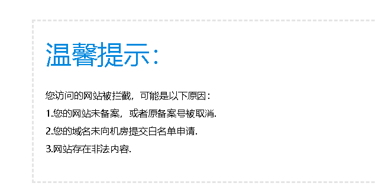

#### 备案信息查询：

- ICP备案查询

<https://beian.miit.gov.cn/#/Integrated/index>


- 公安部备案查询

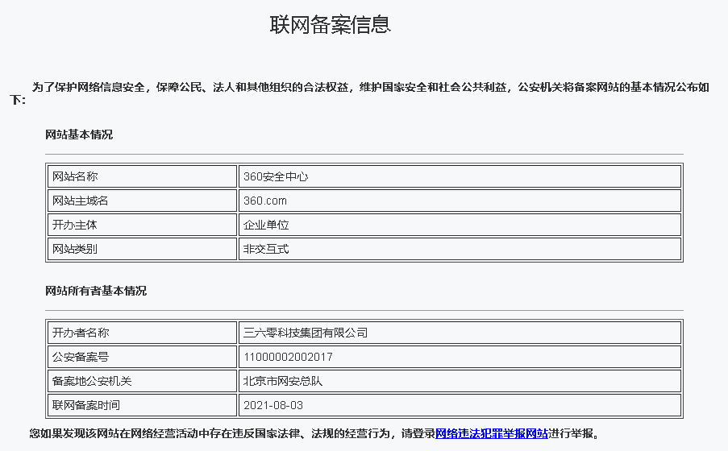

#### 备案反查主域名

反查可分为备案域名查询和未备案域名查询。

**备案域名查询**

- 第三方站点
    
    
    - ICP备案查询-站长工具
    - SEO综合查询

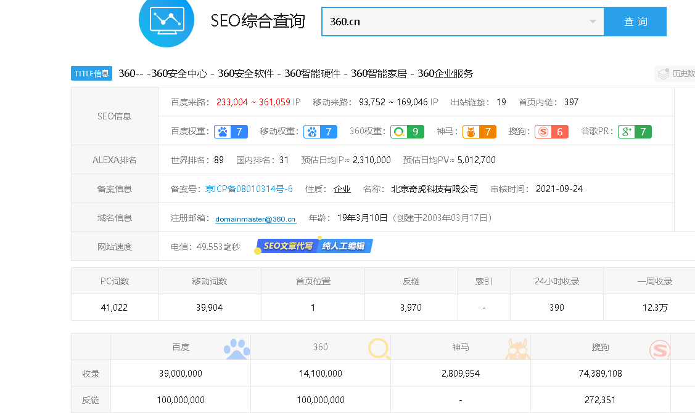

- 公安部备案查询
- 企业信息查询网站

**未备案域名查询**

- 已知网站信息获取（如，网站站点导航可能会包含未备案的站点）


- 网络空间引擎进行证书、图标关联搜索。例如：fofa指定搜索规则 `is_domain=true`，即表示只返回域名*(个人感觉国外shodan、国内fofa)*。

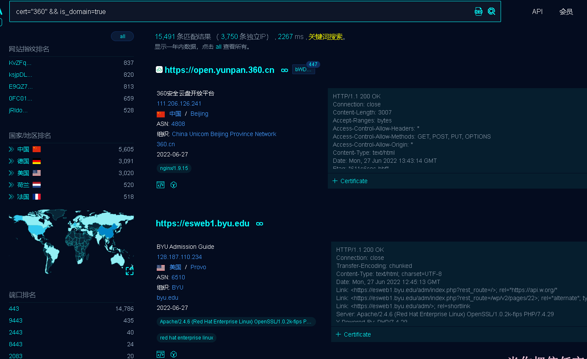

### 2. Whois

> whois是用来查询域名的IP以及所有者等信息的传输协议。

通过whois信息可以获取注册人的关键信息。如注册商、联系人、联系邮箱、联系电话，也可以对注册人、邮箱、电话反查域名，也可以通过搜索引擎进一步挖掘域名所有人的信息。深入可社工、可漏洞挖掘利用。

- 站长之家
    
    [http://whois.chinaz.com](http://whois.chinaz.com/)

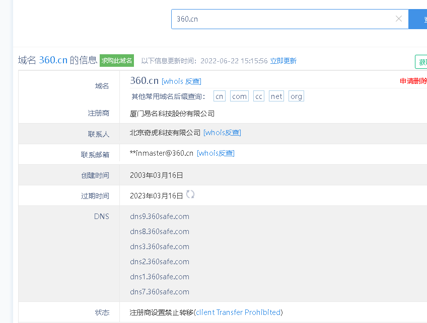

- Bugscanner
    
    [http://whois.bugscaner.com](http://whois.bugscaner.com/)
- 国外BGP
    
    [https://bgp.he.net](https://bgp.he.net/)
- who.is
    
    <https://who.is/>
- IP138网站
    
    <https://site.ip138.com/>
- 域名信息查询-腾讯云
    
    <https://whois.cloud.tencent.com/>
- ICANN LOOKUP
    
    <https://lookup.icann.org/>
- 狗狗查询
    
    <https://www.ggcx.com/main/integrated>

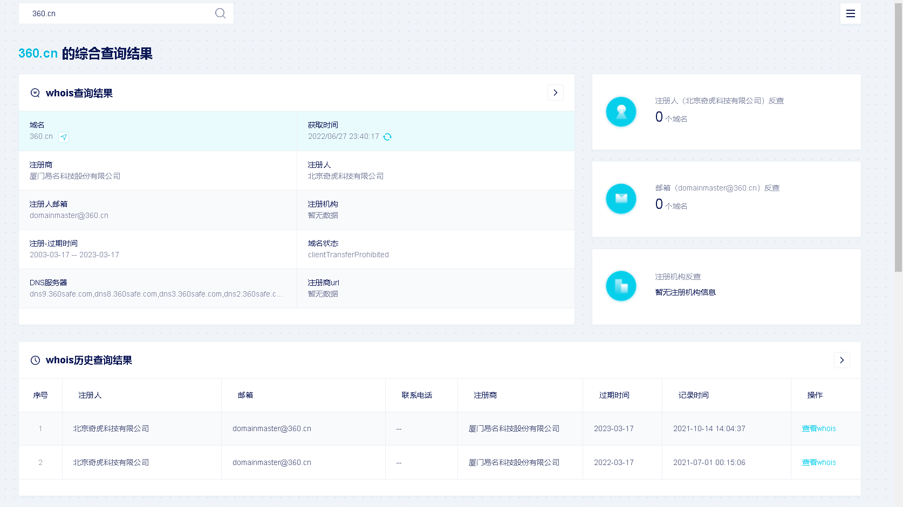

> ps:
> 
> - 部分whois查询存在隐藏信息，可以在其他站点查询。
> - whois主要还是注册商、注册人、邮件、DNS 解析服务器、注册人联系电话。
> - 由于GDRP，ICANN要求所有域名注册商必须对域名whois隐私信息进行保护，所以whois信息越来越少……但还是会存在一些whois域名系统是旧缓存数据。

### 3. IP反查

> ps:
> 
> - 目标可能存在多个域名绑定于同一ip上，通过ip反查可以获取到其他域名信息。比如旁站。
>     
>     
>     - *通过获取目标真实IP后，进行反查的旁站更真实。*
> - 查询站点需复杂性，单一的站点会有反查不出信息的可能。
>     
>     
>     - *大型企业不同的站点收录可能不一样*
>     - *个人推荐3个不同站点反查*

#### 如何查询

**在线查询网站**：

- [同IP网站查询，同服务器网站查询 - 站长工具](http://s.tool.chinaz.com/same)
- [Dnslytics](https://dnslytics.com/)
- [iP或域名查询](https://site.ip138.com/)

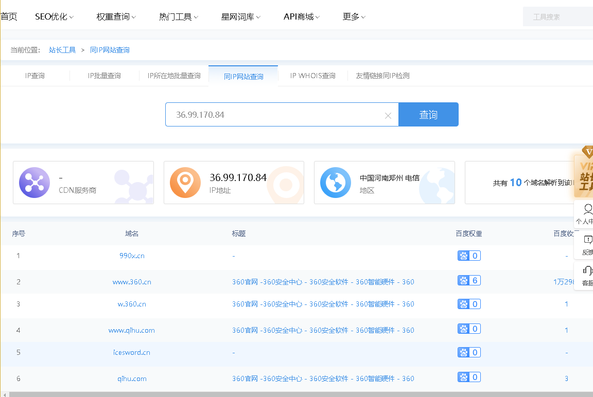

**搜索引擎**：

- shodan
- bing
- fofa

### 4. HOST碰撞

信息收集过程中，往往会因为配置错误或是未及时回收等原因，存在一些隐形资产。直接访问的话会出现访问限制的问题，如下：

- ip访问响应多为：nginx、4xx、500、503、各种意义不明的Route json提示等

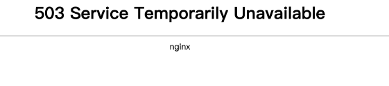


- 域名解析后到内网地址
- 有服务器真实 IP，但找不到内网域名。

究其原因，大多数是因为中间件对ip访问做限制，不能通过ip直接访问，必须使用域名进行访问。如果域名解析记录里也找不到域名记录，这时就可以用到HOST碰撞技术，通过将域名和IP进行捆绑碰撞，一旦匹配到后端代理服务器上的域名绑定配置，就可以访问到对应的业务系统，从而发现隐形资产。

**手法：**

使用收集到的目标IP、爬虫或自定义的内部域名（内网host池），作为字典，通过脚本进行碰撞，脚本会自动模拟绑定ip与host进行请求交互，通过标题或响应大小判断结果。只要字典够强大，总能出一两个，爆破时最好也试下TLS，部分主机会使用TLS的。

验证结果，只需修改本机`host文件`绑定host与ip后，看访问变化。

**自动化**：

- [灯塔](https://github.com/TophantTechnology/ARL)
- [水泽](https://github.com/0x727/ShuiZe_0x727)
- <https://github.com/cckuailong/hostscan>
- [https://github.com/fofapro/Hosts_scan](https://github.com/fofapro/Hosts_scan)
- [https://github.com/smxiazi/host_scan](https://github.com/smxiazi/host_scan)

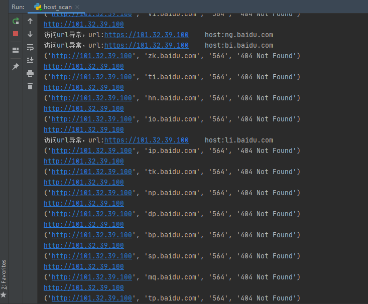

### 5. DNS共享记录

##### 关于DNS

DNS（Domain Name Server，域名服务器）是进行域名(domain name)和与之相对应的IP地址 (IP address)转换的服务器。DNS中保存了一张域名(domain name)和与之相对应的IP地址 (IP address)的表，以解析消息的域名，即保存了**IP地址**和**域名**的相互映射关系。域名是Internet上某一台计算机或计算机组的名称，用于在数据传输时标识计算机的电子方位（有时也指地理位置）。域名是由一串用点分隔的名字组成的，通常包含组织名，而且始终包括两到三个字母的后缀，以指明组织的类型或该域所在的国家或地区。也正是因为DNS的存在，访问相应服务只需记住域名，不需要记住无规则的ip地址。

- DNS服务器端口: tcp/udp 53。
- 常用DNS记录：
    
    | 记录类型 | 说明 |
    |---|---|
    | A 记录 | 将域名指向一个 IP 地址（外网地址）。 |
    | CNAME 记录 | 将域名指向另一个域名，再由另一个域名提供 IP 地址（外网地址）。 |
    | MX 记录 | 电子邮件交换记录，记录一个邮件域名对应的IP地址，设置邮箱，让邮箱能收到邮件。 |
    | NS 记录 | 域名服务器记录，记录该域名由哪台域名服务器解析。如将子域名交给其他 DNS 服务商解析。 |
    | AAAA 记录 | 将域名指向一个 IPv6 地址。 |
    | SRV 记录 | 用来标识某台服务器使用了某个服务，常见于微软系统的目录管理。 |
    | TXT 记录 | 对域名进行标识和说明，绝大多数的 TXT 记录是用来做 SPF 记录（反垃圾邮件）。 |

##### 利用价值

可以通过查询共享DNS服务器的主机来获取到相关的域名，一般多是用于自建DNS服务器。如果是公开的DNS服务器，那么查询的效果将会特别差。

##### 手法

- 查询目标是否存在自建的NS服务器

```bash
nslookup -query=ns baidu.com 8.8.8.8
```

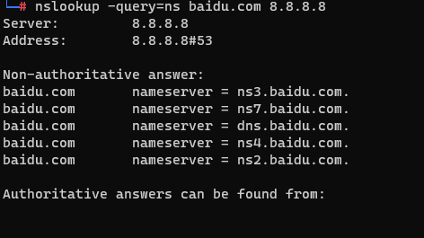

- 将获取到的NS服务器带入 <https://hackertarget.com/find-shared-dns-servers/> 进行查询

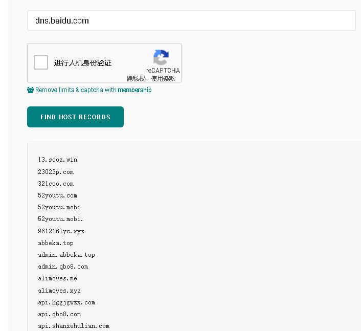

### 6. Google

直接搜索目标相关关键内容来查询，比如公司名、备案、引用的特殊js等。

搜索引擎很多，这里以Google为例：

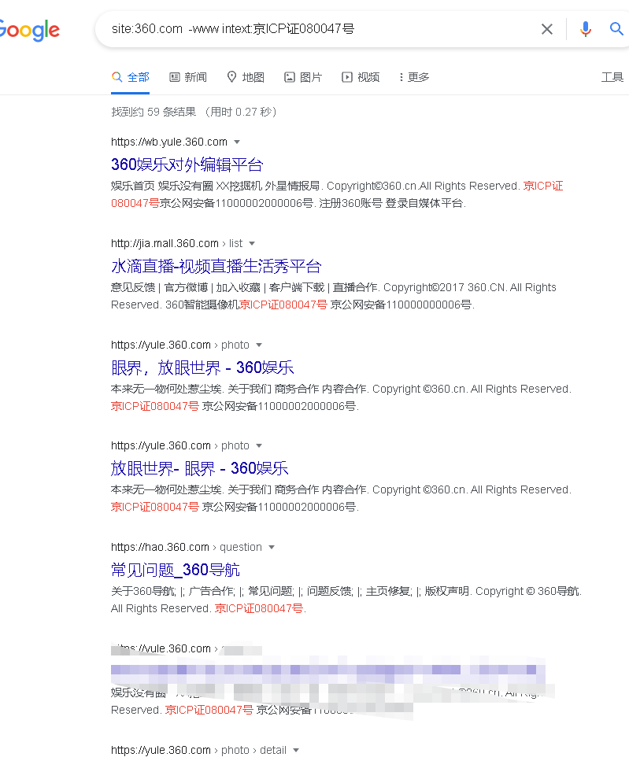

### 7. 配置信息

由于信息泄露问题，某些配置或文件会存储一些目标相关的域名，如子域名、代码托管平台等，一般来说存储信息有限且不应公网存在此类文件。

**策略文件域名信息问题如：**

- crossdomain.xml文件
    
    
    - 通常域名直接拼接crossdomain.xml路径
    
    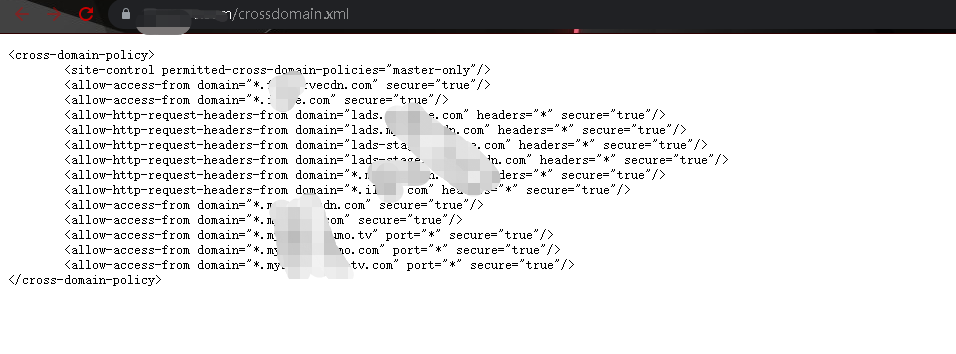
- sitemap文件
    
    站点地图文件，常见如：
    
    
    - sitemap.xml、sitemap.txt、sitemap.html、sitemapindex.xml、sitemapindex.xml路径
    
    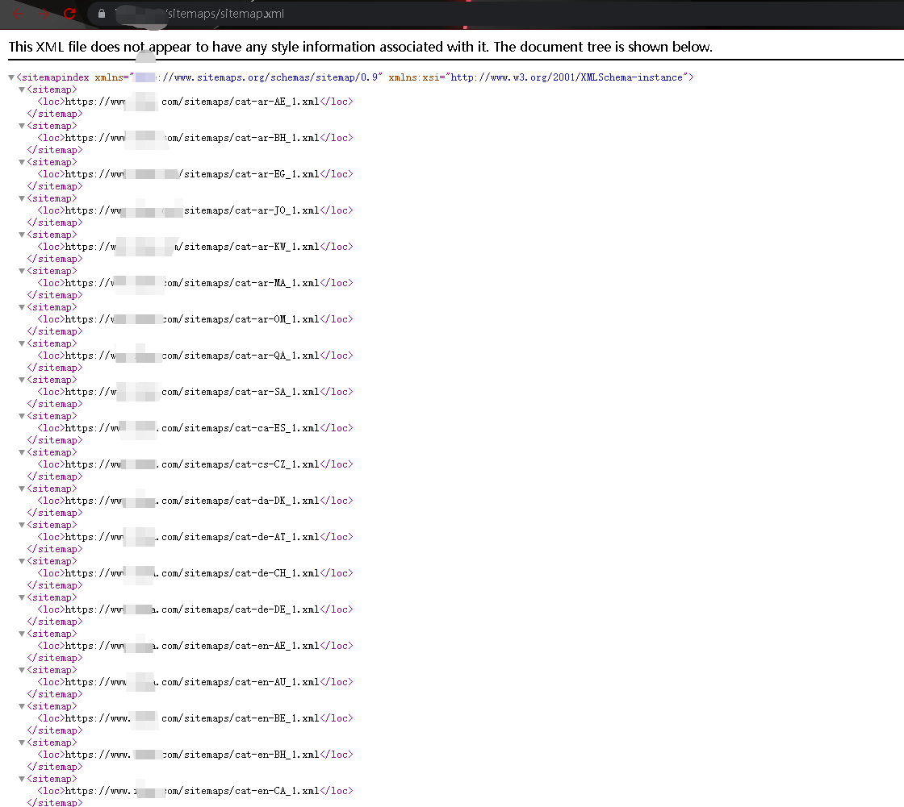

**策略配置方面如**：

- 内容安全策略（CSP，Content Security Policy)

这是一种声明的安全机制，可以让网站运营者能够控制遵循CSP的用户代理（通常是浏览器）的行为。通过控制要启用哪些功能，以及从哪里下载内容，可以减少网站的攻击面。CSP的主要目的是防御跨站点脚本（cross-ste scripting，XSS）攻击。例如，CSP可以完全禁止内联的JavaScript，并且控制外部代码从哪里加载。它也可以禁止动态代码执行。禁用了所有的攻击源，XSS攻击变得更加困难。CSP中的关键字有default-src、img-src、object-src和script-src。其中\*-src可能会存在域名信息。

关键点：

HTTP header的`Content-Security-Policy`属性

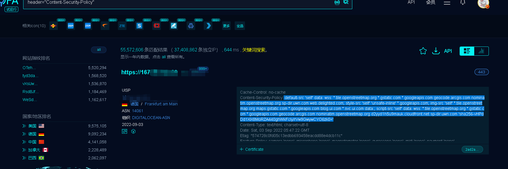

### 8. 众测

补天、漏洞银行、先知、hackerone等众测的广商提供的域名测试范围。

比如hackerone：alibaba

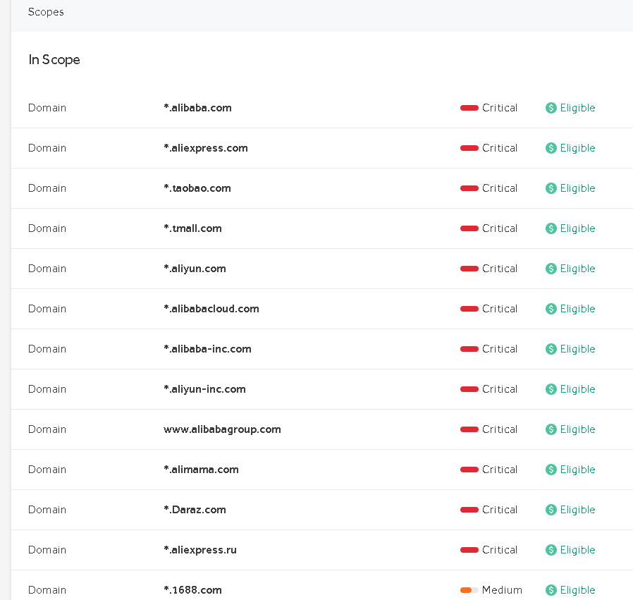

### 9. 企业资产信息

通过企业名称拓展查询目标企业的组织架构、股权信息、股权穿透图、子公司、孙公司、对外投资50%等目标信息，获取其产品业务、域名、邮箱资产范围等，扩大攻击面。大概企业资产收集点如下：

- 企业数据：
    
    
    - 邮箱收集
        
        
        - 邮箱查询：<https://hunter.io/>
    - 企业架构画像
    - 直属单位、机构设置、供应商*（相关合同、人员、系统、软件等）*、合作商等
    - 业务信息：证券、快递、专用网、院校等
- 人员数据，如统计、职责、部门、人员历史泄露密码、浏览习性等
- 设备信息：
    
    
    - WiFi
    - 常用密码、部门设备信息
    - OA/erp/crm/sso/mail/vpn等入口
    - 网络安全设备（waf,ips,ids,router等统计）
    - 内部使用的代码托管平台(gitlab、daocloud等)、bug管理平台、监控平台等
    - 服务器域名资产
    - site:xxx

#### 股权投资信息

一般要求50%持股或者100% 持股都可以算测试目标。

1. **天眼查**

<https://www.tianyancha.com/>

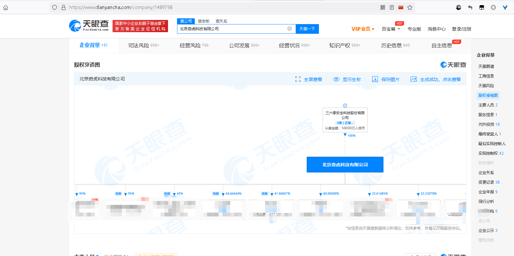

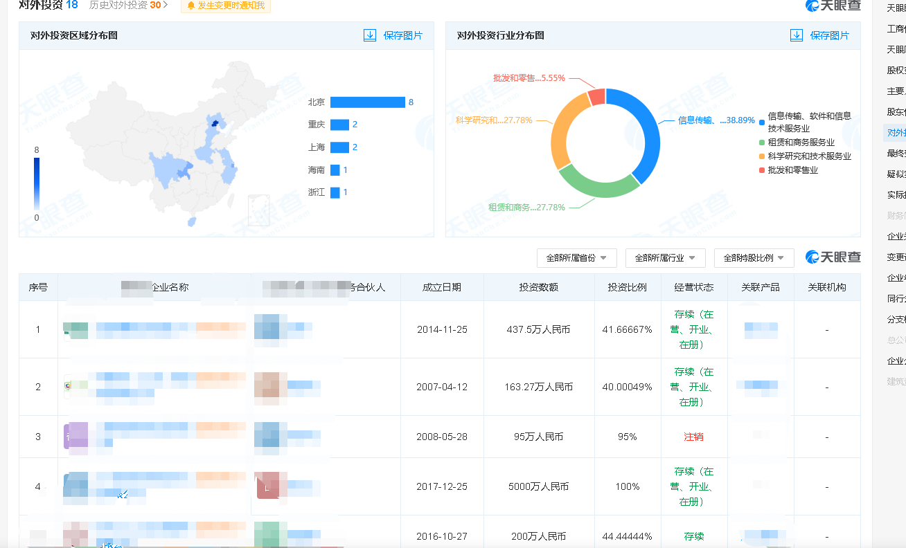

2. **企查查**

<https://www.qcc.com/>

3. **钉钉企典**

<https://www.dingtalk.com/qidian/home?spm=a213l2.13146415.4929779444.89.7f157166W6H4YZ>

#### 公众号信息

1. **搜狗搜索引擎**

<https://wx.sogou.com/>

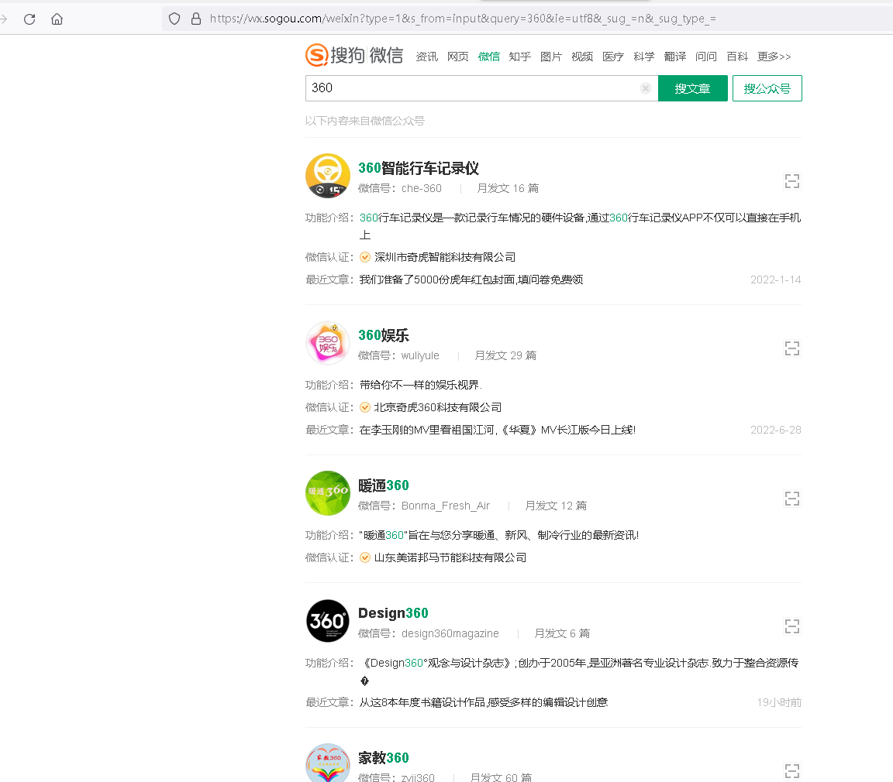

2. 企查查

<https://www.qcc.com/>

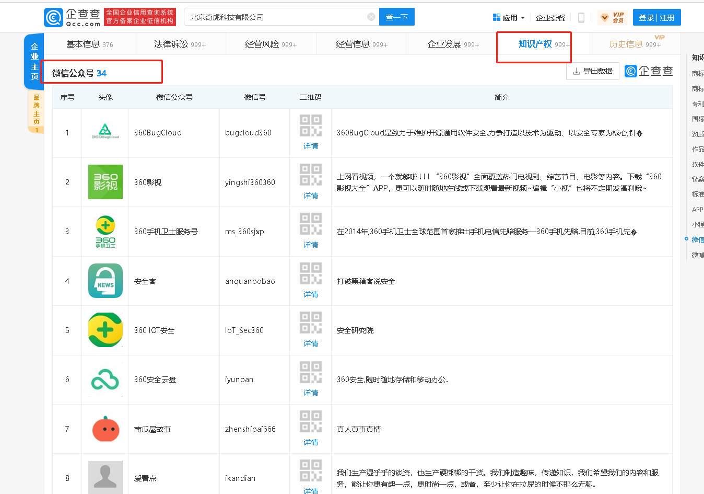

#### 小程序

1. 企查查

<https://www.qcc.com/>

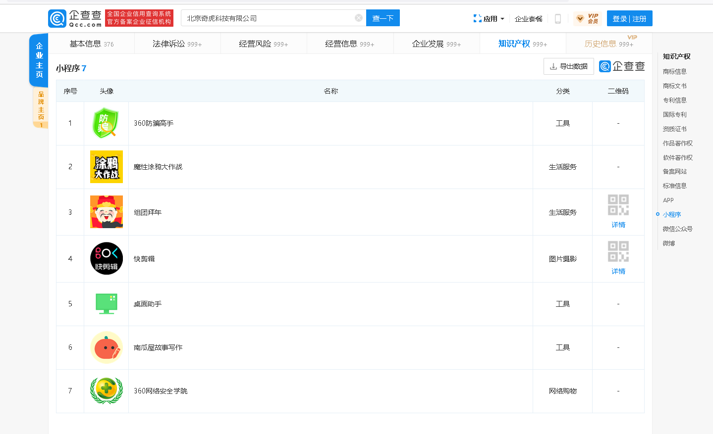

2. 微信app
3. 支付宝app

#### 应用信息

1. **天眼查**

<https://www.tianyancha.com/>

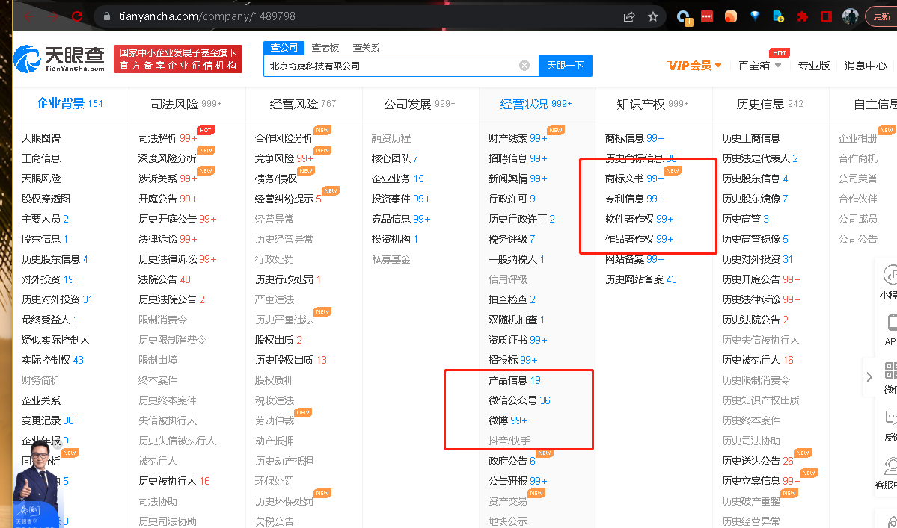

2. **七麦数据**

<https://www.qimai.cn/>

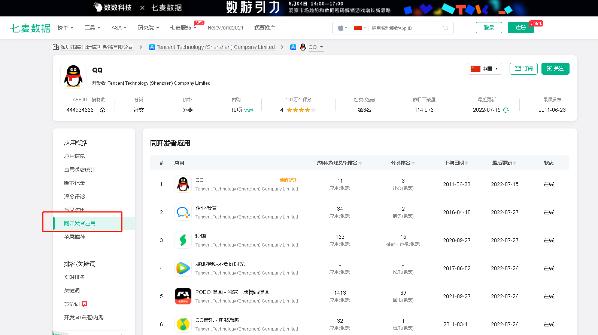

3. **企查查**：

<https://www.qcc.com/>

4. **小蓝本**

<https://www.xiaolanben.com/pc>

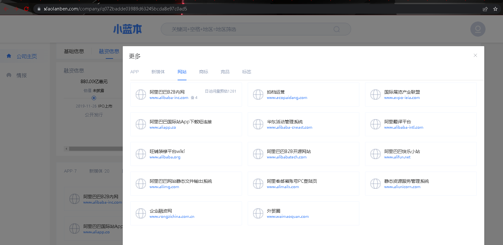

5. **点点数据**

<https://app.diandian.com/>

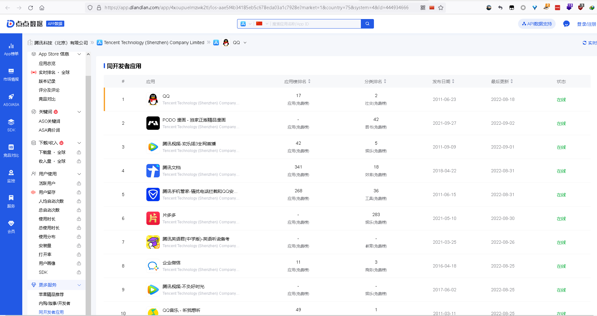

6. **豌豆荚**

<https://www.wandoujia.com/>

方便获取app历史版本

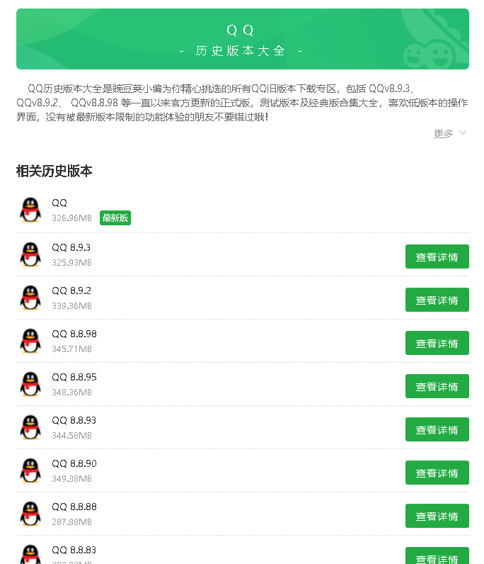

#### 关于工具

- **ENScanGo**

[https://github.com/wgpsec/ENScan_GO](https://github.com/wgpsec/ENScan_GO)

> 由狼组安全团队的 Keac 师傅写的专门用来解决企业信息收集难的问题的工具，可以一键收集目标及其控股公司的 ICP 备案、APP、小程序、微信公众号等信息然后聚合导出。

0x02 子域名信息
----------

子域名一般是父级域名的下一级。一般企业主站域名的防护都是重点，安全级别较高，突破难度较大，而企业可能会有数十个甚至更多的子域名应用，因为数量众多，安全因素和成本投入多，相应的防护也没有那么及时有效。子域名往往是攻击突破口，通过子域名发现更多的可能性或是进行迂回攻击。

**子域名信息点**：

- 子域名包含一些常见资产类型：办公系统，邮箱系统，论坛，商城等。而其他管理系统，网站管理后台等较少出现在子域名中。
- 一般情况下，相同类型漏洞可能存在同一组织的不同的域名/应用程序中。
- 子域名系统维护成本、用户群体等，一般少于主域名，会存在一些版本迭代、配置不安全、弱密码账号管理策略等。
- 子域名探测发现更多的服务，增加漏洞发现的可能性。

### 1. 枚举爆破

#### 手法介绍

要说简单粗暴还是子域名枚举爆破，通过不断的拼接`字典`中的子域名前缀去枚举域名的A记录进行`DNS解析`，如果成功解析说明子域名存在。如xxx.com拼接前缀test组合成test.xxx.com，再对其进行验证。但是域名如果使用`泛解析`的话，则会导致所有的域名都能成功解析，使得子域名枚举变得不精准。

`nslookup`验证下~

- 泛解析域名，成功解析不存在的域名。

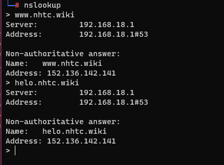

- 普通解析，不存在的域名解析会失败。

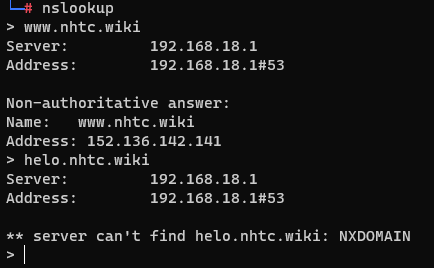

> - 泛解析：使用通配符 `*` 来匹配所有的子域名，从而实现所有的子级域名均指向相同网站空间。
>     
>     
>     - 会存在域名劫持、域名恶意泛解析风险
>     - 会主站被降权，可能被恶意利用，占用大量流量
>     - 关于恶意解析：
>         
>         <https://cloud.tencent.com/developer/article/1494534?from=article.detail.1874625>
> - 混合泛解析：在泛解析的基础上，增加一个限制，使记录可以按照需求进行分类。
>     
>     <https://cloud.tencent.com/document/product/302/9073>

- <https://github.com/Q2h1Cg/dnsbrute/blob/v2.0/dict/53683.txt>)

#### 关于泛解析

那么域名使用了泛解析怎么去解决呢？

一般有两种：

- 黑名单ip：
    
    
    - 通过获取一个不存在的子域名相应解析IP，来记录标记黑名单ip，再爆破字典时，解析到的IP在这个黑名单ip中，则跳过，不存在就继续处理。
    - 或是记录相同的，保留一到两个。
- TTL
    
    
    - 在权威 DNS 中，泛解析记录的 TTL 肯定是相同的，如果子域名记录相同，但 TTL 不同，那这条记录可以说肯定不是泛解析记录。
- 响应内容
    
    
    - 牺牲速度，先获取一个绝对不存在域名的响应内容，再遍历获取每个字典对应的子域名的响应内容，通过和不存在域名的内容做相似度比对，来枚举子域名。

#### **枚举爆破常用工具：**

在线查询：

- <https://phpinfo.me/domain/>
    
    
    - 速度不错
- <https://chaziyu.com/>
    
    
    - 子域、备案都可以查

其他：

- [Layer 子域名挖掘机](https://github.com/euphrat1ca/LayerDomainFinder)
    
    
    - 可视化，取决于字典强度，易上手，就是容易崩溃
- [subDomainsBrute](https://github.com/lijiejie/subDomainsBrute)
    
    
    - 老牌DNS爆破工具，稳定快速~
    - 暂不支持批量
    - **怼泛解析**：超过10个域名指向同一IP，则此后发现的其他指向该IP的域名将被丢弃，该方法可能存在误删，但简单有效。
- [OneForAll](https://github.com/shmilylty/OneForAll)
    
    
    - 收集姿势挺全的，就是依赖多，一直再更新
    - OneForALL + ESD + JSfinder~~
    - **怼泛解析**：oneforall会首先访问一个随机的并不存在的域，通过返回结果判断是否存在泛解析，确定存在泛解析以后，程序会开始不断的循环产生随机域名，去向服务器查询，将每次查询到的IP和TTL记录下来，直到大部分的IP地址出现次数都大于两次，则IP黑名单的收集结束，在得到了IP黑名单以后，oneforall接下来会将自己的字典中的每一项和要指定查询的域名进行拼接。在爆破过程中根据IP黑名单进行过滤。但这种宽泛的过滤容易导致漏报，所以oneforall将 TTL 也作为黑名单规则的一部分，评判的依据是：在权威 DNS 中，泛解析记录的 TTL 肯定是相同的，如果子域名记录相同，但 TTL 不同，那这条记录可以说肯定不是泛解析记录。
- [knock](https://github.com/guelfoweb/knock)
    
    
    - 支持查询VirusTotal，速度快，结果一般
    - VirusTotal API绕过泛解析
- [ESD](https://github.com/FeeiCN/ESD)
    
    
    - 收集方法多，爆破速度极快，接口少
    - **怼泛解析**：基于文本相似度过滤泛解析域名
- [**ksubdomain**](https://github.com/boy-hack/ksubdomain)
    
    
    - 无状态的子域名爆破工具,支持重放，速度不错
    - 结合其他工具，一键子域名搜集验证：
    
    <https://cn-sec.com/archives/1178685.html>
- [xray 高级版](https://github.com/chaitin/xray/releases)
    
    
    - 效率可以，联动很舒服

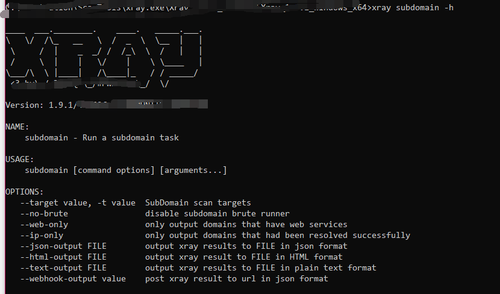

#### 关于字典

> 字典这块引用下<https://feei.cn/esd/>

**DNS服务商的字典**一般来说最准确有效，如：DNSPod公布的使用最多的子域名：[dnspod-top2000-sub-domains.txt](https://github.com/DNSPod/oh-my-free-data/blob/master/src/dnspod-top2000-sub-domains.txt)

**普通字典**：一些基础组合。

- 单字母：f.feei.cn（大都喜欢短一点的域名，单字符的最为常见）
- 单字母+单数字：s1.feei.cn
- 双字母：sd.feei.cn（大都喜欢业务的首字母缩写）
- 双字母+单数字：ss1.feei.cn
- 双字母+双数字：ss01.feei.cn
- 三字母：[www.feei.cn](www.feei.cn)（部分业务名称为三个字）
- 四字母：webp.feei.cn（部分业务名称为四个字）
- 单数字：1.feei.cn
- 双数字：11.feei.cn
- 三数字：666.feei.cn

**常用词组**：常见的中英文词组。

- fanyi.feei.cn（中）tranlate.feei.cn（英）
- huiyuan.feei.cn（中）member.feei.cn（英）
- tupian.feei.cn（中）picture.feei.cn（英）

**爆破工具的字典**: 可结合整理过的字典

- [subbrute](https://github.com/TheRook/subbrute): [names_small.txt](https://github.com/TheRook/subbrute/blob/master/names_small.txt)
- [subDomainsBrute](https://github.com/lijiejie/subDomainsBrute): [subnames_full.txt](https://github.com/lijiejie/subDomainsBrute/blob/master/dict/subnames_full.txt)
- [dnsbrute](https://github.com/Q2h1Cg/dnsbrute): [53683.txt](https://github.com/Q2h1Cg/dnsbrute/blob/v2.0/dict/53683.txt)

### 2. DNS域传送

DNS服务器分为：主服务器、备份服务器和缓存服务器。

在主备服务器之间同步数据库，需要使用“DNS域传送”的一种DNS事务。**域传送**是指备份服务器从主服务器上复制数据，然后更新自身的数据库，以达到数据同步的目的，这样是为了增加冗余，一旦主服务器出现问题可直接让备份服务器做好支撑工作。

若DNS配置不当，可能导致匿名用户获取某个域的所有记录。造成整个网络的拓扑结构泄露给潜在的攻击者，包括一些安全性较低的内部主机，如测试服务器。凭借这份网络蓝图，攻击者可以节省很少的扫描时间。

- 错误配置：只要收到`axfr`请求就进行域传送，刷新数据。

#### 检测方法：

`axfr` 是q-type类型的一种，axfr类型是`Authoritative Transfer`的缩写，指请求传送某个区域的全部记录。只要欺骗dns服务器发送一个`axfr`请求过去，如果该dns服务器上存在该漏洞，就会返回所有的解析记录值。

##### **nslookup**

```bash
# 查询nameserver  
nslookup -type=ns nhtc.wiki 8.8.8.8  
# 指定nameserver，列举域名信息  
nslookup  
# Server 命令参数设定查询将要使用的DNS服务器  
server cloudy.dnspod.net   
#  Ls命令列出某个域中的所有域名  
ls nhtc.wiki
```

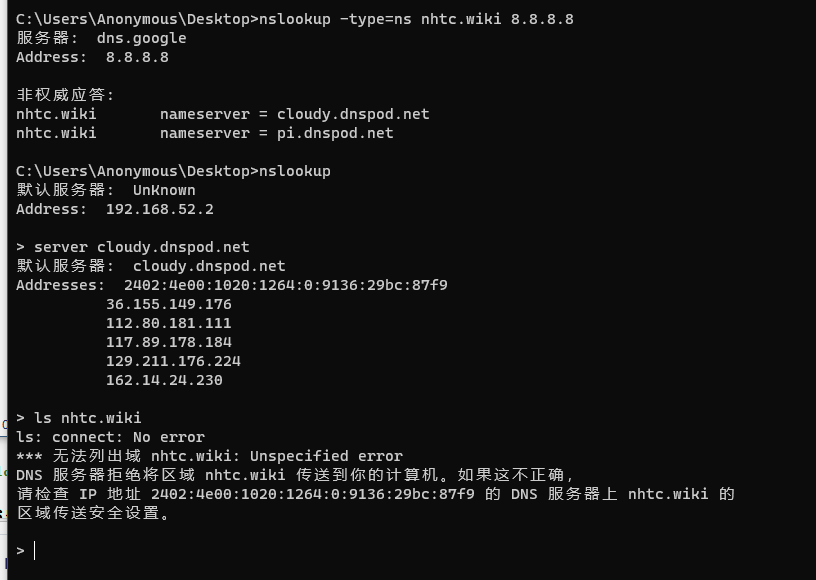

> 无法列出域，不存在此漏洞~

##### **Dig**

```bash
# 找到NS服务器  
dig nhtc.wiki ns
```

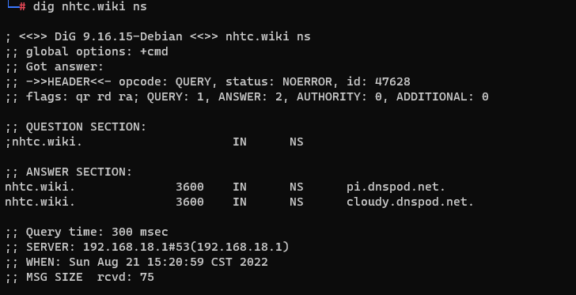

```bash
# 发送axfr请求  
 dig axfr @cloudy.dnspod.net nhtc.wiki
```

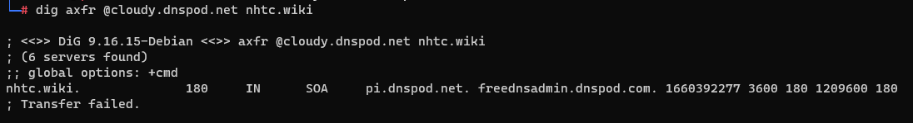

##### 其他

**nmap:**

```bash
nmap --script dns-zone-transfer --script-args dns-zone-transfer.domain=nhtc.wiki -p 53 -Pn cloudy.dnspod.net
```

**python**

```bash
# DNS库  
xfr = dns.query.xfr(where=server, zone=self.domain, timeout=5.0, lifetime=10.0)  
zone = dns.zone.from_xfr(xfr) 
```

> 一般情况下，DNS服务器配置都正常，关闭了域传送或设置白名单，利用率低。推荐交给自动化。

### 3. 证书透明度收集子域

> 证书透明度（Certificate Transparency）是谷歌力推的一项拟在确保证书系统安全的透明审查技术。其目标是提供一个开放的审计和监控系统，可以让任何[域名](https://dnspod.cloud.tencent.com/)的所有者，确定CA证书是否被错误签发或恶意使用。TLS的缺点是你的浏览器隐性包含了一个大型受信任CA列表。如果任何这些CA恶意为域创建新证书，则你的浏览器都会信任它。CT为TLS证书信任提供了额外的安全保障：即公司可以监控谁为他们拥有的域创建了证书。此外，它还允许浏览器验证给定域的证书是否在公共日志记录中。
> 
> ————————[Google 的证书透明度项目](https://www.certificate-transparency.org/)

因为证书透明性是开放架构，可以检测由证书颁发机构错误颁发的 SSL 证书，也可以识别恶意颁发证书的证书颁发机构，且任何人都可以构建或访问，CA证书又包含了`域名、子域名、邮箱`等敏感信息，价值就不言而喻了。

#### 收集方法：

一般使用 CT 日志搜索引擎进行域名信息收集，因为是日志收集，只增不减，可能会有一些失效域名。

##### **在线查询：**

- [crtsh](https://crt.sh/)

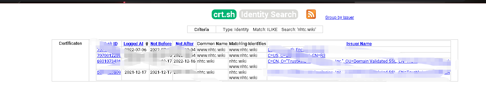

- [entrust](https://www.entrust.com/ct-search/)
- [censys](https://censys.io/certificates)
- [facebook（需要登录）](https://developers.facebook.com/tools/ct/)
- [spyse](https://spyse.com/search/certificate)
- [certspotter（每小时免费查100次）](https://sslmate.com/certspotter/api/)

##### **浏览器查询**

点击浏览器网站小锁-->安全连接-->更多信息-->查看证书-->查看主题替代名称处，有时候会有主域名和子域名信息。

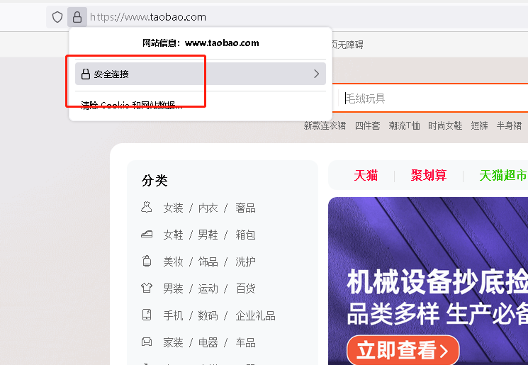

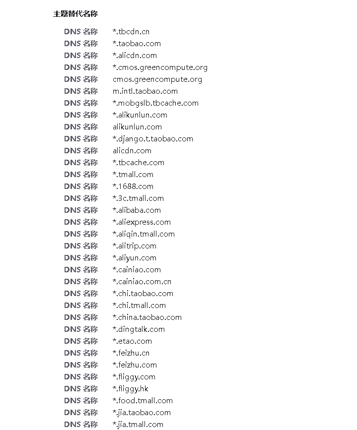

##### **工具：**

- [ctfr](https://github.com/UnaPibaGeek/ctfr)
- [OneForAll](https://github.com/shmilylty/OneForAll)

### 4. 公开数据集

利用已有公开的全网扫描数据集，对子域名信息进行收集。

- [Rapid7的开源数据项目](https://opendata.rapid7.com/)
- [threatcrowd](https://www.threatcrowd.org/)

收集方法：

- [Find DNS Host Records (Subdomains) | hackertarget](https://hackertarget.com/find-dns-host-records/)
- [netcraft](https://searchdns.netcraft.com/)
- 命令进行快速查找
    
    ```bash
    wget https://scans.io/data/rapid7/sonar.fdns_v2/20170417-fdns.json.gz  
    cat 20170417\-fdns.json.gz | pigz \-dc | grep ".target.org" | jq\`
    ```

### 5. 第三方聚合服务

通过第三方平台提供的一些服务，快速发现子域名信息。

- [VirusTotal](https://www.virustotal.com/gui/home/search)

> VirusTotal会运行DNS复制功能，通过存储用户访问URL时执行的DNS解析来构建数据库。

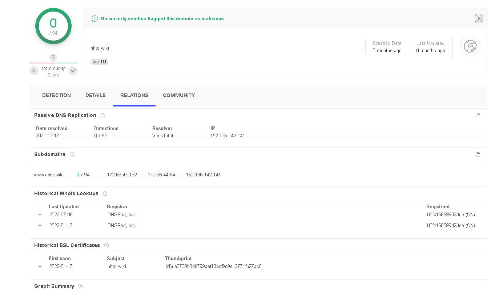

- [Find DNS Host Records | Subdomain Finder | HackerTarget.com](https://hackertarget.com/find-dns-host-records/)
- [netcraft](https://searchdns.netcraft.com/)
- [DNSdumpster.com](https://dnsdumpster.com/)
- [域名查iP 域名解析 iP查询网站 iP反查域名 iP反查网站 同一iP网站 同iP网站域名iP查询](https://site.ip138.com/)
- [threatminer](https://www.threatminer.org/index.php)
- [Subdomain Finder](https://spyse.com/tools/subdomain-finder)
- [threatbook（需要高级权限）](https://x.threatbook.cn/)
- [子域名查询 - 站长工具（需要登录）](http://tool.chinaz.com/subdomain/?domain=)
- [namecheap](https://decoder.link/)
- 其他工具：
    
    
    - [Sublist3r](https://github.com/aboul3la/Sublist3r)
    - [OneForAll](https://github.com/shmilylty/OneForAll)

### 6. 搜索引擎

#### 介绍

搜索引擎是用于查找和排名与用户搜索匹配的 Web 内容的工具。

搜索引擎通过“蜘蛛”对全网进行大量爬行并处理后，建立索引*（索引是将抓取页面中的信息添加到叫做搜索索引的大型数据库中。）*。在此期间往往收集了大量的域名信息，需要对应的语法，即可从这数据库中获取想要的信息。

#### 搜索方法：

##### 主流搜索引擎

一份国外调查表：

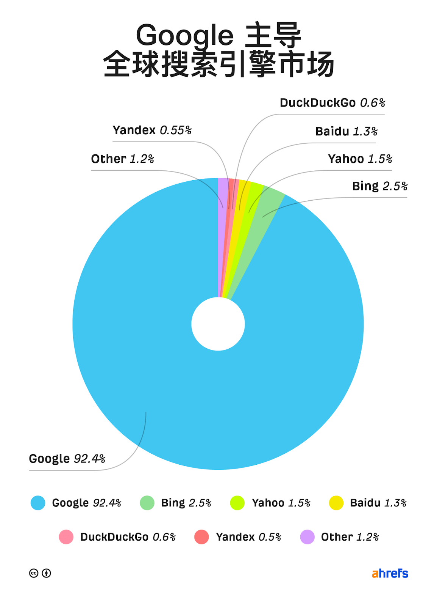

###### Goolge：

俗称Google Hacking 大法，有十几种语法，混合使用可以更加准确地查找信息。

- Google检索技巧大全: <https://sites.google.com/site/hopeanwang/google%E6%A3%80%E7%B4%A2%E6%8A%80%E5%B7%A7%E5%A4%A7%E5%85%A8>

**搜索子域名信息**

```php
site:360.cn
```

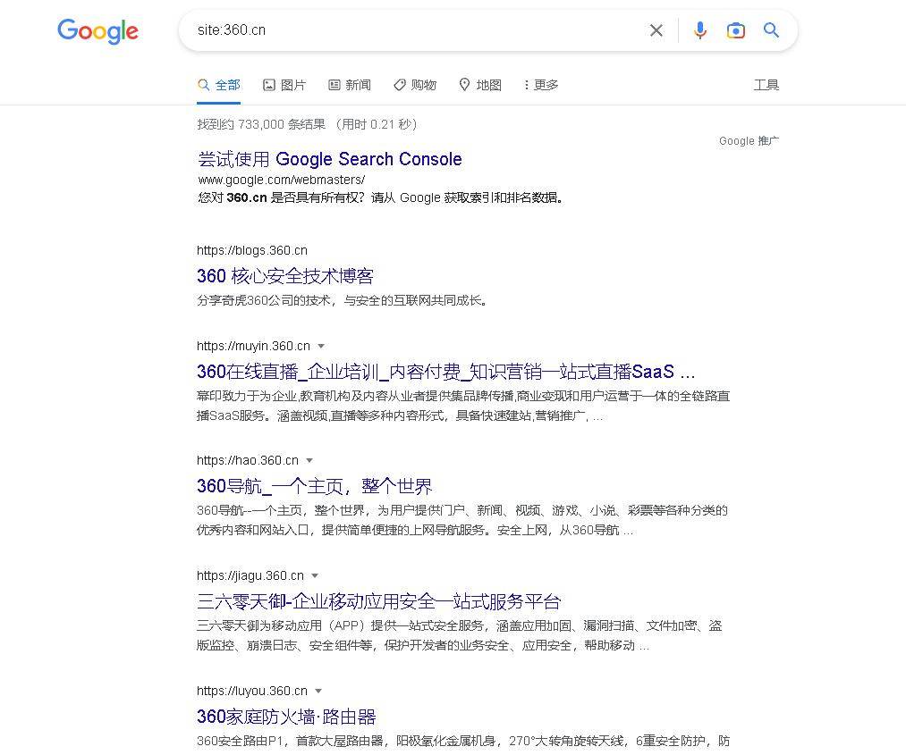

**搜索一个域名后台信息**

```php
site:xx.com inurl:id=1  intext:后台 
```

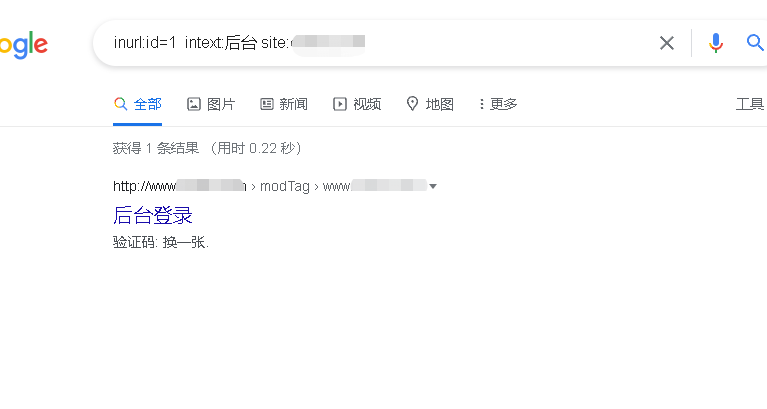

##### **网络空间引擎**

###### [fofa](https://fofa.info/)

FOFA是白帽汇推出的一款网络空间搜索引擎，它通过进行网络空间测绘，能够帮助研究人员或者企业迅速进行网络资产匹配，例如进行[漏洞](https://www.77169.net/ld)影响范围分析、应用分布统计、应用流行度排名统计等。

| 逻辑连接符 | 具体含义 |
|---|---|
| = | 匹配，=""时，可查询不存在字段或者值为空的情况 |
| == | 完全匹配，==""时，可查询存在且值为空的情况 |
| &amp;&amp; | 与 |
| \| | 或者 |
| != | 不匹配，!=""时，可查询值为空的情况 |
| ~= | 正则语法匹配专用（高级会员独有，不支持body） |
| () | 确认查询优先级，括号内容优先级最高 |

目前FOFA支持了多个网络组件的指纹识别，包括建站模块、分享模块、各种开发框架、安全监测平台、项目管理系统、企业管理系统、视频监控系统、站长平台、电商系统、广告联盟、前端库、路由器、SSL证书、服务器管理系统、CDN、Web服务器、WAF、CMS等等，详细信息见<https://fofa.info/library>

**常用语法可通过”查询语法“功能获取：**

<https://fofa.info/>

例句(点击可去搜索)用途说明注

| 例句(点击可去搜索) | 用途说明 | 注 |
|---|---|---|
| [title="beijing"](https://fofa.so/result?qbase64=dGl0bGU9ImJlaWppbmci) | 从标题中搜索“北京” | - |
| [header="jboss"](https://fofa.so/result?qbase64=aGVhZGVyPSJqYm9zcyI%3D) | 从http头中搜索“jboss” | - |
| [body="Hacked by"](https://fofa.so/result?qbase64=Ym9keT0iSGFja2VkIGJ5Ig%3D%3D) | 从html正文中搜索abc | - |
| [domain="qq.com"](https://fofa.so/result?qbase64=ZG9tYWluPSJxcS5jb20i) | 搜索根域名带有qq.com的网站。 | - |
| [icon_hash="-247388890"](https://fofa.so/result?qbase64=aWNvbl9oYXNoPSItMjQ3Mzg4ODkwIg%3D%3D) | 搜索使用此icon的资产。 | 仅限高级会员使用 |
| [host=".gov.cn"](https://fofa.so/result?qbase64=aG9zdD0iLmdvdi5jbiI%3D) | 从url中搜索”.gov.cn” | 搜索要用host作为名称 |
| [port="443"](https://fofa.so/result?qbase64=cG9ydD0iNDQzIg%3D%3D) | 查找对应“443”端口的资产 | - |
| [ip="1.1.1.1"](https://fofa.so/result?qbase64=aXA9IjEuMS4xLjEi) | 从ip中搜索包含“1.1.1.1”的网站 | 搜索要用ip作为名称 |
| [ip="220.181.111.1/24"](https://fofa.so/result?qbase64=aXA9IjIyMC4xODEuMTExLjEvMjQi) | 查询IP为“220.181.111.1”的C网段资产 | - |
| [status_code="402"](https://fofa.so/result?qbase64=c3RhdHVzX2NvZGU9NDAy) | 查询服务器状态为“402”的资产 | - |
| [protocol="https"](https://fofa.so/result?qbase64=cHJvdG9jb2w9Imh0dHBzIg%3D%3D) | 查询https协议资产 | 搜索指定协议类型(在开启端口扫描的情况下有效) |
| [city="Hangzhou"](https://fofa.so/result?qbase64=Y2l0eT0iSGFuZ3pob3Ui) | 搜索指定城市的资产。 | - |
| [region="Zhejiang"](https://fofa.so/result?qbase64=cmVnaW9uPSJaaGVqaWFuZyI%3D) | 搜索指定行政区的资产。 | - |
| [country="CN"](https://fofa.so/result?qbase64=Y291bnRyeT0iQ04i) | 搜索指定国家(编码)的资产。 | - |
| [cert="google"](https://fofa.so/result?qbase64=Y2VydD0iZ29vZ2xlIg%3D%3D) | 搜索证书(https或者imaps等)中带有google的资产。 | - |
| [banner=users &amp;&amp; protocol=ftp](https://fofa.so/result?qbase64=YmFubmVyPXVzZXJzICYmIHByb3RvY29sPWZ0cA%3D%3D) | 搜索FTP协议中带有users文本的资产。 | - |
| [type=service](https://fofa.so/result?qbase64=dHlwZT1zZXJ2aWNl) | 搜索所有协议资产，支持subdomain和service两种。 | 搜索所有协议资产 |
| [os=windows](https://fofa.so/result?qbase64=b3M9d2luZG93cw%3D%3D) | 搜索Windows资产。 | - |
| [server=="Microsoft-IIS/7.5"](https://fofa.so/result?qbase64=c2VydmVyPT0iTWljcm9zb2Z0LUlJUy83LjUi) | 搜索IIS 7.5服务器。 | - |
| [app="HIKVISION-视频监控"](https://fofa.so/result?qbase64=YXBwPSJISUtWSVNJT04t6KeG6aKR55uR5o6nIg%3D%3D) | 搜索海康威视设备 | - |
| [after="2017" &amp;&amp; before="2017-10-01"](https://fofa.so/result?qbase64=YWZ0ZXI9IjIwMTciICZhbXA7JmFtcDsgYmVmb3JlPSIyMDE3LTEwLTAxIg%3D%3D) | 时间范围段搜索 | - |
| [asn="19551"](https://fofa.so/result?qbase64=YXNuPSIxOTU1MSI%3D) | 搜索指定asn的资产。 | - |
| [org="Amazon.com, Inc."](https://fofa.so/result?qbase64=b3JnPSJBbWF6b24uY29tLCBJbmMuIg%3D%3D) | 搜索指定org(组织)的资产。 | - |
| [base_protocol="udp"](https://fofa.so/result?qbase64=YmFzZV9wcm90b2NvbD0idWRwIg%3D%3D) | 搜索指定udp协议的资产。 | - |
| [is_ipv6=true](https://fofa.so/result?qbase64=aXNfaXB2Nj10cnVl) | 搜索ipv6的资产 | 搜索ipv6的资产,只接受true和false。 |
| [is_domain=true](https://fofa.so/result?qbase64=aXNfZG9tYWluPXRydWU%3D) | 搜索域名的资产 | 搜索域名的资产,只接受true和false。 |
| [ip_ports="80,161"](https://fofa.so/result?qbase64=aXBfcG9ydHM9IjgwLDE2MSI%3D) | 搜索同时开放80和161端口的ip | 搜索同时开放80和161端口的ip资产(以ip为单位的资产数据) |
| [port_size="6"](https://fofa.so/result?qbase64=cG9ydF9zaXplPSI2Ig%3D%3D) | 查询开放端口数量等于"6"的资产 | 仅限FOFA会员使用 |
| [port_size_gt="3"](https://fofa.so/result?qbase64=cG9ydF9zaXplX2d0PSIzIg%3D%3D) | 查询开放端口数量大于"3"的资产 | 仅限FOFA会员使用 |
| [port_size_lt="12"](https://fofa.so/result?qbase64=cG9ydF9zaXplX2x0PSIxMiI%3D) | 查询开放端口数量小于"12"的资产 | 仅限FOFA会员使用 |
| [ip_country="CN"](https://fofa.so/result?qbase64=aXBfY291bnRyeT0iQ04i) | 搜索中国的ip资产(以ip为单位的资产数据)。 | 搜索中国的ip资产 |
| [ip_region="Zhejiang"](https://fofa.so/result?qbase64=aXBfcmVnaW9uPSJaaGVqaWFuZyI%3D) | 搜索指定行政区的ip资产(以ip为单位的资产数据)。 | 搜索指定行政区的资产 |
| [ip_city="Hangzhou"](https://fofa.so/result?qbase64=aXBfY2l0eT0iSGFuZ3pob3Ui) | 搜索指定城市的ip资产(以ip为单位的资产数据)。 | 搜索指定城市的资产 |
| [ip_after="2019-01-01"](https://fofa.so/result?qbase64=aXBfYWZ0ZXI9IjIwMTktMDEtMDEi) | 搜索2019-01-01以后的ip资产(以ip为单位的资产数据)。 | 搜索2019-01-01以后的ip资产 |
| [ip_before="2019-07-01"](https://fofa.so/result?qbase64=aXBfYmVmb3JlPSIyMDE5LTA3LTAxIg%3D%3D) | 搜索2019-07-01以前的ip资产(以ip为单位的资产数据)。 | 搜索2019-07-01以前的ip资产 |

基础了解后，可以试试规则专题，官方有提供相应的指纹、组件查找，包含“数据库专题”、“工控专题”和“区块链专题”。也可以自己提交。

- <https://fofa.info/library>

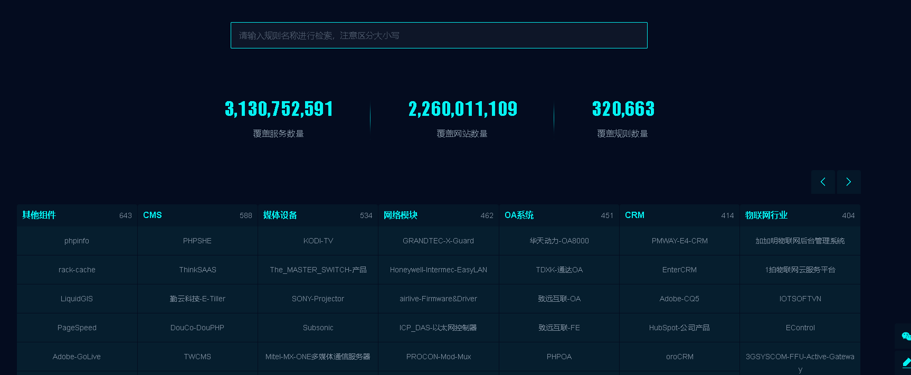

- 查询”致远互联-OA“系统：

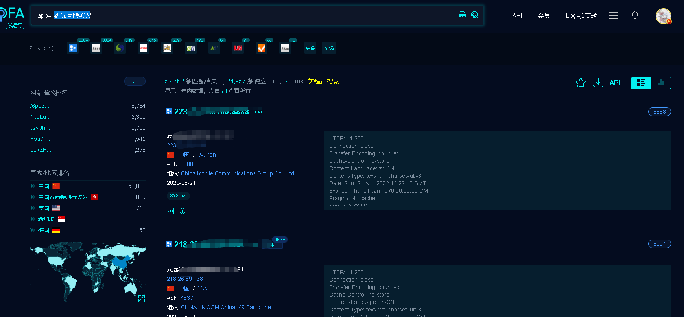

###### [Shodan](https://www.shodan.io/)

Shodan是一个搜索接入互联网的设备的搜索引擎，2009年由约翰·马瑟利发布。学生会员可以每个月下载1w条数据，黑五可能会有优惠价格。

> ps：Shodan 侧重于主机设备

- [规则列表](https://www.shodan.io/explore)


###### [**0.zone**](https://0.zone/)

它是一个免费的外部攻击面管理SaaS平台，供红蓝队使用，为防御者提供攻击者视角下的企业外部攻击面数据，减少攻防信息差，以促进企业攻击面的收敛和管理。

- [语法参考](https://0.zone/grammarList)

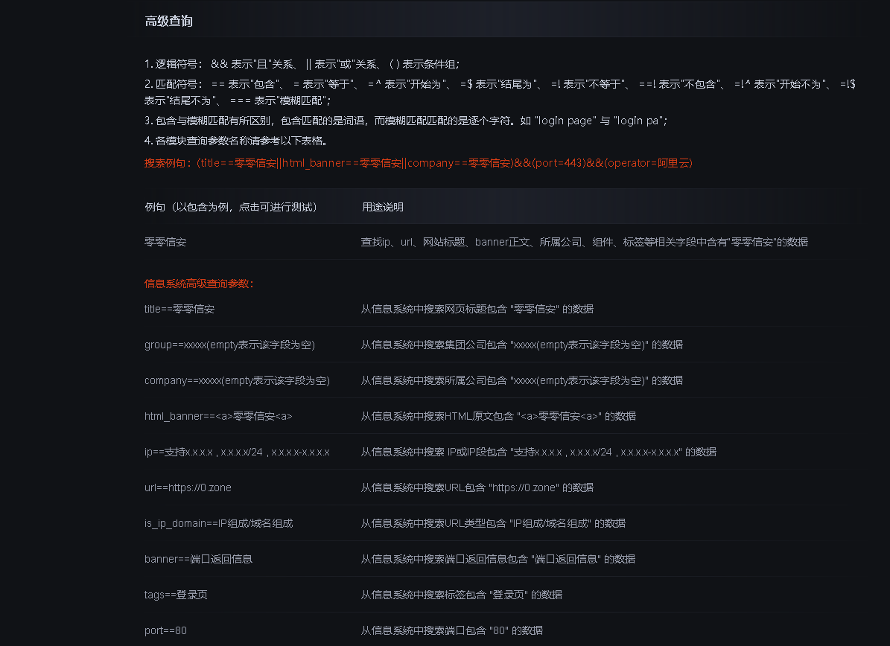

**搜索企业名称示例**（需要会员才能获取企业黄页）

可查看此公司下匹配到的信息系统、移动端应用、敏感目录、邮箱、文档、代码、人员信息数据。这个功能定向查找单位资产非常方便好用。

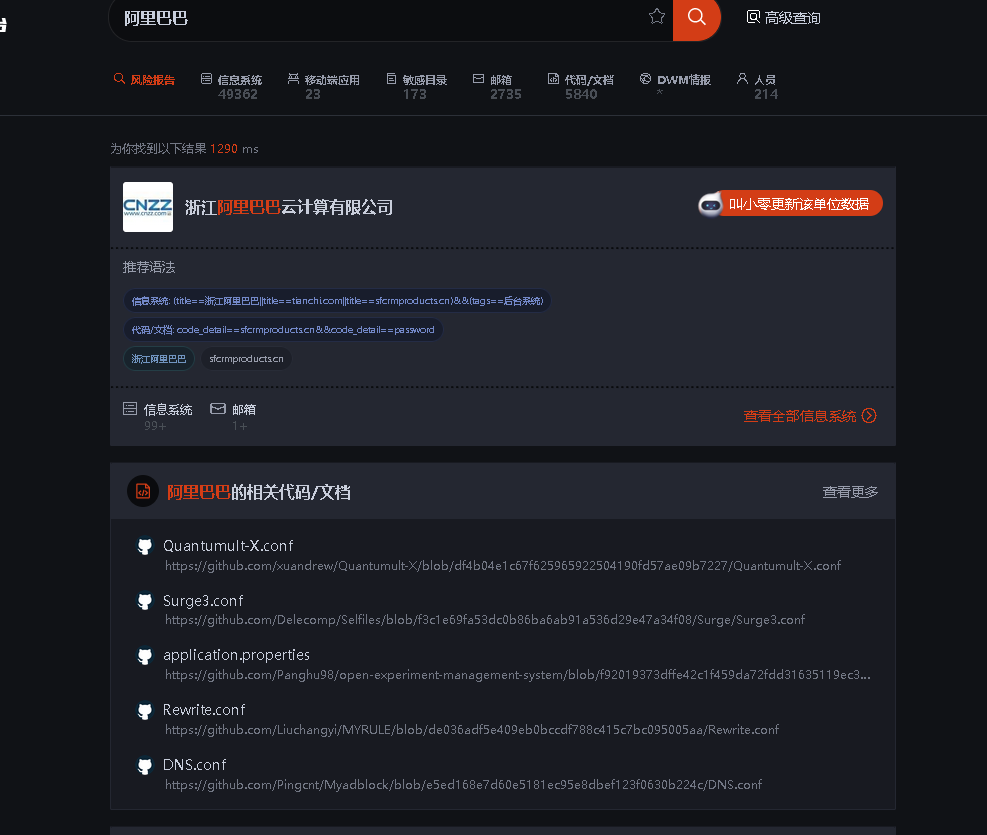

不同于fofa，该平台做了收录信息归纳，感觉还不错。

- 使用参考：[https://mp.weixin.qq.com/s/0Nf_HJr-Rn4mZEC3QYKtwg](https://mp.weixin.qq.com/s/0Nf_HJr-Rn4mZEC3QYKtwg)

###### [hunter](https://hunter.qianxin.com/)

全球鹰是奇安信的一款产品。通过网络空间测绘技术，全球鹰测绘平台可以提供IP、域名、开放端口、应用/组件、所属企业等关键安全信息，同时结合攻防场景绘制了资产画像与IP画像，实现互联网资产的可查、可定位、操作可识别的检索，助力企业日常的安全运营工作，例如未知资产发现、风险识别、漏洞修复等。目前全球鹰网络空间测绘平台已有3亿独立IP，资产(剔除历史重复数据)总数超过20亿，已实现全端口覆盖。在全球我们已覆盖了261个国家，96% ASN域。国内web资产最快4天更新，最慢7天更新。

[语法参考](https://hunter.qianxin.com/)

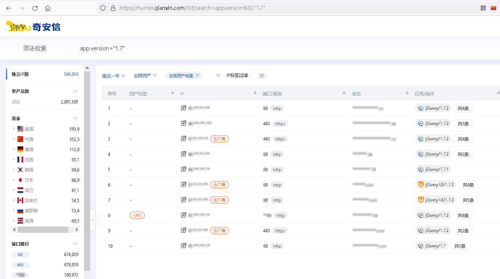

###### 其他

还有一些不错的检索平台，就不一一介绍，可以去官网瞧瞧语法和规则这块，这块还是api用得多。*（没会员没法爽玩。。）*

- [zoomeye](https://www.zoomeye.org/)
- [quake](https://quake.360.cn/)
- [谛听](https://www.ditecting.com/)
- [知风](https://zhifeng.io/web/new/)
- [binaryedge](https://www.binaryedge.io/)
- [censys](https://search.censys.io/)
- [dnsdb](https://dnsdb.io/zh-cn/)
- [greynoise](https://www.greynoise.io/blog)
- [hunter](https://hunter.io/)
- [Project Sonar](https://opendata.rapid7.com/)
- [intelx](https://intelx.io/)
- [dnsdumpster](https://dnsdumpster.com/)
- phonebook.cz
- [fullhunt](https://fullhunt.io/)
- [netlas](https://netlas.io/)

关于搜索引擎详细可以参考下：

- [网络空间检索平台对比](https://www.cnblogs.com/Akkuman/p/15469098.html)
- [零零信安攻击面管理系统 | 企业信息泄露情报平台](https://www.iculture.cc/cybersecurity/pig=16553)
- [盘点一下在渗透测试中可能用到的网络搜索引擎](https://www.77169.net/html/289075.html)

### 7. 工具自动化

总的来说，信息收集有很多重复性查询筛选，手工相对费时费力，因此可以借助半自动化工具来达到事半功倍的效果。

#### OneForAll

> <https://github.com/shmilylty/OneForAll>

解决大多传统子域名收集工具不够强大、不够友好、缺少维护和效率问题的痛点，是一款集百家之长，功能强大的全面快速子域收集终极神器。

#### subfinder

> <https://github.com/projectdiscovery/subfinder>

brew install subfinder

Subfinder 是一个子域发现工具，它通过使用被动在线资源来发现网站的有效子域。它具有简单的模块化架构，并针对速度进行了优化。 subfinder 是为只做一件事而构建的——被动子域枚举，它做得很好。

#### ksubdomain

> <https://github.com/knownsec/ksubdomain>

ksubdomain是一款基于无状态子域名爆破工具，支持在Windows/Linux/Mac上使用，它会很快的进行DNS爆破，在Mac和Windows上理论最大发包速度在30w/s,linux上为160w/s的速度。

#### JSINFO-SCAN

> <https://github.com/p1g3/JSINFO-SCAN>

递归爬取域名(netloc/domain)，以及递归从JS中获取信息的工具

#### URLFinder

> <https://github.com/pingc0y/URLFinder>

URLFinder是一款用于快速提取检测页面中JS与URL的工具。

功能类似于JSFinder，但JSFinder好久没更新了。

#### Layer子域名挖掘机

> <https://github.com/euphrat1ca/LayerDomainFinder>

Layer子域名挖掘机是一款子域名收集工具，拥有简洁的界面和简单的操作模式，支持服务接口查询和暴力枚举获取子域名信息，同时可以通过已获取的域名进行递归爆破。

#### ESD

> <https://github.com/FeeiCN/ESD>

支持泛解析功能较全的枚举子域工具

#### EyeWitness

> <https://github.com/FortyNorthSecurity/EyeWitness>

Eyewitness可自动查询URL对应网站的截图、RDP服务、Open VNC服务器以及一些服务器title、甚至是可识别的默认凭据等，最终会生成一个详细的html报告。

0x03 IP信息收集
-----------

通过ip或域名获取到一些基本信息（端口、服务、架构、目录等）后，也可以通过ip段目标扩大攻击面，也有可能找到一些未分配的边缘资产。

### 1. 绕过CDN获取真实ip

#### 简述

CDN是IP信息探测或打点必不可绕过的一个话题。当目标使用了CDN加速，获取到的目标ip不一定是真实ip。所以通常在实施端口、漏扫等测试之前，需判断下是否真实IP，是否使用了CDN或其他代理等等，避免无效操作、蜜罐、非目标点。

> CDN的全称是Content Delivery Network，即内容分发网络。其基本思路是尽可能避开互联网上有可能影响数据传输速度和稳定性的瓶颈和环节，使内容传输的更快、更稳定。通过在网络各处放置节点服务器所构成的在现有的互联网基础之上的一层智能虚拟网络，CDN系统能够实时地根据网络流量和各节点的连接、负载状况以及到用户的距离和响应时间等综合信息将用户的请求重新导向离用户最近的服务节点上。其目的是使用户可就近取得所需内容，解决 Internet网络拥挤的状况，提高用户访问网站的响应速度。

##### 常见CDN服务商

**一、国内 CDN 服务商**

- 阿里云 CDN
- 百度云 CDN
- 七牛云 CDN
- 又拍云 CDN
- 腾讯云 CDN
- Ucloud
- 360 CDN
- 网宿科技
- ChinaCache
- 帝联科技

**二、国外 CDN 服务商**

- CloudFlare
- StackPath
- Fastly
- Akamai
- CloudFront
- Edgecast
- CDNetworks
- Google Cloud CDN
- CacheFly
- Keycdn
- Udomain
- CDN77

#### CDN判断

确定CDN加速解析后，那就要考虑如何绕过来获取真实ip，以进一步攻击利用。

##### 0x01 多ping

通过多地ping目标域名，如果没有使用CDN，只会显示一个IP地址，或者双线接入情况的两个不同运营商ip。

多ping在线站点：

- <http://ping.chinaz.com/>
- <https://ping.aizhan.com/>
- <http://www.webkaka.com/Ping.aspx>
- <https://www.host-tracker.com/v3/check/>

如图，不同地区访问有不同ip，一般存在CDN：

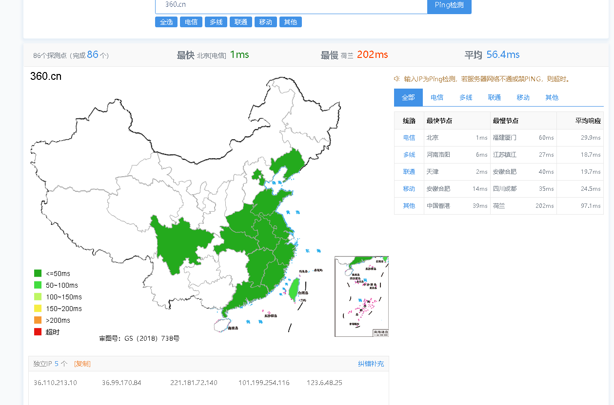

##### 0x02 nslookup

获取到的DNS域名解析结果中返回多个ip的，一般都是存在CDN服务。

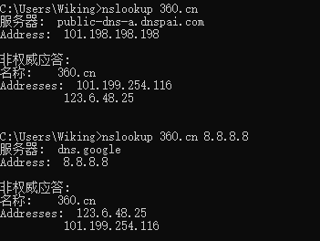

##### 0x03 header头信息

- 请求响应包header头中是否存在cdn服务商信息
- 报错信息
- 若 asp 或者 asp.net 网站返回头的 server 不是 IIS、而是 Nginx，则多半使用了nginx反向代理到 CDN

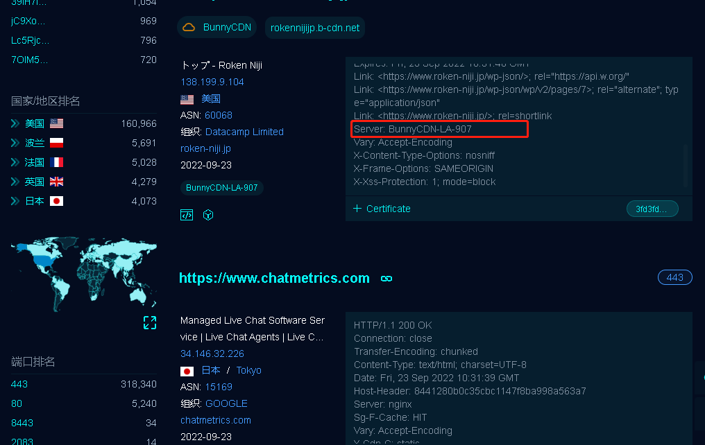

##### 0x04 在线检测工具

- <https://www.cdnplanet.com/tools/cdnfinder/>
- <https://tools.ipip.net/cdn.php>
- <https://whatsmycdn.com/>

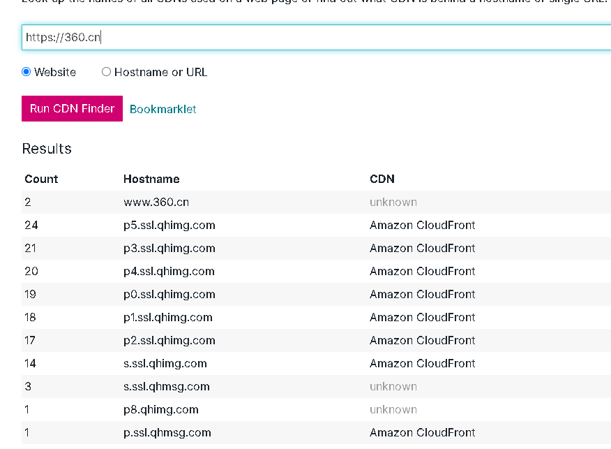

#### 获取真实IP

##### 0x01 dns历史绑定记录

查询域名历史解析记录，可能会存在未使用cdn之前的真实ip记录：

- <https://dnsdb.io/zh-cn/>
- <https://securitytrails.com/>
- <https://x.threatbook.cn/>
- [http://toolbar.netcraft.com/site_report?url=](http://toolbar.netcraft.com/site_report?url=)
- <https://viewdns.info/iphistory/?domain=>
- <https://site.ip138.com/www.xxx.com/>

CDN判断：

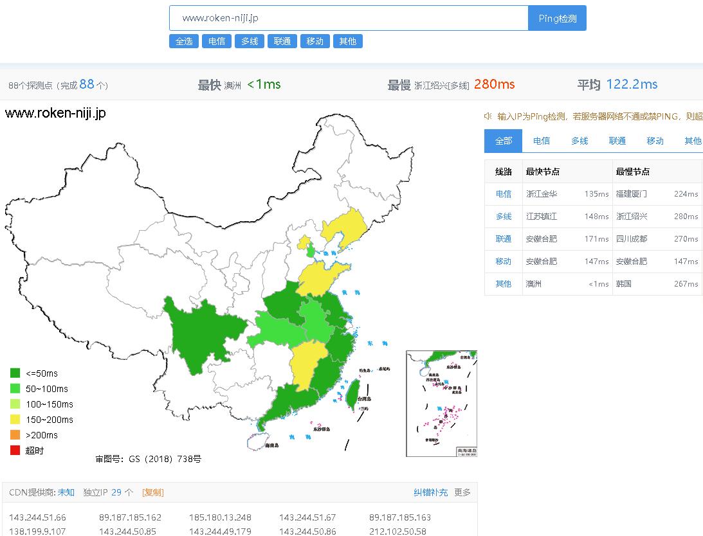

存在CDN，利用微步查询获取历史记录，然后将每个ip都测试一篇

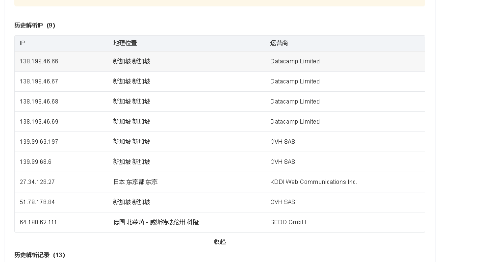

通过源代码获取，确定真实ip


##### 0x02 **网络空间测绘搜索引擎**

> 网络空间测绘，一般都会定时把全网资产扫一遍存在数据库里。

通过网络空间测绘搜索引擎搜索其收录的目标相关信息，有概率获取到目标真实IP。

- [fofa](https://fofa.so/)
- [shodan](https://www.shodan.io/)
- [quake](https://quake.360.cn/quake/#/index)
- [Censys.io](https://censys.io/)

大概从以下几个关键因素去搜索验证：

- ip
- 域名
- title
- logo
- icp
- body
- js/css/html等静态特征值

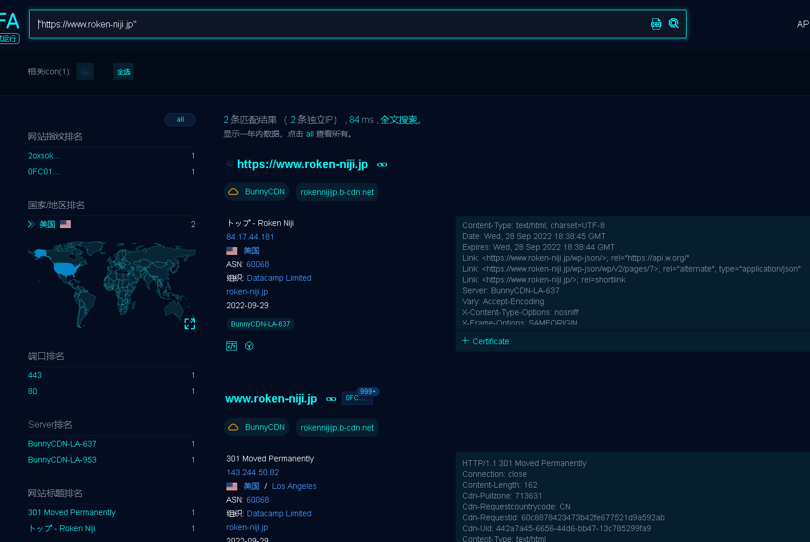

通过获取logo icon指纹哈希特征，搜索其相同的主机结果，进一步探测真实IP：

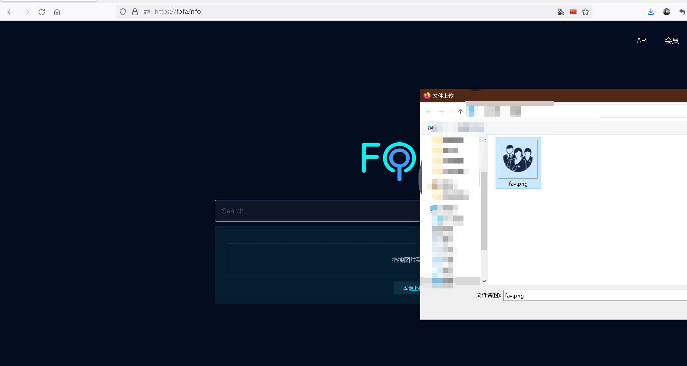

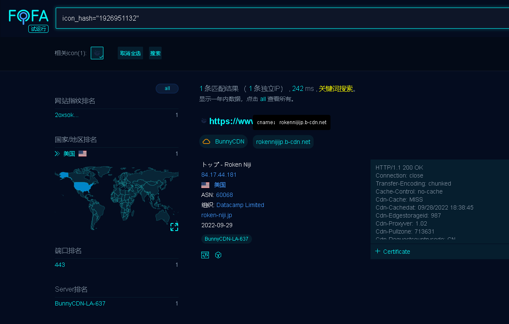

> 未找到~

##### 0x03 子域名

考虑到CDN成本问题，一些重要站点会采用cdn加速，而一些子域名则没有使用。一般情况下，一些子域名与主站的真实ip在同一c段或同一台服务器上，这时就可以通过发现子域名c段ip、端口信息，逐个探测定位主站真实ip地址。

常见查找方法和工具：

- [各大搜索引擎](http://sousuo.org.cn/)
- [微步在线](https://x.threatbook.cn/)
- [oneforall](https://github.com/shmilylty/OneForAll)
- [ksubdomain](https://github.com/knownsec/ksubdomain)
- [Jsinfo-scan](https://github.com/p1g3/JSINFO-SCAN)

##### 0x04 异地ping

部分国内cdn广商只做了国内的线路，而没有铺设对国外的线路，这时就可以通过海外解析直接获取到真实IP。

可以使用：

- <http://ping.chinaz.com/>
- [https://asm.ca.com/zh_cn/ping.php](https://asm.ca.com/zh_cn/ping.php)
- <http://host-tracker.com/>
- <http://www.webpagetest.org/>
- <https://dnscheck.pingdom.com/>
- <https://www.host-tracker.com/v3/check/>

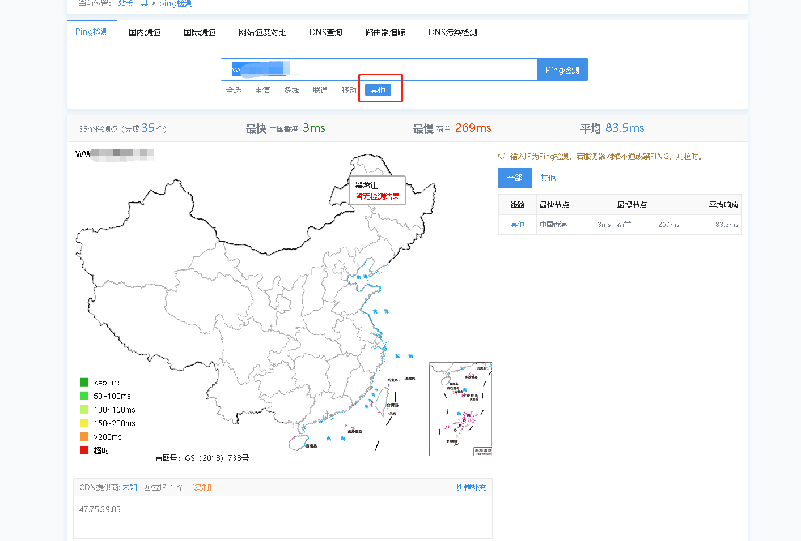

##### 0x05 SSL证书

证书颁发机构 (CA) 必须将他们发布的每个 SSL/TLS 证书发布到公共日志中，SSL/TLS 证书通常包含域名、子域名和电子邮件地址。因此可以利用 SSL/TLS 证书来发现目标站点的真实 IP 地址。

CDN在提供保护的同时，也会与服务器之间进行加密通信（SSL）。当通过服443端口去访问服务器ip或域名时，就会暴露其SSL证书，也就可以通过证书比对发现服务器的真实IP地址。

###### **在线：**

- <https://crt.sh/>

通过 [https://crt.sh](https://crt.sh/) 进行快速证书查询收集

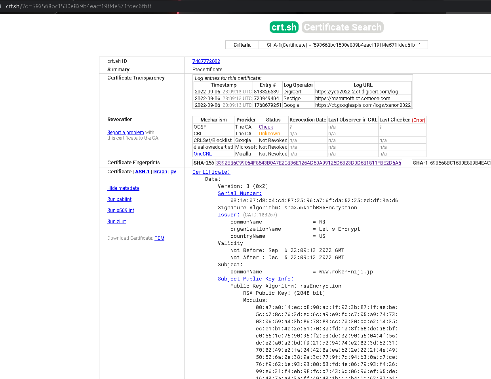

- [Censys 引擎](https://censys.io/)
    
    Censys 搜索引擎能够扫描整个互联网，每天都会扫描 IPv4 地址空间，以搜索所有联网设备并收集相关的信息，可以利用 Censys 进行全网方面的 SSL 证书搜索，找到匹配的真实 IP 。

通过Censys引擎搜索证书信息，发现多个有效或无效的证书：

<https://search.censys.io/certificates?q=www.roken-niji.jp>

> ps: 并不是有效的证书才是有价值的，无效的证书中也会有很多服务器配置错误依然保留着的信息。

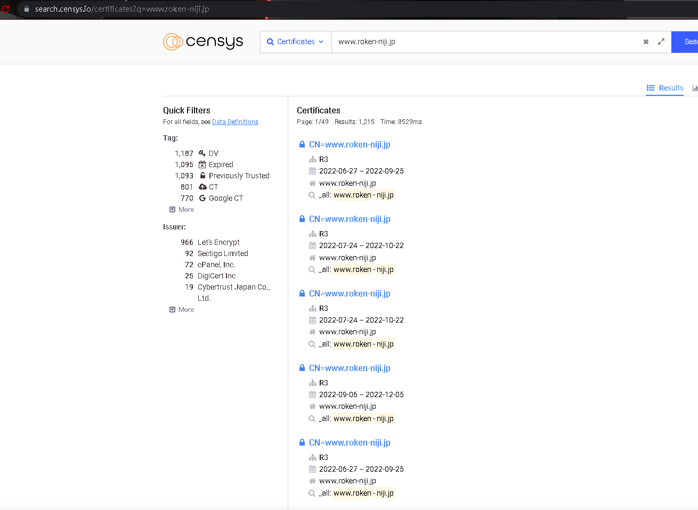

精准定位有效SSL证书：

```bash
parsed.names: xxx.com and tags.raw: trusted
```

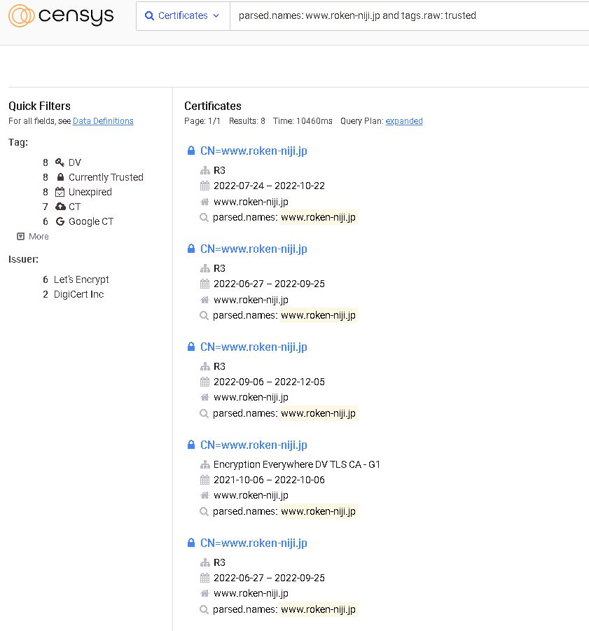

逐个打开，根据sha1签名反查主机

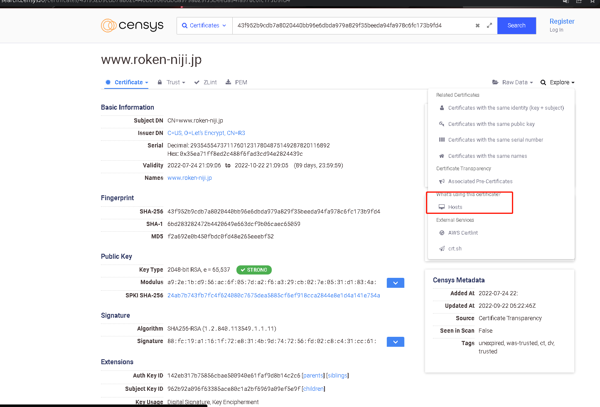

无果~~~

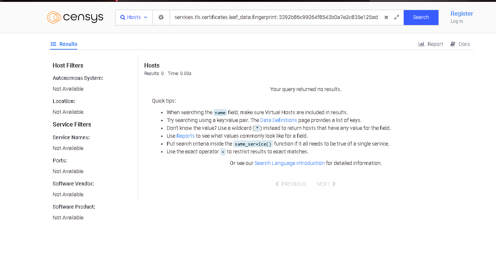

###### **命令行**

- openssl

```bash
openssl s_client -connect roken-niji.jp:443 | grep subject
```

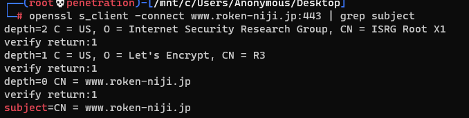

- curl

```bash
curl -v https://www.roken-niji.jp/ | grep &#039;subject&#039;
```

###### 工具：

`CloudFlair`

项目地址：<https://github.com/christophetd/CloudFlair>

> 使用来自 Censys 的全网扫描数据查找 CloudFlare 背后网站的源服务器。

##### 0x06 敏感文件泄露

包括但不限于：

- 服务器日志文件
- 探针文件，例如 phpinfo
- 网站备份压缩文件
- .DS_Store
- .hg
- .git
- SVN
- Web.xml

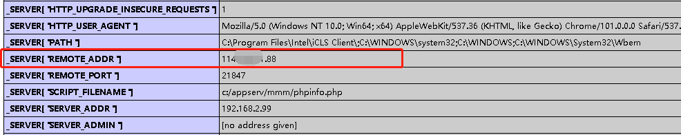

##### 0x07 CDN配置问题

某些站点只做了www cname到CDN上，导致[www.xxx.com](www.xxx.com)和xxx.com是两条独立的解析记录，所以可以通过直接ping域名xxx.com获取到未加入cdn的真实IP，同理http协议和https协议配置也是有可能出现这种问题。

##### 0x08 漏洞

- 网站本身存在一些漏洞时，如XSS/SSRF/XXE/命令执行等，通过带外服务器地址注入，使服务器主动连接，被动获取连接记录。
- 部分本身功能，如url采集、远程url图片、编辑器问题等。
- 异常信息、调式信息等都有可能泄露真实IP或内网ip的。
    
    
    - ThinkPHP 报错/SpringBoot变量/phpinfo

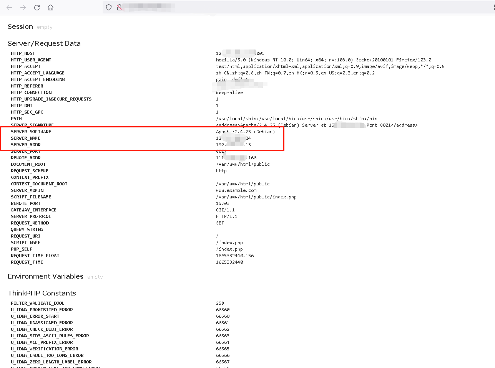

##### 0x09 邮件头信息

一般邮件系统都在内部，没有经过CDN解析，通过邮件发送、RSS订阅等sendmail功能去获取到服务器与邮箱系统交互的邮件源码，在源文件头信息或者源代码中就会包含服务器真实ip。但需注意该ip是否第三方邮件服务器（如腾讯企业邮件、阿里企业邮箱），一般只有应用与网站在同一服务器上时，才获取到当前服务器的真实ip。

常见交互功能点：

- RSS 订阅
- 邮箱注册、激活处
- 邮箱找回密码处
- 产品更新的邮件推送
- 某业务执行后发送的邮件通知
- 员工邮箱、邮件管理平台等入口处的忘记密码

可以通过查mx记录确定下是否第三方邮件服务器，当然这里这个邮箱很明显了。。

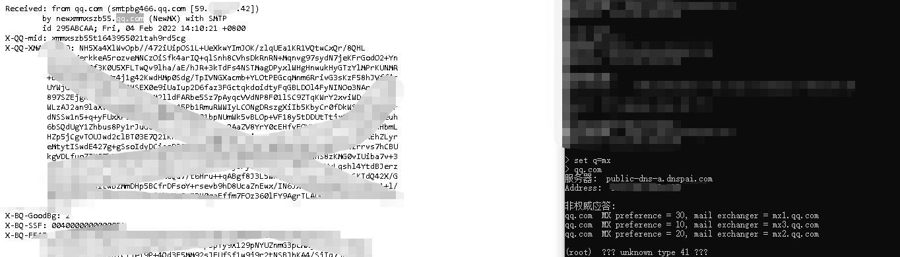

> - 大佬分享的`奇淫技巧`：通过发送邮件给一个不存在的邮箱地址，比如 <000xxx@domain.com> ，因为该用户不存在，所以发送将失败，并且还会收到一个包含发送该电子邮件给你的服务器的真实 IP 通知。
> - foxmail导出的邮件可以用编辑器打开查看其内容。

##### 0x10 vhost碰撞

只要字典够强大，数据够多，通过 IP 和子域的碰撞，总会有所收获。

在线工具：

<https://pentest-tools.com/information-gathering/find-virtual-hosts#>

##### 0x11 应用程序

一些app、小程序会直接采用ip进行通信交互，也可以通过一些历史版本探测真实ip。

##### 0x12 **通过 F5 LTM 解码**

> 一般常用的负载均衡实现方式：
> 
> - 基于cookie的会话保持
> - 基于session的会话保持，如weblogic的session复制机制
> - 基于四层的负载，ip+端口。

- LTM 是将所有的应用请求分配到多个节点服务器上。提高业务的处理能力，也就是负载均衡。F5 LTM也就是5公司旗下的一种负载均衡方案。
- 当服务器使用 F5 LTM 做负载均衡时，通过对 `set-cookie` 关键字的解码，可以获取服务器真实 ip 地址。

**例如：基于cookie会话保持情况：**

F5在获取到客户端第一次请求时，会使用set cookie头，给客户端标记一个特定的cookie。

```http
Set-Cookie: BIGipServerPool-i-am-na_tcp443=2388933130.64288.0000; path=/;
```

后续客户端请求时，F5都会去校验cookie中得字段，判断交给那个服务器处理。那么就可以利用此机制，获取处理服务器的ip地址，大概率也是网站服务器真实ip。具体解法如下：

- 先把第一小节的十进制数，即 2388933130 取出来
- 将其转为十六进制数 8e643a0a
- 接着从后至前，取四个字节出来：0a.3a.64.8e
- 最后依次转为十进制数 10.58.100.142，即是服务器的真实ip地址。

一般来说基本都是内网ip，但也有例外，得看部署情况，无意间找到一个：

```http
Set-Cookie: BIGipServerpool-shibboleth3-dev-8080=3045805720.36895.0000; path=/; Httponly
```

自动化解码工具：

[https://github.com/ezelf/f5_cookieLeaks](https://github.com/ezelf/f5_cookieLeaks)

```http
Set-Cookie: BIGipServerpool-shibboleth3-dev-8080=3045805720.36895.0000; path=/; Httponly
```

##### 0x13 其他

- 扫全网
    
    
    - <https://github.com/superfish9/hackcdn>
    - <https://github.com/boy-hack/w8fuckcdn>
- 流量攻击
    
    
    - 对不设防的CDN发起大量访问，导致出错或服务器更换时可能会泄露真实ip。
- 长期关注
    
    
    - 定期访问记录ip变化，业务变更或架构调整可能会有更换服务器更换ip的情况。
- 流量包问题
    
    
    - 部分开发者会将真实ip记录到一些header响应头或者响应包中。
- 403绕过
    
    
    - 当目标地址放在标头（如Location头）中时，可通过抓包将http协议改为1.0并将请求中除第一行外的所有数据删掉，再发送请求有机会再相应包中Location头获取到真实ip地址。
    - ……

更多方法可以参考binmaker大佬的总结：

[渗透测试中最全的CDN绕过总结](https://mp.weixin.qq.com/s?__biz=MzIzNzMxMDkxNw==&mid=2247490046&idx=1&sn=994fc288c54907e7317c6818e2e2507b&chksm=e8cbdf54dfbc5642dd5ac26de38bfcf5749614d5bf6ba5bb61cb9078a59027d6ee7f5e183ad1#rd)

#### 真实ip验证：

##### cdn节点判断

对于一些cdn节点可以使用阿里云的CDN节点判断验证找到的ip是否为CDN节点：

<https://www.alibabacloud.com/help/zh/alibaba-cloud-cdn/latest/query-ip-addresses>

##### 真实IP使用：

- 通过修改 hosts 文件，将域名和 IP 绑定。
- 如使用 burpsuite 测试，可以在 Project options ——> Connections ——> Hostname Resolution 中增加域名和 IP 记录。
- 通过源代码获取，确定真实ip
    
    使用 view-source:xxx.xxx.xxx.xxx，表明这是真实ip，如果是真，则返回网站源代码。

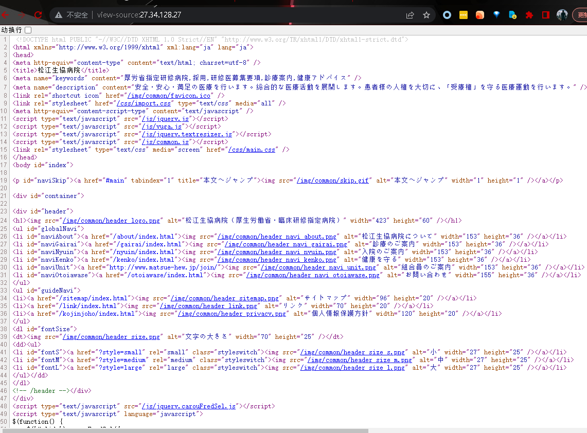

如果是假，则返回cdn信息

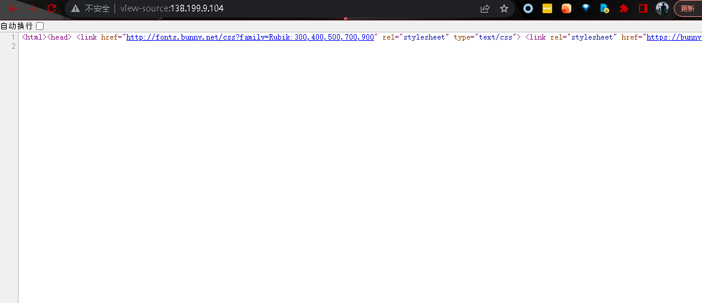

### 2. 组织IP段

当目标信息比较笼统时，可以通过IP地址注册信息查询运营商给目标组织所分配的ip段信息，继而对这个段进行测试。这样既可以扩大范围也有可能直接找到CDN后的真实服务器。

- [CNNIC IP地址注册信息查询系统](https://ipwhois.cnnic.net.cn/)

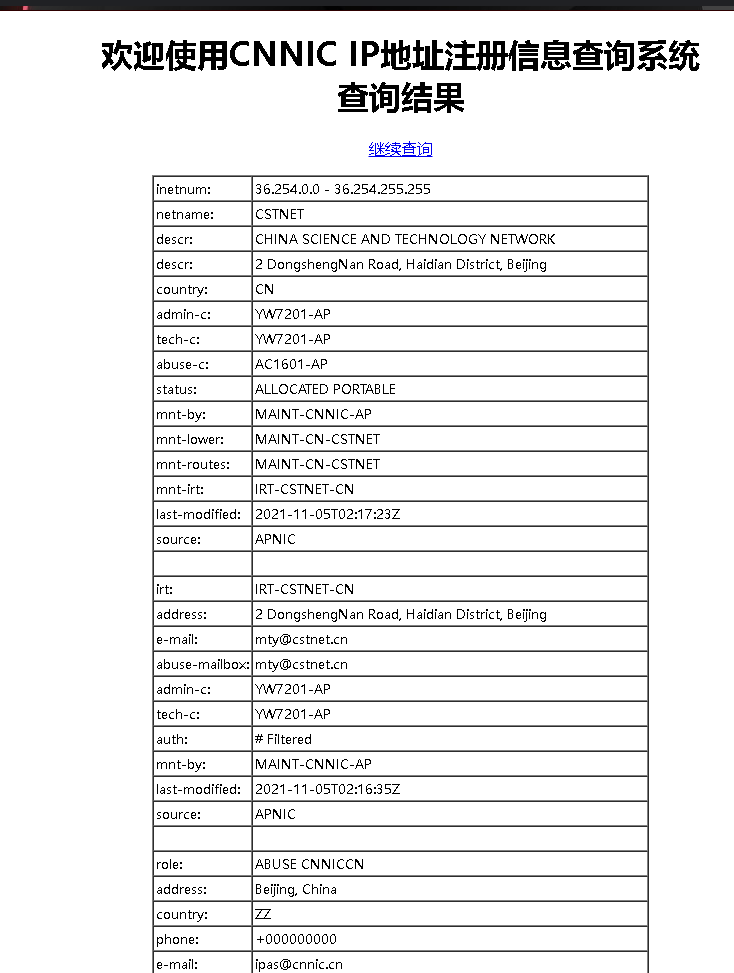

- [RIPE 数据库](https://apps.db.ripe.net/)

以阿里为例，收集组织对应ip信息

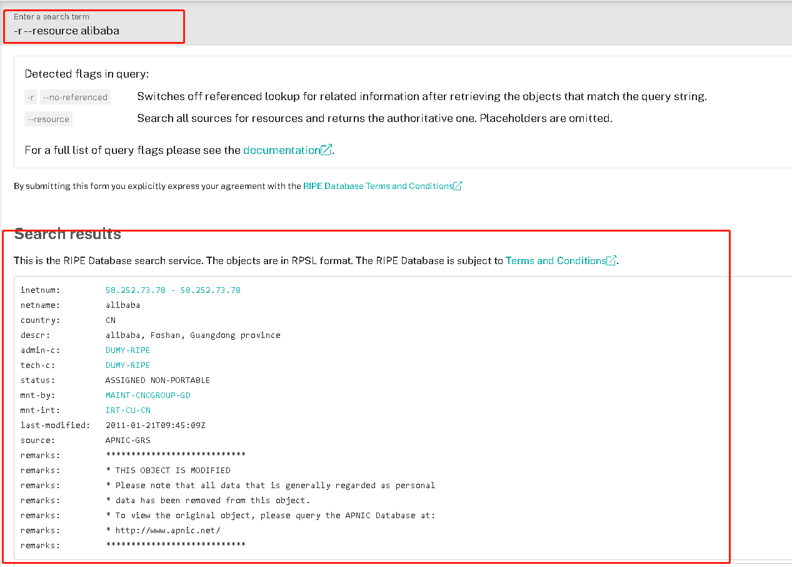

- [Hurricane Electric BGP Toolkit](https://bgp.he.net/)

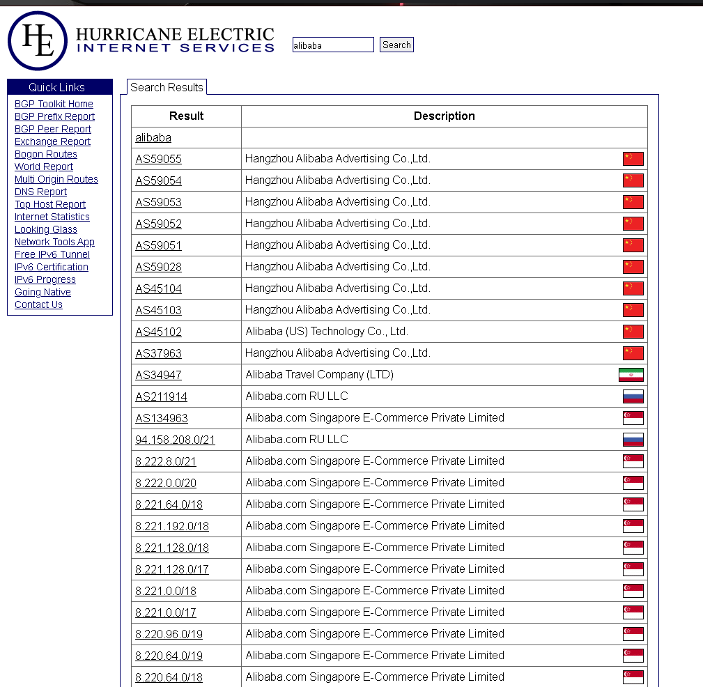

### 3. C段

一般都是扫C段为主，B段为辅。通过获取同在一个ip段的同类型网站或业务来扩大攻击面，往往同ip段中会存在一些后台、api相关处理服务等。

#### C段主要收集点：

- ip
- 端口
- 容器类型
- title

#### 扫描常用工具：

##### 网络空间搜索引擎（fofa、quake...)

> ps: 手工扫描都是实时的，相比空间搜索引擎较精准些。

##### nmap

- 工具强大，速度有待优化。
- 六种扫描结果
    
    
    - open(开放的)
    - filtered(被过滤的)
    - open|filtered(开放或者被过滤的)
    - closed(关闭的)
    - closed|filtered(关闭或者被过滤的)
    - unfiltered(未被过滤的)
- 常用命令

```bash
nmap -vvv -Pn -p- ip/24 -n -T4  
#-v 输出详细信息，-v/-vv/-vvv v越多信息越详细 上线3个v  
#-Pn 扫描时不用ping  
#-p-  扫描所有端口（65535个）。如果不使用 -p- ，nmap 将仅扫描1000个端口，GUI参数不可用  
#-n 不做DNS解析  
#-T4 设置时间模板,0-5部分做了扫描时间优化，默认3未作优化。4加速扫描又保持一定准确性
```

- 扫描全端口，并调用各种脚本

```bash
#!/usr/bin/env bash   

read -p "ip: " ip  
nmap -v -Pn -p- --open -sV $ip -n -T4 --max-scan-delay 10 --max-retries 3 --min-hostgroup 10 -oX $ip-result-\`date +%y-%m-%d-%H-%M-%S\`.xml --script=dns-zone-transfer,ftp-anon,ftp-proftpd-backdoor,ftp-vsftpd-backdoor,ftp-vuln-cve2010-4221,http-backup-finder,http-cisco-anyconnect,http-iis-short-name-brute,http-put,http-php-version,http-shellshock,http-robots.txt,http-svn-enum,http-webdav-scan,iax2-version,memcached-info,mongodb-info,msrpc-enum,ms-sql-info,mysql-info,nrpe-enum,pptp-version,redis-info,rpcinfo,samba-vuln-cve-2012-1182,smb-vuln-ms08-067,smb-vuln-ms17-010,snmp-info,sshv1,xmpp-info,tftp-enum,teamspeak2-version,ftp-brute,imap-brute,smtp-brute,pop3-brute,mongodb-brute,redis-brute,ms-sql-brute,rlogin-brute,rsync-brute,mysql-brute,pgsql-brute,oracle-sid-brute,oracle-brute,rtsp-url-brute,snmp-brute,svn-brute,telnet-brute,vnc-brute,xmpp-brute
```

- 快速扫描常见端口，并调用各种脚本

```bash
#!/usr/bin/env bash   

read -p "ip: " ip  
nmap -vvv -Pn -p 20,22,23,25,53,69,80-89,443,8440-8450,8080-8089,110,111,137,143,161,389,512,873,1194,1352,1433,1521,1500,1723,2082,2181,2601,3128,3312,3306,3389,3690,4848,5000,5432,5900,5984,6379,7001,7002,7003,7778,8000,8069,8888,9000,9002,9080-9081,9090,9200,10001,10002,11211,27017,50070 --open -sV $ip -n -T4 --max-scan-delay 10 --max-retries 3 --min-hostgroup 10 -oX $ip-result-\`date +%y-%m-%d-%H-%M-%S\`.xml --script=dns-zone-transfer,ftp-anon,ftp-proftpd-backdoor,ftp-vsftpd-backdoor,ftp-vuln-cve2010-4221,http-backup-finder,http-cisco-anyconnect,http-iis-short-name-brute,http-put,http-php-version,http-shellshock,http-robots.txt,http-svn-enum,http-webdav-scan,iax2-version,memcached-info,mongodb-info,msrpc-enum,ms-sql-info,mysql-info,nrpe-enum,pptp-version,redis-info,rpcinfo,samba-vuln-cve-2012-1182,smb-vuln-ms08-067,smb-vuln-ms17-010,snmp-info,sshv1,xmpp-info,tftp-enum,teamspeak2-version,ftp-brute,imap-brute,smtp-brute,pop3-brute,mongodb-brute,redis-brute,ms-sql-brute,rlogin-brute,rsync-brute,mysql-brute,pgsql-brute,oracle-sid-brute,oracle-brute,rtsp-url-brute,snmp-brute,svn-brute,telnet-brute,vnc-brute,xmpp-brute
```

##### msscan

> <https://github.com/robertdavidgraham/masscan>

- 速度快，精确度有待优化 ```shell
    masscan -p80,8000-8100 10.0.0.0/8 --rate=10000
    ```
    
    ##### masscan_to_nmap

[https://github.com/7dog7/masscan_to_nmap](https://github.com/7dog7/masscan_to_nmap)

- nmap+msscan缝合怪

##### Goby

> <https://cn.gobies.org/>

- 资产扫描利器，支持图像化、方便快捷、可自定义poc漏扫。

##### shuize

> [https://github.com/0x727/ShuiZe_0x727](https://github.com/0x727/ShuiZe_0x727)

- 信息收集一键化+漏洞检验

##### fscan

> <https://github.com/shadow1ng/fscan>

##### ALLin

> <https://github.com/P1-Team/AlliN>

### 4. 旁站（ip反查域名）

一个服务器上存在多个站点，可通过ip查询相应站点，再从相应站点进一步突破获取服务器权限。

##### 常见查询方法：

**在线平台：**

<https://www.webscan.cc/>  
<https://viewdns.info/reverseip/>  
<https://reverseip.domaintools.com/>  
<https://tools.ipip.net/ipdomain.php>  
<https://dnslytics.com/>

**网络空间搜索引擎：**

- fofa、zoomeye、hunte、quake等

**工具：**

- [ip2domain - 批量查询ip对应域名、备案信息、百度权重](https://github.com/Sma11New/ip2domain)
- 水泽
- nmap
- ....

### 5. 端口

确定真实ip后，就可以进行端口扫描，比较常见的就是nmap和masscan了，masscan相比nmap多了速度的优势，可以快速扫描全端口。扫描可以结合空间引擎结果发现更多目标端口。

> tips:
> 
> - 大批量扫描时建议云上挂代理池进行。
> - 查看端口出现频率
> 
> <https://github.com/laconicwolf/Masscan-to-CSV>
> 
> - masscan扫描出的端口可以用nmap去确认

工具可参考C段章节

#### 端口渗透思路表

引用下某大佬的端口渗透思路表，可以学习学习下。

| 端口 | 服务 | 渗透用途 |
|---|---|---|
| tcp 20,21 | FTP | 允许匿名的上传下载,爆破,嗅探,win提权,远程执行(proftpd 1.3.5),各类后门(proftpd,vsftp 2.3.4) |
| tcp 22 | SSH | 可根据已搜集到的信息尝试爆破,v1版本可中间人,ssh隧道及内网代理转发,文件传输等等 |
| tcp 23 | Telnet | 爆破,嗅探,一般常用于路由,交换登陆,可尝试弱口令 |
| tcp 25 | SMTP | 邮件伪造,vrfy/expn查询邮件用户信息,可使用smtp-user-enum工具来自动跑 |
| tcp/udp 53 | DNS | 允许区域传送,dns劫持,缓存投毒,欺骗以及各种基于dns隧道的远控 |
| tcp/udp 69 | TFTP | 尝试下载目标及其的各类重要配置文件 |
| tcp 80-89,443,8440-8450,8080-8089 | 各种常用的Web服务端口 | 可尝试经典的topn,vpn,owa,webmail,目标oa,各类Java控制台,各类服务器Web管理面板,各类Web中间件漏洞利用,各类Web框架漏洞利用等等…… |
| tcp 110 | POP3 | 可尝试爆破,嗅探 |
| tcp 111,2049 | NFS | 权限配置不当 |
| tcp 137,139,445 | Samba | 可尝试爆破以及smb自身的各种远程执行类漏洞利用,如,ms08-067,ms17-010,嗅探等…… |
| tcp 143 | IMAP | 可尝试爆破 |
| udp 161 | SNMP | 爆破默认团队字符串,搜集目标内网信息 |
| tcp 389 | LDAP | ldap注入,允许匿名访问,弱口令 |
| tcp 512,513,514 | Linux rexec | 可爆破,rlogin登陆 |
| tcp 873 | Rsync | 匿名访问,文件上传 |
| tcp 1194 | OpenVPN | 想办法钓VPN账号,进内网 |
| tcp 1352 | Lotus | 弱口令,信息泄漏,爆破 |
| tcp 1433 | SQL Server | 注入,提权,sa弱口令,爆破 |
| tcp 1521 | Oracle | tns爆破,注入,弹shell… |
| tcp 1500 | ISPmanager | 弱口令 |
| tcp 1723 | PPTP | 爆破,想办法钓VPN账号,进内网 |
| tcp 2082,2083 | cPanel | 弱口令 |
| tcp 2181 | ZooKeeper | 未授权访问 |
| tcp 2601,2604 | Zebra | 默认密码zerbra |
| tcp 3128 | Squid | 弱口令 |
| tcp 3312,3311 | kangle | 弱口令 |
| tcp 3306 | MySQL | 注入,提权,爆破 |
| tcp 3389 | Windows rdp | shift后门\[需要03以下的系统\],爆破,ms12-020 |
| tcp 3690 | SVN | svn泄露,未授权访问 |
| tcp 4848 | GlassFish | 弱口令 |
| tcp 5000 | Sybase/DB2 | 爆破,注入 |
| tcp 5432 | PostgreSQL | 爆破,注入,弱口令 |
| tcp 5900,5901,5902 | VNC | 弱口令爆破 |
| tcp 5984 | CouchDB | 未授权导致的任意指令执行 |
| tcp 6379 | Redis | 可尝试未授权访问,弱口令爆破 |
| tcp 7001,7002 | WebLogic | Java反序列化,弱口令 |
| tcp 7778 | Kloxo | 主机面板登录 |
| tcp 8000 | Ajenti | 弱口令 |
| tcp 8009 | tomcat Ajp | Tomcat-Ajp协议漏洞 |
| tcp 8443 | Plesk | 弱口令 |
| tcp 8069 | Zabbix | 远程执行,SQL注入 |
| tcp 8080-8089 | Jenkins,JBoss | 反序列化,控制台弱口令 |
| tcp 9080-9081,9090 | WebSphere | Java反序列化/弱口令 |
| tcp 9200,9300 | ElasticSearch | 远程执行 |
| tcp 11211 | Memcached | 未授权访问 |
| tcp 27017,27018 | MongoDB | 爆破,未授权访问 |
| tcp 50070,50030 | Hadoop | 默认端口未授权访问 |

- - - - - -

| **端口号** | **端口说明** | **渗透思路** |
|---|---|---|
| 21/69 | FTP/TFTP：文件传输协议 | 爆破、内网嗅探 |
| 22 | SSH：远程连接 | 用户名枚举、爆破 |
| 23 | Telnet：远程连接 | 爆破、内网嗅探 |
| 25 | SMTP：邮件服务 | 邮件伪造 |
| 53 | DNS：域名系统 | DNS域传送\\DNS缓存投毒\\DNS欺骗\\利用DNS隧道技术刺透防火墙 |
| 389 | LDAP | 未授权访问（通过LdapBrowser工具直接连入） |
| 443 | https服务 | OpenSSL 心脏滴血（nmap -sV --script=ssl-heartbleed 目标） |
| 445 | SMB服务 | ms17_010远程代码执行 |
| 873 | rsync服务 | 未授权访问 |
| 1090/1099 | Java-rmi | JAVA反序列化远程命令执行漏洞 |
| 1352 | Lotus Domino邮件服务 | 爆破：弱口令、信息泄漏：源代码 |
| 1433 | MSSQL | 注入、SA弱口令爆破、提权 |
| 1521 | Oracle | 注入、TNS爆破 |
| 2049 | NFS | 配置不当 |
| 2181 | ZooKeeper服务 | 未授权访问 |
| 3306 | MySQL | 注入、爆破、写shell、提权 |
| 3389 | RDP | 爆破、Shift后门、CVE-2019-0708远程代码执行 |
| 4848 | GlassFish控制台 | 爆破：控制台弱口令、认证绕过 |
| 5000 | Sybase/DB2数据库 | 爆破、注入 |
| 5432 | PostgreSQL | 爆破弱口令、高权限执行系统命令 |
| 5632 | PcAnywhere服务 | 爆破弱口令 |
| 5900 | VNC | 爆破：弱口令、认证绕过 |
| 6379 | Redis | 未授权访问、爆破弱口令 |
| 7001 | WebLogic中间件 | 反序列化、控制台弱口令+部署war包、SSRF |
| 8000 | jdwp | JDWP 远程命令执行漏洞（[工具](https://github.com/IOActive/jdwp-shellifier)） |
| 8080/8089 | Tomcat/JBoss/Resin/Jetty/Jenkins | 反序列化、控制台弱口令、未授权 |
| 8161 | ActiveMQ | admin/admin、任意文件写入、反序列化 |
| 8069 | Zabbix | 远程命令执行 |
| 9043 | WebSphere控制台 | 控制台弱口令[https://:9043/ibm/console/logon.jsp、远程代码执行](https://blog.gm7.org/%E4%B8%AA%E4%BA%BA%E7%9F%A5%E8%AF%86%E5%BA%93/01.%E6%B8%97%E9%80%8F%E6%B5%8B%E8%AF%95/01.%E4%BF%A1%E6%81%AF%E6%94%B6%E9%9B%86/1.%E8%B5%84%E4%BA%A7%E6%94%B6%E9%9B%86/03.IP%E6%AE%B5%E4%BF%A1%E6%81%AF%E6%94%B6%E9%9B%86/07.%E7%AB%AF%E5%8F%A3%E5%AF%B9%E5%BA%94%E6%B8%97%E9%80%8F%EF%BC%88%E7%AB%AF%E5%8F%A3%E6%B8%97%E9%80%8F%E5%A4%87%E5%BF%98%E5%BD%95%EF%BC%89.html) |
| 9200/9300 | Elasticsearch服务 | 远程代码执行 |
| 11211 | Memcache | 未授权访问（nc -vv 目标 11211） |
| 27017 | MongoDB | 未授权访问、爆破弱口令 |
| 50000 | SAP | 远程代码执行 |
| 50070 | hadoop | 未授权访问 |

- - - - - -

| **端口号** | **服务** | **渗透思路** |
|---|---|---|
| 21 | FTP/TFTP/VSFTPD | 爆破/嗅探/溢出/后门 |
| 22 | ssh远程连接 | 爆破/openssh漏洞 |
| 23 | Telnet远程连接 | 爆破/嗅探/弱口令 |
| 25 | SMTP邮件服务 | 邮件伪造 |
| 53 | DNS域名解析系统 | 域传送/劫持/缓存投毒/欺骗 |
| 67/68 | dhcp服务 | 劫持/欺骗 |
| 110 | pop3 | 爆破/嗅探 |
| 139 | Samba服务 | 爆破/未授权访问/远程命令执行 |
| 143 | Imap协议 | 爆破161SNMP协议爆破/搜集目标内网信息 |
| 389 | Ldap目录访问协议 | 注入/未授权访问/弱口令 |
| 445 | smb | ms17-010/端口溢出 |
| 512/513/514 | Linux Rexec服务 | 爆破/Rlogin登陆 |
| 873 | Rsync服务 | 文件上传/未授权访问 |
| 1080 | socket | 爆破 |
| 1352 | Lotus domino邮件服务 | 爆破/信息泄漏 |
| 1433 | mssql | 爆破/注入/SA弱口令 |
| 1521 | oracle | 爆破/注入/TNS爆破/反弹shell2049Nfs服务配置不当 |
| 2181 | zookeeper服务 | 未授权访问 |
| 2375 | docker remote api | 未授权访问 |
| 3306 | mysql | 爆破/注入 |
| 3389 | Rdp远程桌面链接 | 爆破/shift后门 |
| 4848 | GlassFish控制台 | 爆破/认证绕过 |
| 5000 | sybase/DB2数据库 | 爆破/注入/提权 |
| 5432 | postgresql | 爆破/注入/缓冲区溢出 |
| 5632 | pcanywhere服务 | 抓密码/代码执行 |
| 5900 | vnc | 爆破/认证绕过 |
| 6379 | Redis数据库 | 未授权访问/爆破 |
| 7001/7002 | weblogic | java反序列化/控制台弱口令 |
| 80/443 | http/https | web应用漏洞/心脏滴血 |
| 8069 | zabbix服务 | 远程命令执行/注入 |
| 8161 | activemq | 弱口令/写文件 |
| 8080/8089 | Jboss/Tomcat/Resin | 爆破/PUT文件上传/反序列化 |
| 8083/8086 | influxDB | 未授权访问 |
| 9000 | fastcgi | 远程命令执行 |
| 9090 | Websphere | 控制台爆破/java反序列化/弱口令 |
| 9200/9300 | elasticsearch | 远程代码执行 |
| 11211 | memcached | 未授权访问 |
| 27017/27018 | mongodb | 未授权访问/爆破 |

- - - - - -

| **端口号** | **服务** | **渗透思路** |
|---|---|---|
| 20 | ftp_data | 爆破、嗅探、溢出、后门 |
| 21 | ftp_control | 爆破、嗅探、溢出、后门 |
| 23 | telnet | 爆破、嗅探 |
| 25 | smtp | 邮件伪造 |
| 53 | DNS | DNS区域传输、DNS劫持、DNS缓存投毒、DNS欺骗、深度利用：利用DNS隧道技术刺透防火墙 |
| 67 | dhcp | 劫持、欺骗 |
| 68 | dhcp | 劫持、欺骗 |
| 110 | pop3 | 爆破 |
| 139 | samba | 爆破、未授权访问、远程代码执行 |
| 143 | imap | 爆破 |
| 161 | snmp | 爆破 |
| 389 | ldap | 注入攻击、未授权访问 |
| 512 | linux r | 直接使用rlogin |
| 513 | linux r | 直接使用rlogin |
| 514 | linux r | 直接使用rlogin |
| 873 | rsync | 未授权访问 |
| 888 | BTLINUX | 宝塔Linux主机管理后台/默认帐户：admin｜默认密码：admin |
| 999 | PMA | 护卫神佩带的phpmyadmin管理后台，默认帐户：root｜默认密码：huweishen.com |
| 1080 | socket | 爆破：进行内网渗透 |
| 1352 | lotus | 爆破：弱口令、信息泄露：源代码 |
| 1433 | mssql | 爆破：使用系统用户登录、注入攻击 |
| 1521 | oracle | 爆破：TNS、注入攻击 |
| 2049 | nfs | 配置不当 |
| 2181 | zookeeper | 未授权访问 |
| 3306 | mysql | 爆破、拒绝服务、注入 |
| 3389 | rdp | 爆破、Shift后门 |
| 4848 | glassfish | 爆破：控制台弱口令、认证绕过 |
| 5000 | sybase/DB2 | 爆破、注入 |
| 5432 | postgresql | 缓冲区溢出、注入攻击、爆破：弱口令 |
| 5632 | pcanywhere | 拒绝服务、代码执行 |
| 5900 | vnc | 爆破：弱口令、认证绕过 |
| 5901 | vnc | 爆破：弱口令、认证绕过 |
| 5902 | vnc | 爆破：弱口令、认证绕过 |
| 6379 | redis | 未授权访问、爆破：弱口令 |
| 7001 | weblogic | JAVA反序列化、控制台弱口令、控制台部署webshell |
| 7002 | weblogic | JAVA反序列化、控制台弱口令、控制台部署webshell |
| 80 | web | 常见Web攻击、控制台爆破、对应服务器版本漏洞 |
| 443 | web | 常见Web攻击、控制台爆破、对应服务器版本漏洞 |
| 8080 | web｜Tomcat｜.. | 常见Web攻击、控制台爆破、对应服务器版本漏洞、Tomcat漏洞 |
| 8069 | zabbix | 远程命令执行 |
| 9090 | websphere | 文件泄露、爆破：控制台弱口令、Java反序列 |
| 9200 | elasticsearch | 未授权访问、远程代码执行 |
| 9300 | elasticsearch | 未授权访问、远程代码执行 |
| 11211 | memcacache | 未授权访问 |
| 27017 | mongodb | 爆破、未授权访问 |
| 27018 | mongodb | 爆破、未授权访问 |
| 50070 | Hadoop | 爆破、未授权访问 |
| 50075 | Hadoop | 爆破、未授权访问 |
| 14000 | Hadoop | 爆破、未授权访问 |
| 8480 | Hadoop | 爆破、未授权访问 |
| 8088 | web | 爆破、未授权访问 |
| 50030 | Hadoop | 爆破、未授权访问 |
| 50060 | Hadoop | 爆破、未授权访问 |
| 60010 | Hadoop | 爆破、未授权访问 |
| 60030 | Hadoop | 爆破、未授权访问 |
| 10000 | Virtualmin/Webmin | 服务器虚拟主机管理系统 |
| 10003 | Hadoop | 爆破、未授权访问 |
| 5984 | couchdb | 未授权访问 |
| 445 | SMB | 弱口令爆破，检测是否有ms_08067等溢出 |
| 1025 | 111 | NFS |
| 2082 |  | cpanel主机管理系统登陆 （国外用较多） |
| 2083 |  | cpanel主机管理系统登陆 （国外用较多） |
| 2222 |  | DA虚拟主机管理系统登陆 （国外用较多） |
| 2601 |  | zebra路由 |
| 2604 |  | zebra路由 |
| 3128 |  | 代理默认端口,如果没设置口令很可能就直接漫游内网了 |
| 3311 |  | kangle主机管理系统登陆 |
| 3312 |  | kangle主机管理系统登陆 |
| 4440 |  | 参考WooYun: 借用新浪某服务成功漫游新浪内网 |
| 6082 |  | 参考WooYun: Varnish HTTP accelerator CLI 未授权访问易导致网站被直接篡改或者作为代理进入内网 |
| 7778 |  | 主机控制面板登录 |
| 8083 |  | 主机管理系统 （国外用较多） |
| 8649 |  |  |
| 8888 |  | 主机管理系统默认端口 |
| 9000 |  | fcgi php执行 |
| 50000 | SAP | 命令执行 |

**Web端口：**

```php
80,81,82,443,5000,7001,7010,7100,7547,7777,7801,8000,8001,8002,8003,8005,8009,8010,8011,8060,8069,8070,8080,8081,8082,8083,8085,8086,8087,8088,8089,8090,8091,8161,8443,8880,8888,8970,8989,9000,9001,9002,9043,9090,9200,9300,9443,9898,9900,9998,10002,50000,50070
```

**服务器：**

```php
21,22,445,3389,5900
```

**数据库：**

```php
1433,1521,3306,6379,11211,27017
```

### 6. IP定位

这里提供几个不错的溯源定位工具：

<https://www.opengps.cn/Default.aspx>  
<https://www.chaipip.com/aiwen.html>  
<https://cz88.net/>

0x04 指纹信息
---------

通过关键特征，去识别出目标指纹信息可以快速了解目标架构信息，调整攻击方向。

常见指纹信息：

- CMS
    
    
    - Discuz、织梦、帝国CMS、WordPress、ecshop、蝉知等
- 前端技术
    
    
    - HTML5、jquery、bootstrap、Vue等
- 开发语言
    
    
    - PHP、JAVA、Ruby、Python、C#等
- web服务器
    
    
    - Apache、Nginx、IIS、lighttpd等
- 应用服务器：
    
    
    - Tomcat、Jboss、Weblogic、Websphere等
- 操作系统信息
    
    
    - Linux、windows等
- CDN信息
    
    
    - 帝联、Cloudflare、网宿、七牛云、阿里云等
- WAF信息
    
    
    - 创宇盾、宝塔、安全狗、D盾、玄武盾等。
- 其他组件信息
    
    
    - fastjson、shiro、log4j等
    - OA协议办公

### 1. CMS

已知目标CMS后，可以通过已知漏洞匹配利用，如果是开源CMS，就可以进行审计精准发现问题点。

#### 开发语言识别思路

1. 通过爬虫获取动态链接然后进行正则匹配判断
2. header头中X-Powered-By信息
3. Set-Cookie特征信息
    
    如包含PHPSSIONID说明是php、包含JSESSIONID说明是java、包含ASP.NET_SessionId说明是aspx。

#### 服务器系统识别思路

1. 通过ping命令根据回显中的ttl值来判断是win还是linux，但值可被修改精准度不高。默认Linux是64，win是128
2. 页面回显、报错回显、header头等站点泄露的系统信息。
3. nmap

```bash
nmap -O IP
```

#### CMS识别思路

##### **特定文件的MD5**

一般来说，网站的特定图标、js、css等静态文件不会去修改，通过爬虫对这些文件进行抓取并与规则库中md5值做对比，如果一致就是同一CMS。这种情况不排除会出现二开导致的误报，但速度较快。

##### **页面关键字**

正则匹配关键字或报错信息判断。如Powered by Discuz、dedecms等、tomcat报错页面

##### **请求头信息关键字**

通过匹配http响应包中的banner信息来识别。

如：

- X-Powered-By字段
- Cookies 特征
- Server信息
- WWW-Authenticate
- Meta特征
- ……

##### **url关键字**

将url中存在路由、robots.txt、爬虫结果与规则库做对比分析来判断是否使用了某CMS

如：

- wordpress默认存在目录：wp-includes、wp-admin
- 织梦默认管理后台：dede
- 帝国常用目录：login/loginjs.php
- weblogic常用目录：wls-wsat
- jboss常用目录：jmx-console
- ……

#### 在线平台

- [bugscaner](http://whatweb.bugscaner.com/look/)
- [数字观星](https://fp.shuziguanxing.com/#/)
- [云悉](https://www.yunsee.cn/)（自从需要认证后就没有用过.....还认证失败.....）
- [WhatWeb](https://www.whatweb.net/)

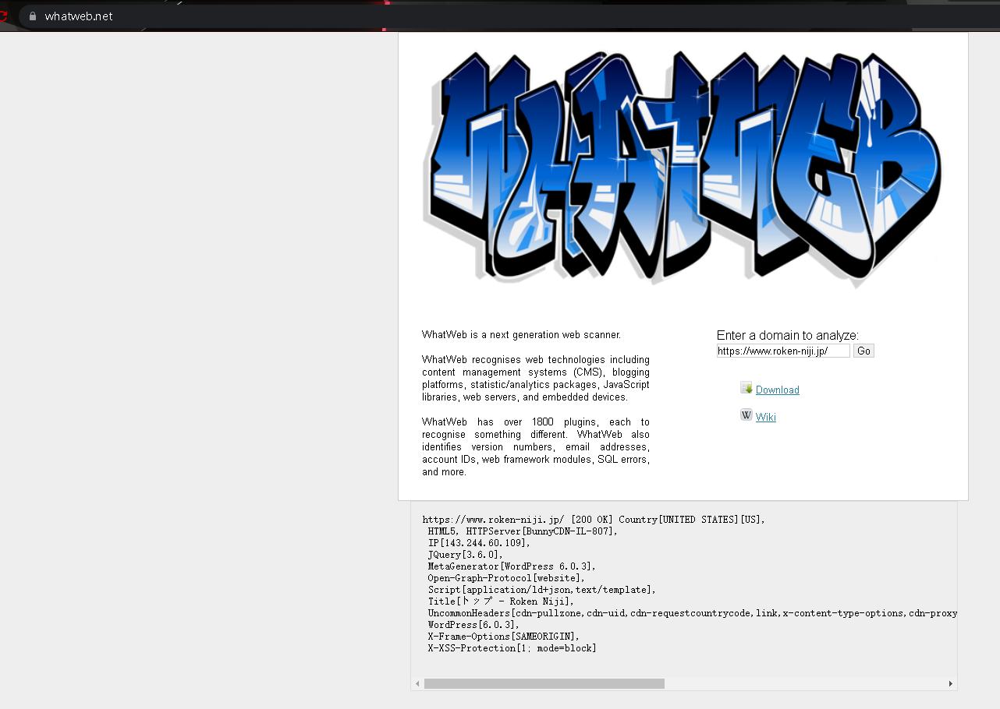

#### 工具

- 御剑Web指纹识别
- WhatWeb
- Test404轻量CMS指纹识别
- 椰树
- WTFScan
- [Kscan](https://github.com/lcvvvv/kscan)
- [CMSeeK](https://github.com/Tuhinshubhra/CMSeeK)
- [CMSmap](https://github.com/Dionach/CMSmap)
- [ACMSDiscovery](https://github.com/aedoo/ACMSDiscovery)
- [TideFinger](https://github.com/TideSec/TideFinger)
- [AngelSword](https://github.com/Lucifer1993/AngelSword)
- [EHole(棱洞)2.0](https://github.com/EdgeSecurityTeam/EHole)

> ps: cms识别主要还是在于指纹库的维护和更新。

#### 浏览器插件

[wappalyzer](https://www.wappalyzer.com/)


插件开源指纹库：<https://github.com/AliasIO/wappalyzer/tree/master/src/technologies>

### 2. WAF

遇到WAF就得对症下药，总的来说识别分为两种手工和工具：

#### 手工

一般直接输入敏感字段触发拦截规则库就行，如XSS、SQL payload

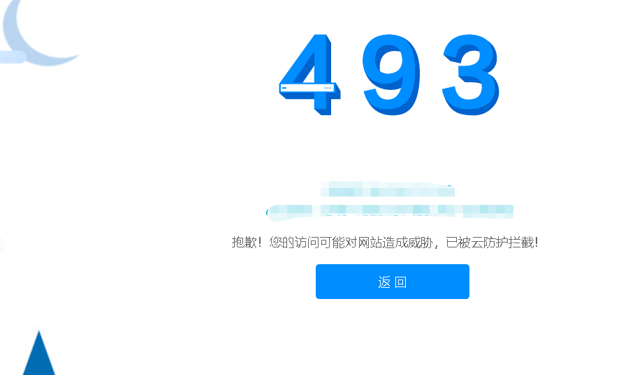

常见的WAF拦截页面可以参考下某大佬总结的WAF一图流：<https://cloud.tencent.com/developer/article/1872310>

#### 工具

- <https://github.com/EnableSecurity/wafw00f>
- <https://github.com/Ekultek/WhatWaf>
- nmap的`http-waf-fingerprint.nse`脚本

### 3. 组件

一般通过异常报错、常用路由、常用header头来获取组件版本、配置等相关信息。

常见组件漏洞简记参考博客《组件漏洞简记》章

### 4. 信息处理

对前期收集到的大量资产域名、ip信息批量进行存活性、title、架构、服务等信息进行验证提取时，可以用一些自动化工具筛选出有价值的数据，从而提高漏洞发现效率。

#### Ehole

> <https://github.com/EdgeSecurityTeam/EHole>
> 
> EHole是一款对资产中重点系统指纹识别的工具，在红队作战中，信息收集是必不可少的环节，如何才能从大量的资产中提取有用的系统(如OA、VPN、Weblogic...)。EHole旨在帮助红队人员在信息收集期间能够快速从C段、大量杂乱的资产中精准定位到易被攻击的系统，从而实施进一步攻击。

#### AlliN

> <https://github.com/P1-Team/AlliN>
> 
> 一个辅助平常渗透测试项目或者攻防项目快速打点的综合工具，由之前写的工具AG3改名而来。是一款轻便、小巧、快速、全面的扫描工具。多用于渗透前资产收集和渗透后内网横向渗透。工具从项目上迭代了一些懒人功能（比如提供扫描资产文件中，可以写绝大部分的各种形式的链接/CIDR,并在此基础上可以添加任意端口和路径）

#### Bufferfly

> <https://github.com/dr0op/bufferfly>
> 
> 攻防资产处理小工具，对攻防前的信息搜集到的大批量资产/域名进行存活检测、获取标题头、语料提取、常见web端口检测、简单中间识别，去重等，便于筛选有价值资产。

#### HKTools

> <https://github.com/Security-Magic-Weapon/HKTools>
> 
> 一款辅助安全研发在日常工作中渗透测试、安全研究、安全开发等工作的工具

#### EyeWitness

> <https://github.com/FortyNorthSecurity/EyeWitness>

Eyewitness可自动查询URL对应网站的截图、RDP服务、Open VNC服务器以及一些服务器title、甚至是可识别的默认凭据等，最终会生成一个详细的html报告。

#### anew(去重)

> <https://github.com/tomnomnom/anew>
> 
> 好用的去重对比工具

0x05 敏感信息
---------

### 1. 目录结构及敏感文件

常见的敏感目录及文件，会对渗透突破有着很大作用，收集思路一般是爬虫采集、递归扫描、Google Hacking。

#### 常见敏感目录及文件

- 备份文件：`www.zip`、`www.rar`、`blog.gm7.org.zip`等
- 代码仓库：`.git`、`.svn`等
- 敏感、隐藏api接口：`/swagger-ui.html`、`/env`等
- 站点配置文件：`crossdomain.xml`、`sitemap.xml`、`security.txt`等
- robots文件
- 网站后台管理页面
- 文件上传/下载界面
- ...

> tips:
> 
> - 扫描核心主要在于字典价值
> - 403、404页面可能会存在一些信息，可以多fuzz下。
> - 工具使用时善于关键字过滤，将会减少一些误报。

#### 工具推荐

##### [dirsearch](https://github.com/maurosoria/dirsearch)

dirsearch 是一款使用 python3 编写的，用于暴力破解目录的工具，速度不错，支持随机代理、内容过滤。

##### [feroxbuster](https://github.com/epi052/feroxbuster)

用Rust编写的快速，简单，递归的内容发现工具

##### [yjdirscan](https://github.com/foryujian/yjdirscan)

御剑目录扫描专业版

#### 字典推荐

##### [fuzzDicts](https://github.com/TheKingOfDuck/fuzzDicts)

庞大的Web Pentesting Fuzz 字典，部分精准度不错，可惜更新是2021的时候了。

##### [Web-Fuzzing-Box](https://github.com/gh0stkey/Web-Fuzzing-Box)

Web Fuzzing Box - Web 模糊测试字典与一些Payloads，主要包含：弱口令暴力破解、目录以及文件枚举、Web漏洞...

字典运用于实战案例：<https://gh0st.cn/archives/2019-11-11/1>

##### [XXE 暴力枚举字典](https://mp.weixin.qq.com/s/7kUFx6VpCgNVomQ_e6H6HA)

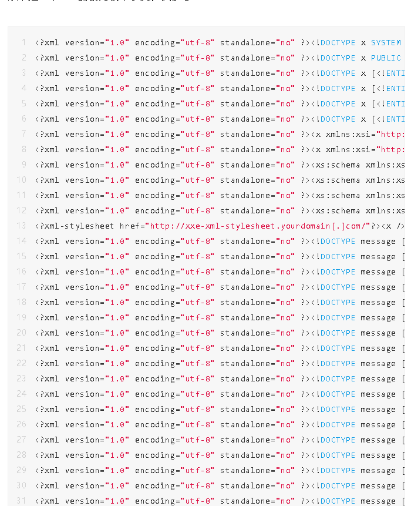

### 2. JS信息收集

js文件一般用于帮助网站执行某些功能，存储着客户端代码，可能会存在大量的敏感信息，通过阅读分析可能会找到宝藏。

#### JS信息查找方法

##### 1. 手工

通过查看页面源代码信息，找到.js后筛选特定信息，但这种方法费时费力，一般网站都会存在大量的js文件，还多数为混淆后的信息。

关键信息查找可以使用浏览器自带的全局搜索：

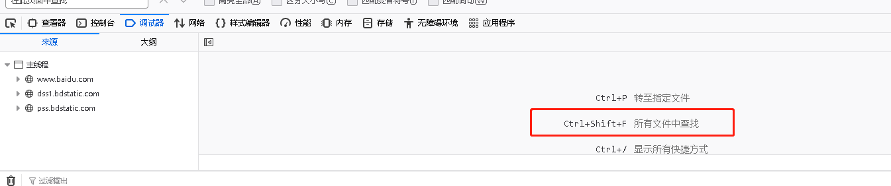

如：通过path:来查Vue框架路由

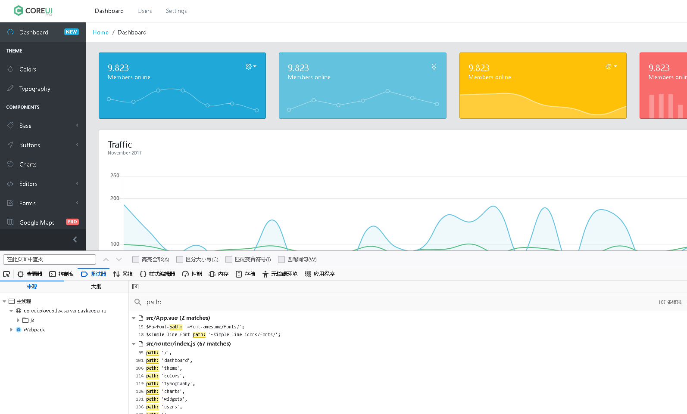

##### 2. 半自动

通过抓包拦截获取url后使用脚本筛选，比如`Burp Suite`专业版，可以在`Target > sitemap`下，选中目标网站选中`Engagement tools -> Find scripts`，找到网站所有脚本内容。

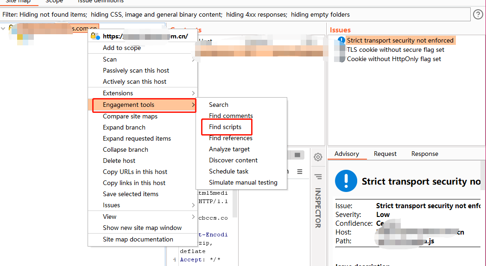

也可以使用`Copy links in selected items`复制出选中脚本项目中所包含的URL链接。

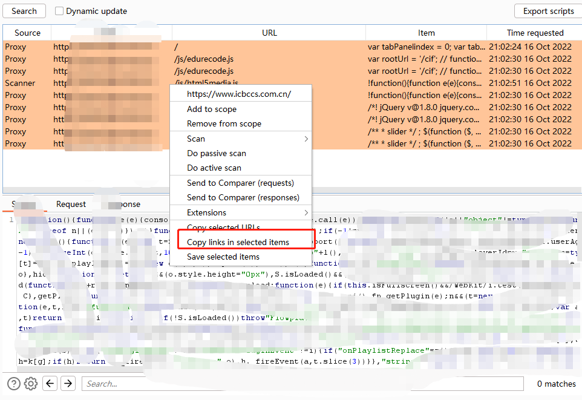

粘贴下，然后就可以手工验证url信息价值，有时候可以发现一些未授权、敏感的api接口或者一些GitHub仓库、key值等。

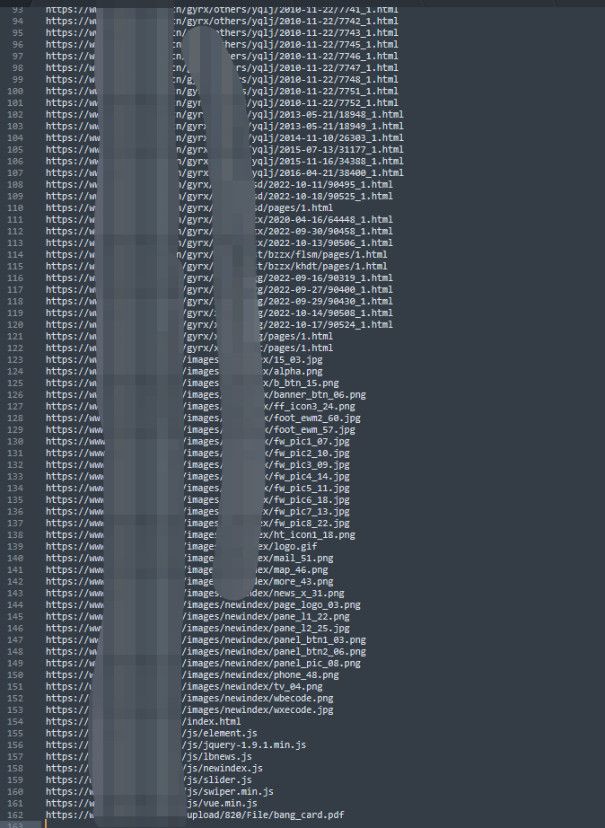

这种方法因为结合手工，在一些深层目录架构中，通过`Burp Suite script`可以获取到一些工具跑不到的js信息。

##### 3. 工具：

**[JSFinder](https://github.com/Threezh1/JSFinder)**

> JSFinder是一款用作快速在网站的js文件中提取URL，子域名的工具

[JSINFO-SCAN](https://github.com/p1g3/JSINFO-SCAN)

> 递归爬取域名(netloc/domain)，以及递归从JS中获取信息的工具

[URLFinder](https://github.com/pingc0y/URLFinder)

> URLFinder是一款用于快速提取检测页面中JS与URL的工具。
> 
> 功能类似于JSFinder，但JSFinder好久没更新了。

[HAE](https://github.com/gh0stkey/HaE)

> **HaE**是基于 `BurpSuite Java插件API` 开发的请求高亮标记与信息提取的辅助型框架式插件，该插件可以通过自定义正则的方式匹配响应报文或请求报文，并对满足正则匹配的报文进行信息高亮与提取。如匹配敏感信息、提取页面中的链接信息等。

[**Repo-supervisor**](https://github.com/auth0/repo-supervisor#)

> Repo-supervisor 是一种工具，可帮助您检测代码中的秘密和密码。
> 
> [command-line-mode](https://github.com/auth0/repo-supervisor#command-line-mode) 功能：
> 
> CLI 模式允许使用源代码扫描本地目录以检测文件中的机密和密码。结果可能以明文或 JSON 格式返回。

##### 4. 其他辅助工具

信息收集过程中，js文件不用仅限于当前网站版本，网站的历史版本中也可能会存在一些未失效的关键信息。

###### 历史界面

[wayback](https://archive.org/web/)会记录网站版本更迭，可以获取到之前版本的网站，不仅可以用于收集历史js文件，也有可能找到一些后来删除的敏感资产信息，或者一些漏洞

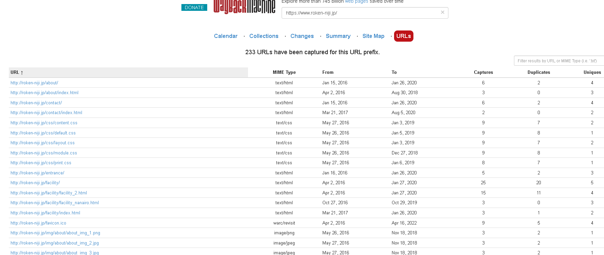

**历史信息查找工具：**

[**waybackurls**](https://github.com/tomnomnom/waybackurls)

> 获取 Wayback Machine 知道的域的所有 URL

收集历史js文件

webbackurls target.com | grep "\\.js" | uniq |sort

通过`Wayback Machine`收集到的url js列表需要进行存活检验，避免误报，可以使用curl命令或者[hakcheckurl](https://github.com/hakluke/hakcheckurl)工具进行检验。最后在做url提取即可。

###### 反混肴

对于存在混淆的代码需要进行反混淆美化下，使其更易看懂

[**js-beautify**](https://github.com/beautify-web/js-beautify)

> 这个小美化器将重新格式化和重新缩进书签、丑陋的 JavaScript、由 Dean Edward 的流行打包程序打包的解包脚本，以及由 npm 包 [javascript-obfuscator](https://github.com/javascript-obfuscator/javascript-obfuscator)处理的部分去混淆脚本。

**[de4js](https://lelinhtinh.github.io/de4js/)**

> 在线JavaScript 反混淆器和解包器

###### url采集

[**Rad**](https://stack.chaitin.com/tool/detail?id=2)

一款专为安全扫描而生的浏览器爬虫。

[whatweb-plus](https://github.com/winezer0/whatweb-plus)

获取网站title头及Web指纹

[url-extractor](http://www.bulkdachecker.com/url-extractor/)

在线url提取

#### js中关键信息简记

- 密码、api密钥、secretKey等硬编码
- 隐藏的api接口，如后台、业务测试、某服务等，可能会存在未授权。
- 注释信息，注释为代码时，可能会通过修改注释改变业务逻辑，实现机制绕过，如xss绕过、登录绕过等。
- Webpack 打包静态资源、js.map后缀文件，是jQuery中的一个新功能，支持Source Map,储存着各种api接口信息，而Webpack打包的信息很多都会放在js.map文件中，通过还原代码可能会找到一些未授权的api接口。相关处理工具如下：
    
    
    - [sourcemapper](https://github.com/denandz/sourcemapper)
    - <https://www.npmjs.com/package/restore-source-tree>
    - <https://github.com/paazmaya/shuji>
- 子域名信息
- 依赖或框架，对于旧依赖或框架可以直接使用[retire.js](https://retirejs.github.io/retire.js/)扫描相关漏洞。
- ……

### 3. Google Hacking

Google作为一款全球通用的发达搜索引擎，爬取的和收录的数据量也是庞大无比，善用搜索引擎语法可以帮忙我们发现更多敏感信息。

#### 说明

| 指令 | 用法 | 示例 |
|---|---|---|
| “”（引号） | 用引号来查询一个确切的单词或短语 | 查找有关《百年孤独》这本书的网页，语法：“百年孤独” |
| OR（或者） | 用OR分隔搜索词，同时执行两个搜索查询，这将找到包含多个单词之一的页面。 | 搜索引用了“Google Drive”、“Dropbox”或“OneDrive”的页面，语法：Google Drive OR Dropbox OR OneDrive |
| -（减号、连字符） | 在单词或网站前使用连字符将其从搜索结果中排除 | 从搜索结果中排除www主机名，语法：-www site:wikipedia.org |
| allintext: | 使用allintext:\[搜索短语\]查找正文中包含这些单词的页面 | 查找正文中有关Roth、IRA投资讯息的页面，语法：allintext:Roth IRA 投资 |
| allintitle: | 使用allintitle:\[搜索短语\]查找标题中包含这些单词的页面 | 查找标题中同时包含“Apple”和“notebook”的页面，语法：allintitle:Apple notebook |
| allinurl: | 使用allinurl:\[搜索短语\]查找URL中包含这些单词的页面 | 查找URL中同时包含”Microsoft” and “Surface”的页面，语法：allinurl:Microsoft Surface |
| site: | 使用site:\[URL\]将搜索结果限制到特定网站 | 查找云点SEO网关于谷歌SEO的页面，语法：site:yundianseo.com 谷歌SEO |
| ~（波浪号） | 使用波浪号获得目标关键词及其近似词的搜索结果 | 查找SEO方面的策略或者教程，语法：SEO ~教程 |
| related: | 使用related:\[URL\]查找与特定网站类似的网站 | 查找与云点SEO类似的网站，语法：related:yundianseo.com |
| define: | 使用define:\[搜索短语\]查找其定义 | 查找SEO的定义，语法：define:SEO |
| $ | 使用$查找特定价格的商品 | 查找一款售价在99美金的手机，语法：mobile phone $99 |
| location: | 使用location:\[地点\]查看某个地区内的相关信息 | 查询南京的酒店，语法：hotel location:Nanjing |
| \*（星号） | 添加星号作为未知单词或事实的占位符 | 查找以“生活就像一个”开头的引语，语法：生活就像一个\* |
| filetype: | 使用filetype:\[后缀\]将结果限制为特定的文件格式，如PDF或DOC。 | 查找PDF格式的Microsoft Office键盘快捷键相关文件，语法：filetype:pdf Microsoft Office键盘快捷键 |
| ..（两点） | 用两个句点分隔数字，不带空格，以搜索该范围内的数字 | 查找1950年至2000年间发生的计算机里程碑，语法：”计算机里程碑” 1950..2000 |
| AROUND(n) | 在两个搜索词之间加上AROUND(n)，以查找两个词间有特定距离的页面。用数字n设置术语之间的最大距离，这对于查找两个搜索词之间的关系很有用。 | 查找在同一句话或段落中提到Facebook和Microsoft的页面，语法：Facebook AROUND(7) Microsoft |

#### hacking常用语法

- [Google Hacking Database](https://www.exploit-db.com/google-hacking-database)
- [cxsecurity-hacking-dorks](https://cxsecurity.com/dorks/)
- [Github Google Hacking](https://github.com/BullsEye0/google_dork_list/blob/master/google_Dorks.txt)

##### 管理后台地址

```php
site:target.com intext:管理 | 后台 | 后台管理 | 登陆 | 登录 | 用户名 | 密码 | 系统 | 账号 | login | system  
site:target.com inurl:login | inurl:admin | inurl:manage | inurl:manager | inurl:admin_login | inurl:system | inurl:backend  
site:target.com intitle:管理 | 后台 | 后台管理 | 登陆 | 登录
```

##### 上传类漏洞地址

```php
site:target.com inurl:file  
site:target.com inurl:upload
```

##### 注入页面

```php
site:target.com inurl:?id=  
site:target.com inurl:php?id=
```

##### 编辑器页面

```php
site:target.com inurl:ewebeditor
```

##### 目录遍历漏洞

```php
site:target.com intitle: "index of"
```

##### SQL错误

``  
site:target.com intext:"sql syntax near" | intext:"syntax error has occurred" | intext:"incorrect syntax near" | intext:"unexpected end of SQL command" | intext:"Warning: mysql_connect()" | intext:”Warning: mysql_query()" | intext:"Warning: pg_connect()"

```php
##### phpinfo
```

site:target.com ext:php intitle:phpinfo "published by the PHP Group"

```php
##### 配置文件泄露
```

site:target.com ext:.xml | .conf | .cnf | .reg | .inf | .rdp | .cfg | .txt | .ora | .ini

```php
##### 数据库文件泄露
```

site:target.com ext:.sql | .dbf | .mdb | .db

```php
##### 日志文件泄露
```

site:target.com ext:.log

```php
##### 备份和历史文件泄露
```bash
site:target.com ext:.bkf | .bkp | .old | .backup | .bak | .swp | .rar | .txt | .zip | .7z | .sql | .tar.gz | .tgz | .tar
```

##### 公开文件泄露

```bash
site:target.com filetype:.doc | .docx | .xls | .xlsx | .ppt | .pptx | .odt | .pdf | .rtf | .sxw | .psw | .csv
```

##### 邮箱信息

```bash
site:target.com intext:@target.com  
site:target.com 邮件  
site:target.com email
```

##### 社工信息

```bash
site:target.com intitle:账号 | 密码 | 工号 | 学号 | 身份证
```

#### **tips：**

- 判断目标是否被黑过。（如html寄生虫）

site:xx.com指定搜索发现多个垃圾数据，大概率中招过。（黑帽SEO劫持）

- 可搜索渗透特征痕迹（如遗留webshell、执行命令接口、黑页）
- 搜索常见的敏感文件、路由
- 发现其他人正在搜索的内容
    
    
    - [Google Trends](https://www.yundianseo.com/google-trends/)
- 搜索结果别忘了快照信息。
- Google搜索会追踪ip和地址，想要隐私可以试试私密搜索*（代理访问其他搜索引擎内容）*：
    
    
    - [startpage.com](https://www.startpage.com/)
    - [秘迹搜索](https://mijisou.com/)

> ps: 百度、搜狗、bing也是可以使用语法精确搜索，但限于seo逻辑、广告、资源等多个因素，经常不如Google，但有时候结合又有不错的收获。

#### 百度语法

- **`site`:** 搜索特定网站的内容


- **`intitle`:** 搜索网页标题的内容

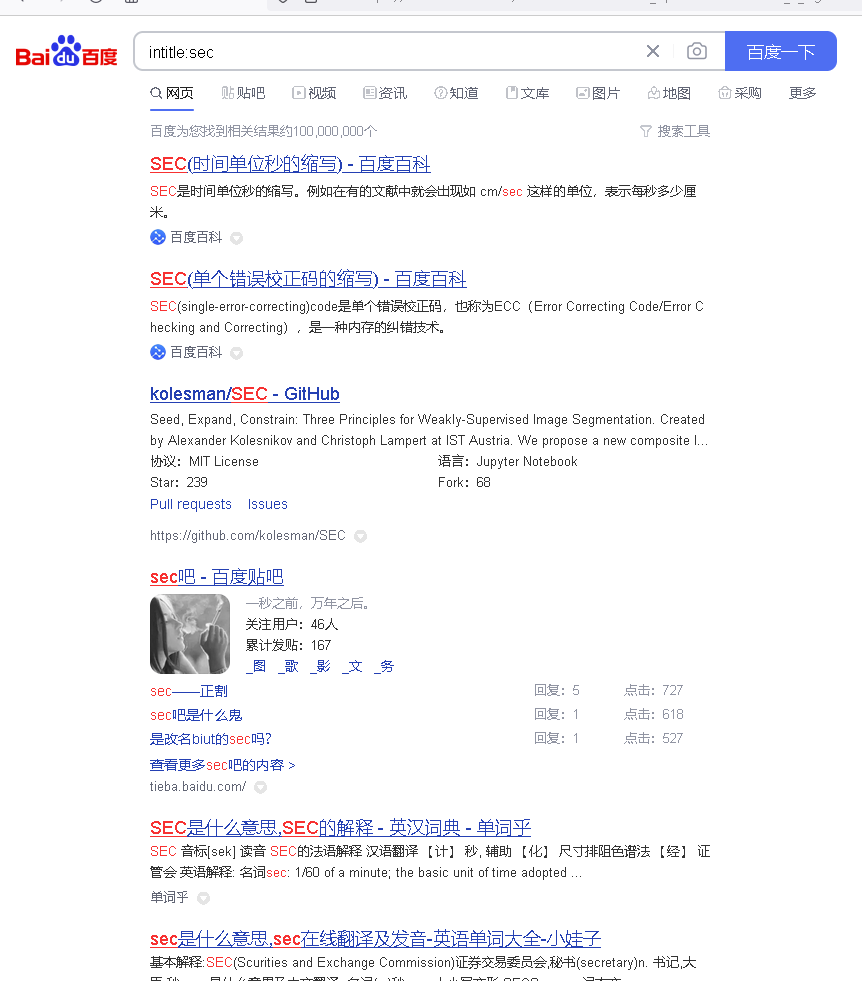

- **`inurl`:** 搜索网址中的内容
    
    
    - 可以用`-`减号忽略掉关键词网页

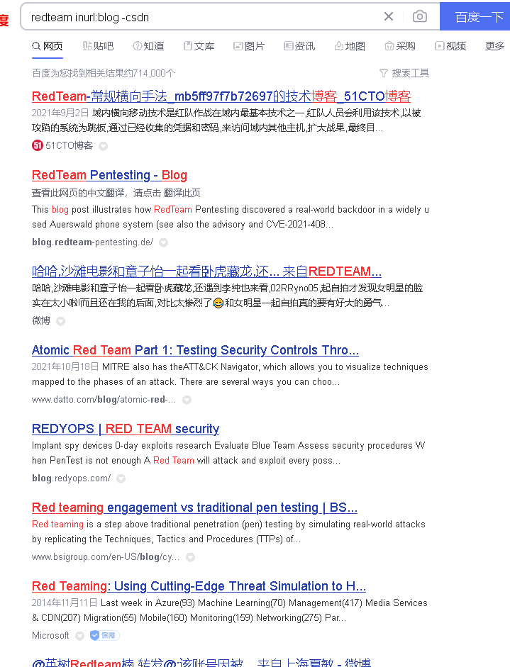

- **`“ ”`：** 搜索关键不可拆分


#### 图片反查

##### 百度识图、googleimage、tineye等识图引擎

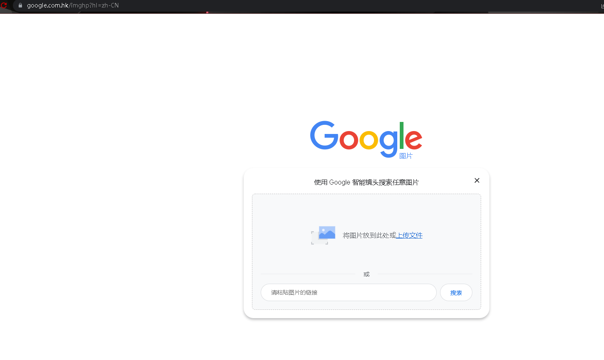

##### 从图片原图获取坐标

###### 在线查看器

改图宝  
<https://www.gaitubao.com/exif>  
图虫EXIF查看器  
<https://exif.tuchong.com/>  
我爱斗图  
<https://www.52doutu.cn/tools/exif>  
python-exifread 库  
[https://link.zhihu.com/?target=https%3A//pypi.python.org/pypi/ExifRead](https://link.zhihu.com/?target%5C=https%3A//pypi.python.org/pypi/ExifRead)

###### 经纬度转地址

GPS查询网址1  
<http://www.gpsspg.com/maps.htm>  
GPS查询网址2  
<http://www.gzhatu.com/dingwei.html>  
地球在线  
<https://www.earthol.com/>  
python-geopy库  
<https://www.osgeo.cn/geopy/>

### 4. Github信息收集

自从学会使用github并在上面乱捣鼓找到一些站点账号或源码后，就此走上不归路，各种Github监控搞上，又发现一些阿里key，简直是宝了……

#### Github搜索语法

**高级搜索：**<https://github.com/search/advanced>

**Github高级搜索语法：<https://docs.github.com/cn/search-github/getting-started-with-searching-on-github/understanding-the-search-syntax?spm=a2c6h.12873639.article-detail.6.55db74b8e8hJQq>**

Github有着自己的搜索语法，善用搜索语法能发现更多的有用信息。一般来说，Github搜索都是以域名、备案、js路径、网站技术支持等关键内容为主。

搜索包含"`AccessKey ID`"和`password`内容的代码。

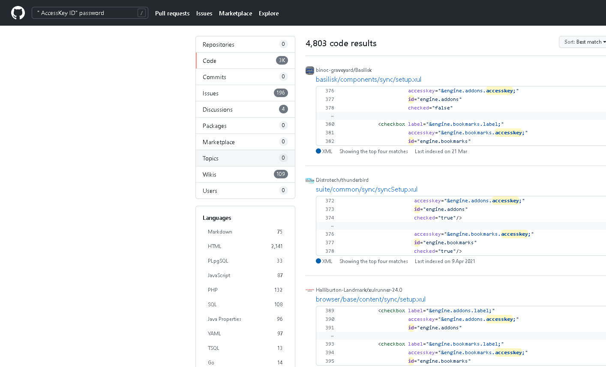

一些工具中总结了一些常见的搜索语法：

<https://github.com/obheda12/GitDorker/tree/master/Dorks>


搜索常用语法，可以搜索到一些敏感的私钥，一些SSH登录私钥，mysql的数据库密码，API key等等

```bash
"token"  
"password"  
"secret"  
"passwd"  
"username"  
"key"  
"apidocs"  
"appspot"  
"auth"  
"aws_access"  
"config"  
"credentials"  
"dbuser"  
"ftp"  
"login"  
"mailchimp"  
"mailgun"  
"mysql"  
"pass"  
"pem private"  
"prod"  
"pwd"  
"secure"  
"ssh"  
"staging"  
"stg"  
"stripe"  
"swagger"  
"testuser"  
"jdbc"  
extension:pem private  
extension:ppk private  
extension:sql mysql dump password  
extension:json api.forecast.io  
extension:json mongolab.com  
extension:yaml mongolab.com  
extension:ica \[WFClient\] Password=  
extension:avastlic “support.avast.com”  
extension:js jsforce conn.login  
extension:json googleusercontent client_secret  
“target.com” send_keys  
“target.com” password  
“target.com” api_key  
“target.com” apikey  
“target.com” jira_password  
“target.com” root_password  
“target.com” access_token  
“target.com” config  
“target.com” client_secret  
“target.com” user auth
```

#### 收集工具

##### GitDorker

> <https://github.com/obheda12/GitDorker>

GitDorker 是一款github自动信息收集工具，它利用 GitHub 搜索 API 和作者从各种来源编译的大量 GitHub dorks 列表，以提供给定搜索查询的 github 上存储的敏感信息的概述。

##### trufflehog

> <https://github.com/trufflesecurity/trufflehog>

Truffle Hog是一款采用Python开发的工具，它可以检索GitHub代码库的所有代码提交记录以及分支，并搜索出可以表示密钥(例如AWS密钥)的高熵字符串。一般用来探测泄漏密钥的工具，支持扫描的数据源包括git、github、gitlab、S3、文件系统、文件和标准输入。

##### 其他检索方法：

<https://github.com/BishopFox/GitGot>

<https://github.com/UKHomeOffice/repo-security-scanner>

<https://github.com/gwen001/github-search>

<https://github.com/eth0izzle/shhgit>

<https://github.com/lightless233/geye>

<https://github.com/cve-search/git-vuln-finder>

<https://github.com/Securityautomation/DumpTheGit>

<https://github.com/4x99/code6>

<https://github.com/tillson/git-hound>

#### 代码仓库在线搜索平台

##### pinatahub

> [https://pinatahub.incognita.tech](https://pinatahub.incognita.tech/)
> 
> github敏感信息搜索引擎，有时候github搜索查看不方便，可以直接在这个网站搜索。

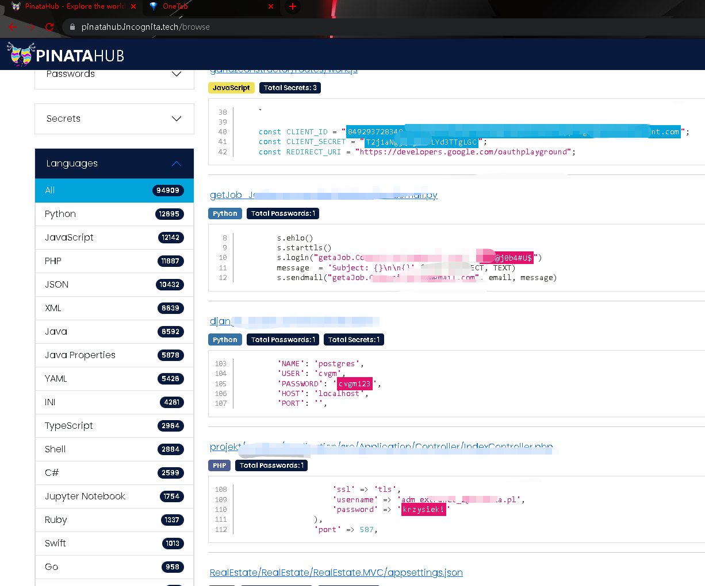

##### searchcode

> <https://searchcode.com/>
> 
> SearchCode从Github、BitBucket、CodePlex、SourceForge、Fedora等代码仓库里筛选了近160亿行开源代码，你能够使用文件扩展、特定代码库名字、URL、正则表达式、特殊字符等过滤器对源代码进行过滤，以便搜到你想要的代码。

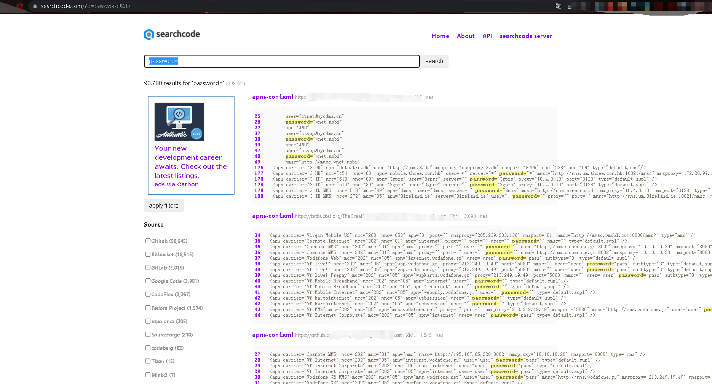

#### 其他仓库

GitLab: <https://about.gitlab.com/>

gitee: <https://gitee.com/>

csdn：<https://gitcode.net/explore>

### 5. 邮箱信息收集

有时候不仅是正面硬刚就可以的，还需要迂回战术配合出击，正如攻防中社工一样，总会有一些意想不到的成果。随着办公网络的发展，邮箱也成为了常用的办公方式之一。攻防也是从信息收集逐渐延伸到钓鱼上，只要钓鱼技术好，轻轻松松混入内部，而要想社工钓鱼玩得溜，邮件方面是一个重要的突破口。

> tips: 邮箱建议做筛选，把一些疑是网络管理员、运维人员、安全部门的人员提取出来，单独发送或者不发，由于这部分人员安全意识偏高，容易打草惊蛇，一般多针对非技术人员，容易下手。

#### 邮箱入口查找方法

> 邮件服务器主要从端口和title标识两个信息点去确认的。

邮件服务器常见端口：

- 25
- 109
- 110
- 143
- 465
- 995
- 993

邮件服务器常见title：

- 邮箱登录
- Coremail
- eYou邮件系统
- TurboMail
- Exchange
- ……

##### C段扫描寻找入口

- 获取到目标后，从目标mx记录域名找到他的真实ip，若是第三方邮件服务器，MX记录就没啥参考价值了。

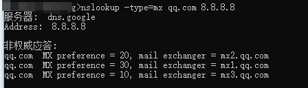

- 对获取到的真实ip这个段进行C段扫描，有时候也可以进行B段扫描。然后通过端口、title去确定邮件服务器信息。C段扫描方法可以参考上文C段收集章节。

##### 通过子域名扫描寻找入口

主要通过一些子域名收集工具去确认，如：Subdomainbrute、ksubdomain、Oneforall、Sublist3r、TeeMO、LangSrcCurise、Layer挖掘机等。

##### 通过搜索引擎寻找入口

战场主力也还是Google hacking和网络空间搜索引擎

1. **Google Hacking**

```bash
site:target.com intitle:"Outlook Web App"  
site:target.com intitle:"mail"  
site:target.com intitle:"邮箱"
```


2. **网络空间搜索引擎**

- Shodan
- fofa
- zoomeye
- 0.zone

`(group==阿里&&title==邮箱)`

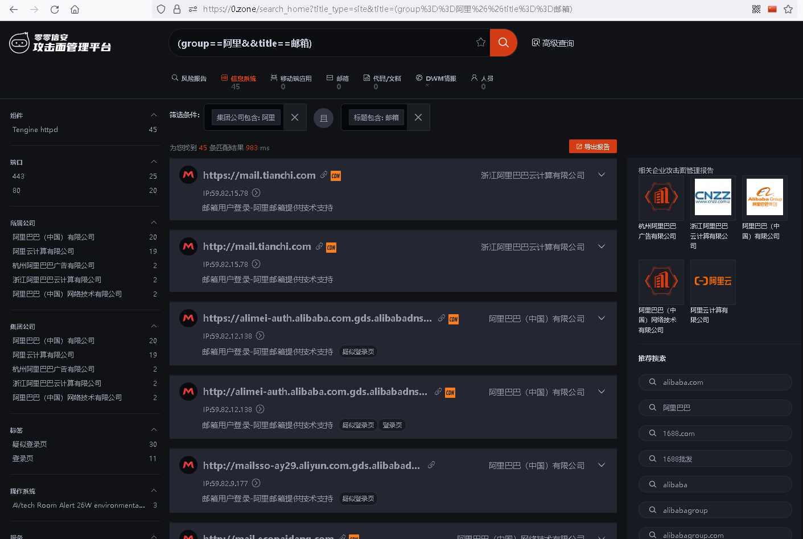

#### 邮箱收集方法

##### 搜索引擎

###### Google Hacking

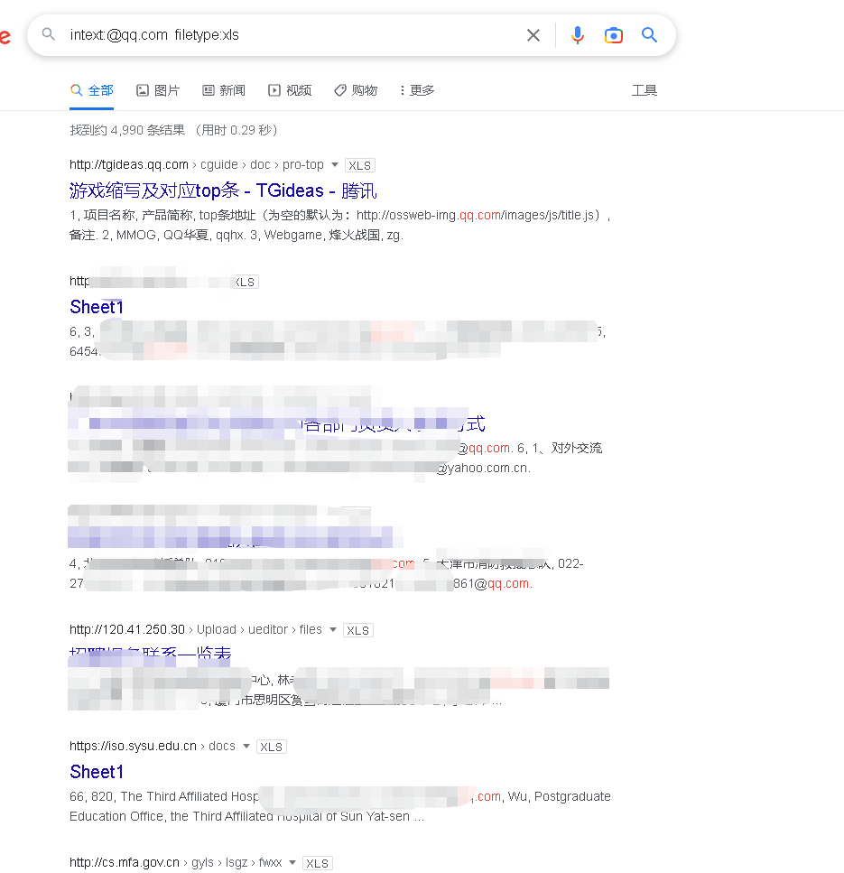

> - 有时候github一些仓库代码中也会存在邮箱信息。
> - 一般都会有邮箱、手机号等官方联系方式信息。

###### 网络空间搜索引擎

**0.zone邮箱收集**

`email_type==邮箱&&(group==阿里)`

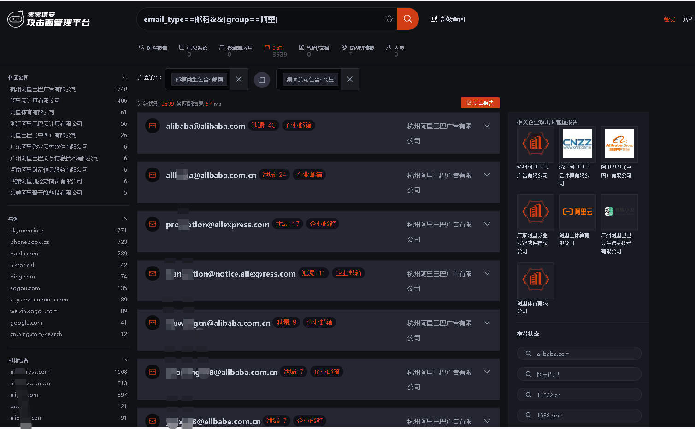

##### 在线收集平台

> ps: 基本都需要注册，注册获取的信息比游客多好多，有些还需要绑定手机号。

###### [Snov.io](https://app.snov.io/)

Snovio是一个集成了“LinkedIn、GitHub、Moz、StackOverflow、Indeed、Behance、Upwork、Google页面邮箱采集”+“邮箱验证”+“联系人管理”+“邮件发送”为一身的网站。在Snovio只要输入一个域名，就可以采集到该域名在以上平台中暴露的所有邮箱地址，还支持API批量读取。

强大的邮箱收集，可单个收集也可以批量收集，还支持api调用。

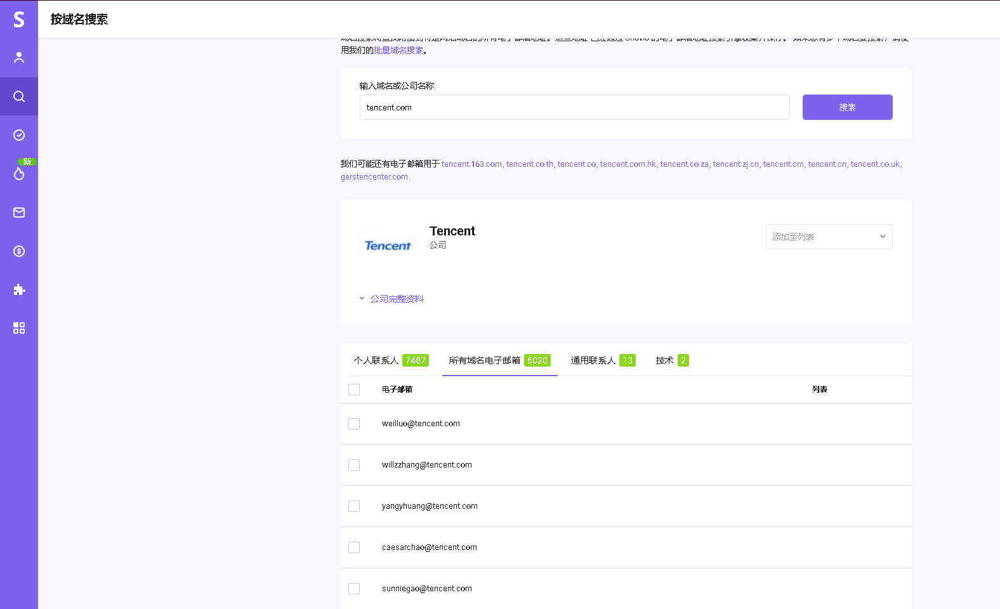

> - 免费版每月可以有100条收集数量，也就是50信用。
> - 该站点的Google插件更方便
>     
>     
>     - <https://snov.io/knowledgebase/how-to-use-snovio-extension-for-chrome/>

###### [hunter](https://hunter.io/)

Hunter可让您在几秒钟内找到专业的电子邮件地址，并与对您的业务重要的人建立联系。

> 打码信息需要注册绑定手机号后才能看到。

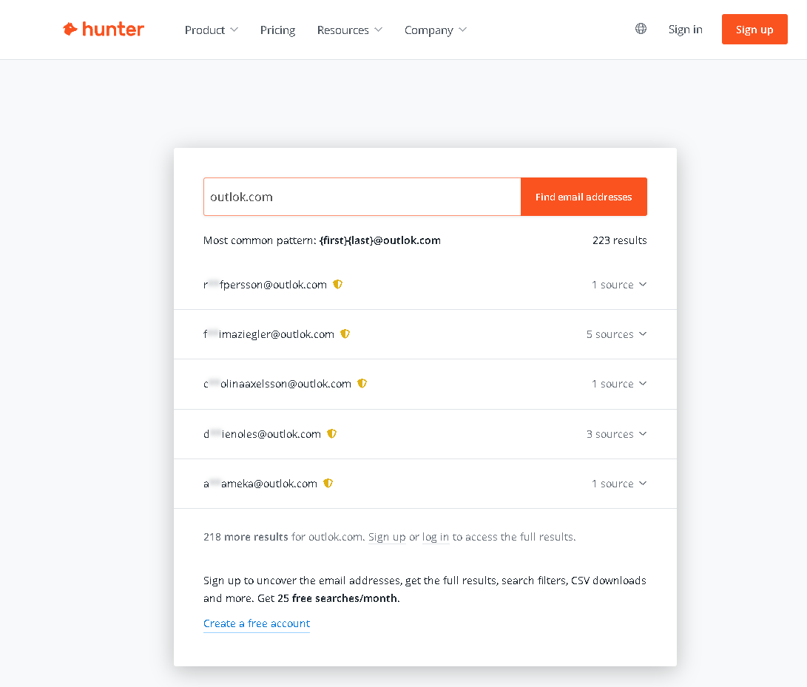

###### [phonebook](https://phonebook.cz/)

Phonebook例举所有的域名，邮件地址，或者是所予域名的url，支持\*.gov.uk的通配符，有340亿条记录。可以批量下载想要的域名。

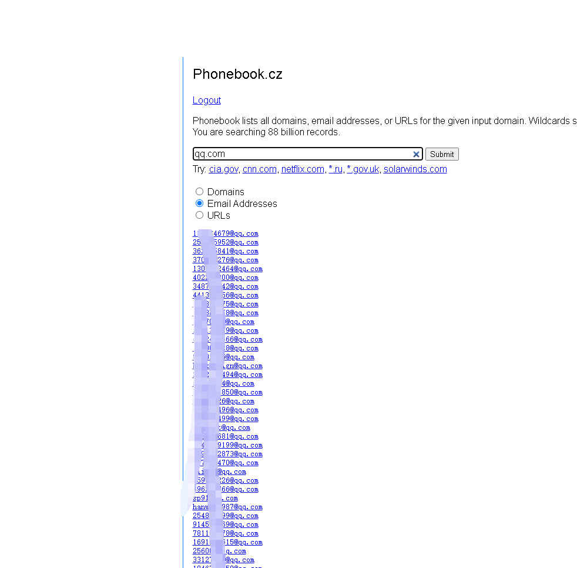

###### [intelx](https://intelx.io/)

intelx是一个搜索引擎和数据存档。通过电子邮件，域名，IP, CIDR，比特币地址等等查找数据泄露信息。随便搜一下好像搜索出了一个泄露的邮箱数据库：

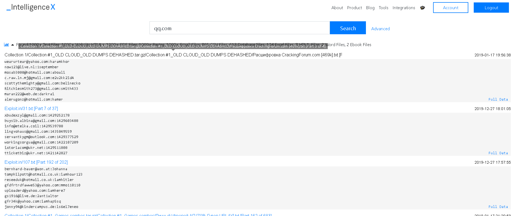

###### [skymem](http://www.skymem.info/)

一款可查找公司和人员的电子邮件地址在线邮箱查找平台，数据量较少，准确度高，大批量的需要购买。

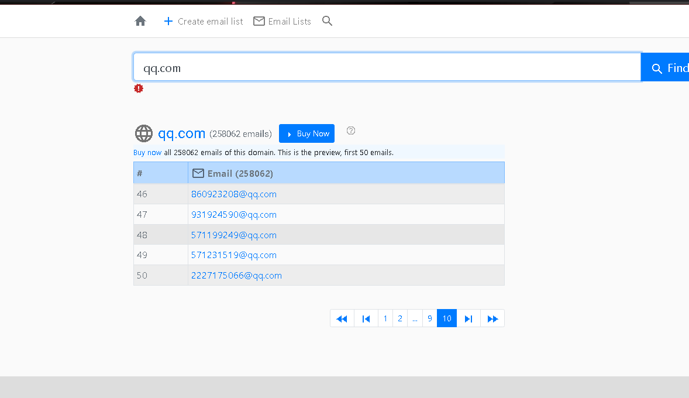

###### 爱企查、企查查等批量查询

如通过爱企查的爱番番寻宝客“获取更多的联系方式”

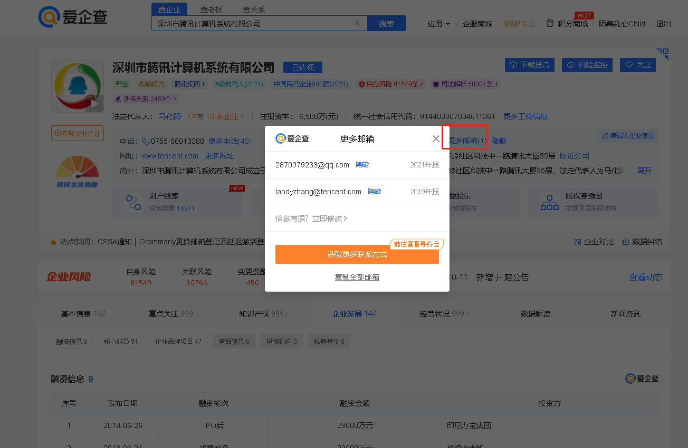

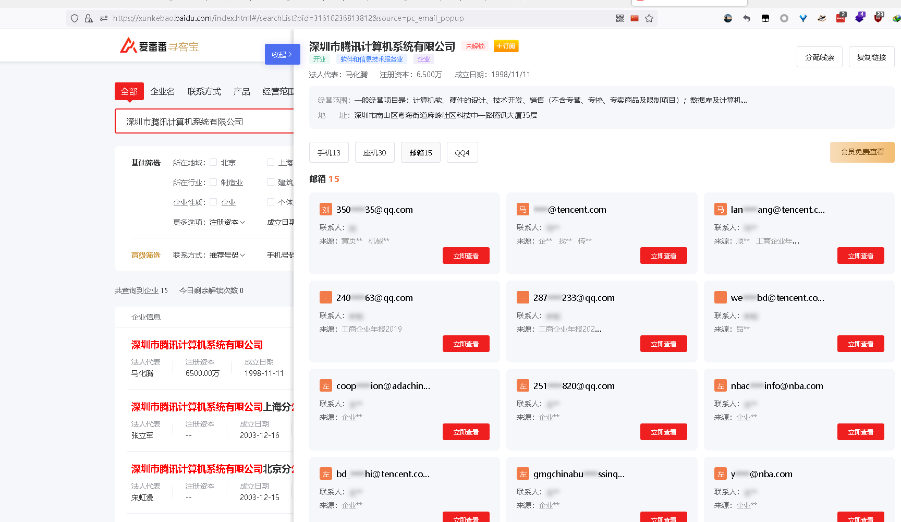

如使用八爪鱼采集器进行批量查询

<https://www.bazhuayu.com/tutorial/qccqyemailcj>

###### 邮箱泄露信息查询

- <https://monitor.firefox.com/>
- <https://haveibeenpwned.com/>
- <https://ghostproject.fr/>

###### 其他

- [https://app.apollo.io](https://app.apollo.io/)
- [https://contactout.com](https://contactout.com/)
- [https://www.datanyze.com](https://www.datanyze.com/)
- [https://www.email-format.com](https://www.email-format.com/)
- TG社工库、其他社工库

##### 工具收集

###### [theHarvester](https://github.com/laramies/theHarvester)

> theHarvester是Kali自带的一款社会工程学工具，默认集成了多个api，利用网络爬虫技术通过Google、Bing、PGP、LinkedIn、Baidu、Yandex、People123、Jigsaw、Shodan、PGP服务器等不同公开源整理收集，能够收集e-mail、用户名、主机名、子域名、雇员、开放端口和Banner等信息。

theHarvester 参数详解

```php
  -h, \--help            show this help message and exit    #显示帮助信息并退出  
  -d, \--domain          DOMAIN Company name or domain to search.    #要搜索的公司名称或域名  
  -l, \--limit           LIMIT Limit the number of search results, default=500.  #采集特定数量的结果，不指定情况下，默认为500  
  -S, \--start           START Start with result number X, default=0.    #从采集到的信息编号“X”处开始执行采集，默认从0开始  
  -g, \--google-dork     Use Google Dorks for Google search.     #使用google Dorks进行google搜索。 （一般情况下不用，你懂的）  
  -p, \--proxies         Use proxies for requests, enter proxies in proxies.yaml.    #对信息采集的请求使用代理  
  -s, \--shodan          Use Shodan to query discovered hosts.       #使用shodan查询发现的主机  
  --screenshot Take screenshots of resolved domains specify output directory:       #对解析域的页面进行截图，需指定截图文件存放目录  
        \--screenshot output_directory      \# 截图保存目录  
  -v, \--virtual-host    Verify host name via DNS resolution and search for virtual hosts.       #通过DNS解析主机名并搜索虚拟主机  
  -e, \--dns-server DNS_SERVER DNS server to use for lookup.     #指定DNS解析服务器  
  -t, \--dns-tld DNS_TLD  Perform a DNS TLD expansion discovery, default False.      #执行DNS TLD扩展发现，默认为False状态  
  -r, \--take-over       Check for takeovers.    #检查接管  
  -n, \--dns-lookup      Enable DNS server lookup, default False.       \# 启用DNS服务器查找，默认为False状态                                                                                                       
  -c, \--dns-brute       Perform a DNS brute force on the domain.       \# 进行DNS域解析暴力破解                                                                                                           
  -f, \--filename        Save the results to an HTML and/or XML file.    #指定输出文件名，格式支持HTML和XML                                                                                                         
  -b SOURCE, \--source SOURCE                                                                                                                                                     
                        baidu, bing, bingapi, bufferoverun, certspotter, crtsh, dnsdumpster, duckduckgo, exalead, github-code, google, hackertarget, hunter, intelx,             
                        linkedin, linkedin_links, netcraft, otx, pentesttools, projectdiscovery, qwant, rapiddns, securityTrails, spyse, sublist3r, threatcrowd, threatminer,    
                        trello, twitter, urlscan, virustotal, yahoo     #指定采集信息的源  
```

**常用参数**

-d：指定搜索的域名或网址  
-b：指定采集信息的源（如baidu，biying，google）  
-l：指定采集信息的返回数量，默认500  
-f：输出文件名并保存采集结果，可以保存为HTML或XML格式；如果不指定，采集信息仅作屏幕显示

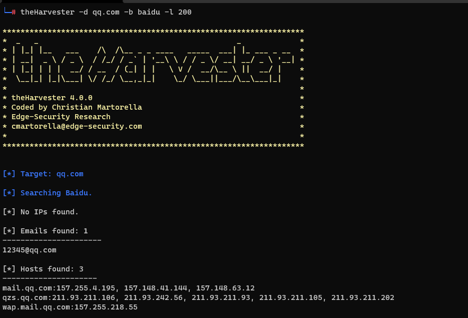

> api key没有配置的时候，结果较少。

#### 验证邮箱

收集到邮箱后，就要对其进行存活性验证，避免出现被弃用、不可用的邮箱。

##### 在线平台

- [Email地址检查、检测Email地址真实性、检测电子邮件地址真实性--查错网](http://tool.chacuo.net/mailverify)
- [Verify Email Address Online - Free Email Verifier - Free Email Address Verification](https://verify-email.org/)
- [免费在线批量验证邮箱有效性 - EmailCamel.com](http://www.emailcamel.com/)
- [Email Verifier - Verify Email Address For Free With Our Verifier Tool](https://www.verifyemailaddress.org/)
- [snov.io 电子邮箱验证](https://app.snov.io/verify/individual-emails)

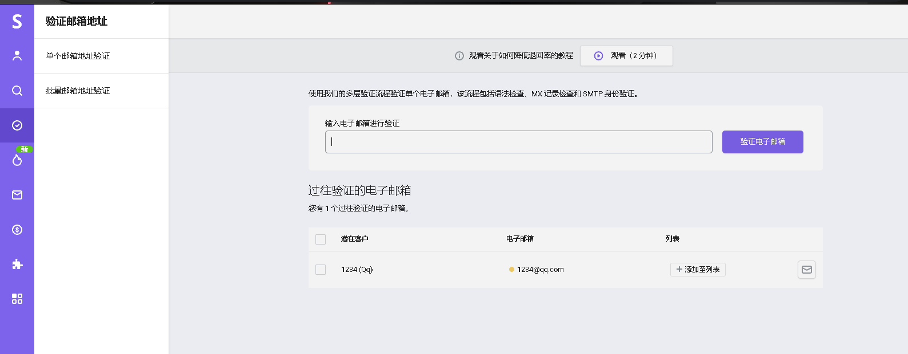

##### 工具

**verifyemail**

> <https://github.com/Tzeross/verifyemail>
> 
> Python在线验证邮箱真实性，支持批量验证，支持全部域名邮箱，支持全部域名邮箱，支持全部域名邮箱，支持全部域名邮箱

#### 邮箱爆破

> 弱口令爆破方式只适用于目标企业自己的邮件服务器如owa等，对第三方邮箱不优先考虑

##### 常用字典组合

> 员工名称拼音/首字母
> 
> 员工名称拼音/首字母+日期
> 
> 公司简称+年份
> 
> 员工名称+公司名
> 
> passwd+日期
> 
> P@sswd!+日期

**爆破字典**

[https://github.com/rootphantomer/Blasting_dictionary](https://github.com/rootphantomer/Blasting_dictionary)

<https://github.com/TheKingOfDuck/fuzzDicts>

##### 工具

爆破邮箱大概分为两种情况

- 网页邮箱爆破
    
    
    - burpsuite等
- STMP协议等邮箱端口爆破
    
    
    - medusa、hydra、SNETCracker、[GoMapEnum](https://github.com/nodauf/GoMapEnum)、APT34组织 owa爆破工具等（多数工具kali都自带）

> 邮箱相关端口：
> 
> SMTP默认端口：25
> 
> POP3默认端口：110
> 
> IMAP默认端口：143

#### 临时邮箱

```bash
#所谓的十分钟邮箱类  
http://www.yopmail.com/zh/  
https://10minutemail.com/  
https://10minutemail.net/  
https://www.guerrillamail.com/zh/inbox  
http://www.fakemailgenerator.com/  
https://temp-mail.org/en/  
https://www.guerrillamail.com/  
http://tool.chacuo.net/mailsend  
https://maildrop.cc/  
http://tool.chacuo.net/mailanonymous  
https://tempmail.altmails.com/  
https://www.snapmail.cc/  
https://www.linshi-email.com/
```

#### 匿名邮箱

- [ProtonMail](https://mail.protonmail.com/inbox)
- [Get secure, reliable email hosting – FastMail](https://www.fastmail.com/)
- [xyfir/ptorx](https://github.com/xyfir/ptorx)
- [Tutanota](https://tutanota.com/)

### 6. 网盘信息收集

一些安全意识薄弱的人员对于上传到网盘上的资源未作加密限制或者密码泄露，然后又被一些云盘爬虫给收集到，最终导致信息泄露。通过一些网盘引擎可以获取到其中的泄露信息。

#### 在线平台

<https://lzpan.com/>  
凌风云：<https://www.lingfengyun.com/>  
蓝菊花：<http://www.lanjuhua.com/>  
大力盘：<https://www.dalipan.com/>  
猪猪盘：<http://www.zhuzhupan.com/>  
PanSou：<http://www.pansou.com/>  
盘飞飞：<https://panfeifei.com/>

由于网盘搜索工具的时效性，可以通过搜索引擎去获取一些。


##### 搜索关键词

关键词一般以单位名称、别称、产品业务等

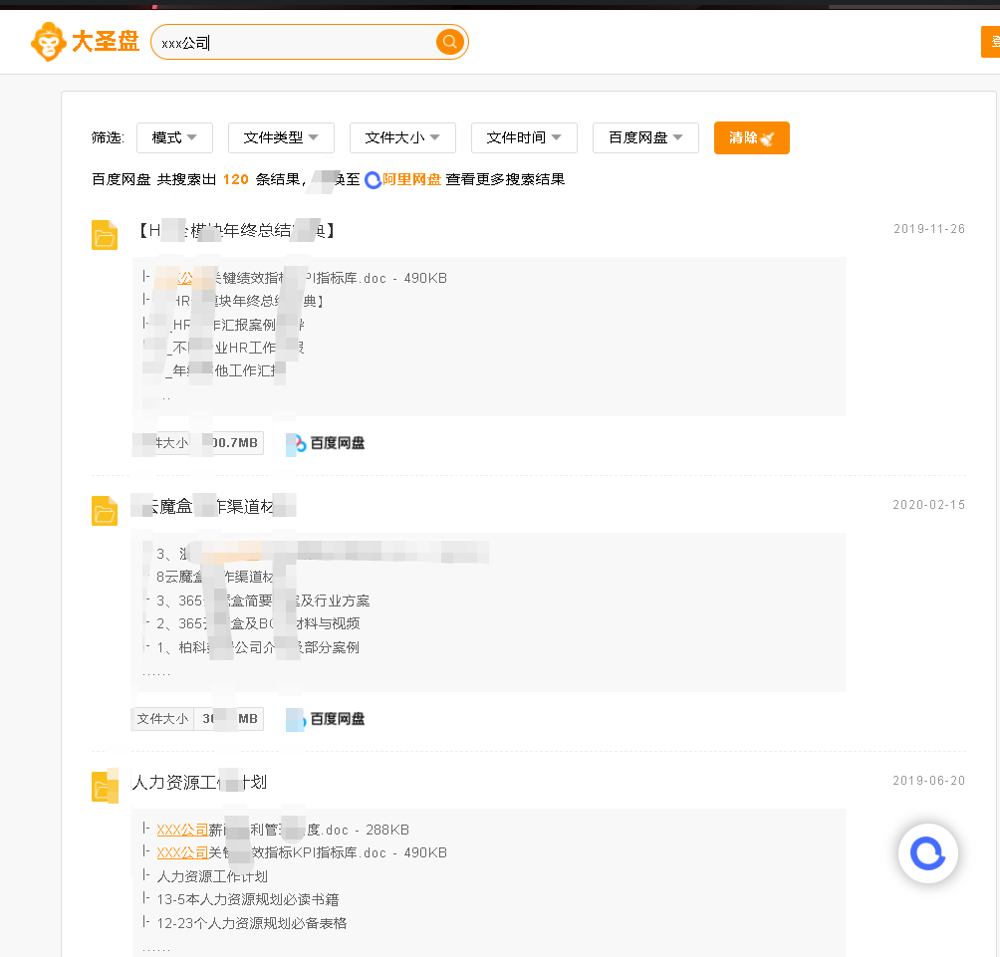

#### 爬虫

- [百度网盘爬虫脚本搜索](https://github.com/search?q=%E7%99%BE%E5%BA%A6%E7%BD%91%E7%9B%98%E7%88%AC%E8%99%AB)
- [网盘搜索工具](https://www.yzzpan.com/#sharefile=trOPDGQC_54416)
    
    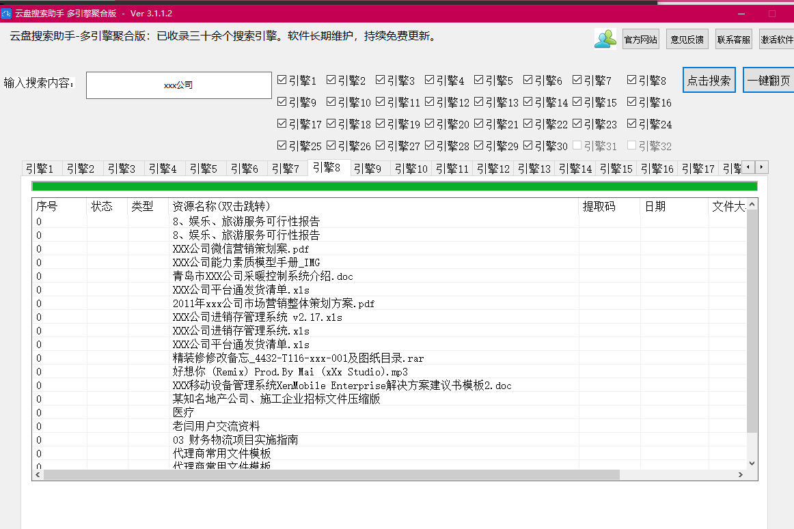

> - 网盘有时候会存在一些简历信息泄露，如手机号、邮箱、部门等。

0x06 其他信息
---------

### 1. APP

通过获取App配置、数据包，去获取url、api、osskey、js等敏感信息。

#### App查找入口

##### 搜索引擎

- Google Hacking
- 网络空间搜索引擎

##### 在线聚合平台

- [小蓝本](https://www.xiaolanben.com/pc)
- [七麦](https://www.qimai.cn/)
- [AppStore](https://www.apple.com/app-store)
- [点点](https://www.diandian.com/)
- [豌豆荚](https://www.wandoujia.com/)
- [天眼查](https://www.tianyancha.com/)/[爱企查](https://aiqicha.baidu.com/)等
- App应用商城

#### App敏感信息收集

> ps：App关联打算另写一篇。

##### 手工收集

一般是通过抓包收集接口数据或者逆向获取配置数据。

- 抓包可能会需要进行证书绕过、绕过抓包限制等。
    
    
    - 常用的软件简记
        
        
        - [Fastboot &amp; ADB](https://developer.android.google.cn/studio/releases/platform-tools?hl=zh_cn)
        - [HttpCanary](https://pan.baidu.com/s/1-4YrEuNYAS_g7o34NO26xg?pwd=p7o3)
        - [Packet Capture](https://play.google.com/store/apps/details?id=app.greyshirts.sslcapture)
        - [Wicap](https://nalankang.lanzoui.com/b00usn8te)
        - [Fildder](https://www.telerik.com/fiddler)+[Burpsuite](https://portswigger.net/burp)
        - [Mitmproxy](https://mitmproxy.org/)
        - [Charles](https://www.charlesproxy.com/)
        - [Frida](https://github.com/frida/frida)
        - SSL相关：[JustTrustMe++](https://github.com/JunGe-Y/JustTrustMePP)/[TrustMeAlready](https://github.com/ViRb3/TrustMeAlready)/[SSLUnpinning](https://github.com/ac-pm/SSLUnpinning_Xposed)/[Inspeckage](https://github.com/ac-pm/Inspeckage)
        - 强制走代理：[ProxyDroid](https://play.google.com/store/apps/details?id=org.proxydroid&hl=en_SG&gl=US)/[Droni](https://play.google.com/store/apps/details?id=org.sandrob.drony)+[Burpsuite](https://portswigger.net/burp)
        - 综合性安卓抓包/逆向/HOOK自动化脚本工具：[lamda](https://github.com/rev1si0n/lamda)/[r0capture](https://github.com/r0ysue/r0capture)/[fridaUiTools](https://github.com/dqzg12300/fridaUiTools)/[frida_hook_libart](https://github.com/lasting-yang/frida_hook_libart)
- 逆向可能会需要进行脱壳/解码等。
    
    
    - 常用软件简记
        
        
        - [幸运破解器](https://pan.quark.cn/s/e597d624dd23#/list/share/c978afeb1cdc48ed9e51745006cfea6e-Lucky%20Patcher)
        - [核心破解](https://github.com/Xposed-Modules-Repo/com.coderstory.toolkit)
        - [BlackDex](https://github.com/CodingGay/BlackDex)
        - [fdex2](https://github.com/CodingGay/BlackDex)
        - [FART](https://github.com/hanbinglengyue/FART)
        - [Android Killer](https://github.com/liaojack8/AndroidKiller)
        - [午夜神大佬应用集](https://www.yuque.com/docs/share/c0691a64-3b55-4ae3-ab20-90e1daff12cd)
            
            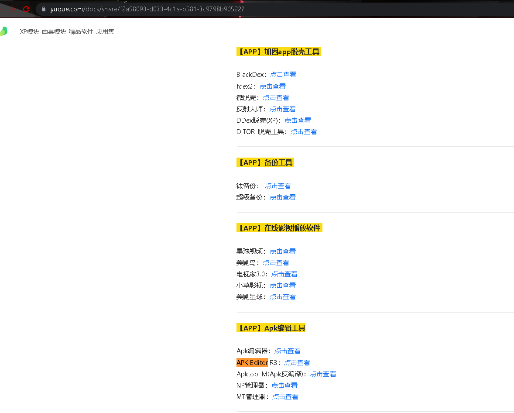
        - grep筛选
            
            ```php
            grep \-EHirn "accesskey|admin|aes|api_key|apikey|checkClientTrusted|crypt|http:|https:|password|pinning|secret|SHA256|SharedPreferences|superuser|token|X509TrustManager|insert into|setJavaScriptEnabled|root|JavascriptInterface|MODE_WORLD_READABLE|MODE_WORLD_WRITEABLE|Pinner|checkServerTrusted|api_secret|api/v1|api/v2" \--color APKfolder/  
            \# https://twitter.com/AmitMDubey/status/1272982285277491200
            ```

##### **工具推荐：**

**AppInfoScanner**

> <https://github.com/kelvinBen/AppInfoScanner>
> 
> 一款适用于以HW行动/红队/渗透测试团队为场景的移动端(Android、iOS、WEB、H5、静态网站)信息收集扫描工具，可以帮助渗透测试工程师、攻击队成员、红队成员快速收集到移动端或者静态WEB站点中关键的资产信息并提供基本的信息输出,如：Title、Domain、CDN、指纹信息、状态信息等。

**ApkAnalyser**

> <https://github.com/TheKingOfDuck/ApkAnalyser>
> 
> 一键提取安卓应用中可能存在的敏感信息。
> 
> 目前可提取APK内：
> 
> - 所有字符串
> - 所有URLs
> - 所有ip
> - 可能是hash值的字符串
> - 存在的敏感词（如oss.aliyun）
> - 可能是accessKey的值

### 2. OSINT

> OSINT(Open-source intelligence) 指开源情报,一项从媒体、网络、博客、视频，等公开来源中进行信息收集、提取的技术。

#### 情报相关资源

- [OSINT-CN](https://start.me/p/GE7JQb/osint) 一款在线分享国内外OSINT资源和工具的网站
- [Digital-Privacy](https://github.com/ffffffff0x/Digital-Privacy) Information Protection &amp; OSINT resources | 一个关于数字隐私搜集、保护、清理集一体的方案,外加开源信息收集(OSINT)对抗
- [丁爸网](http://dingba.top/)
- 微信公众号 情报小蜜蜂 little_bee007
- [iYouPort OSINT专栏](https://www.iyouport.org/category/osint/)
- [sinwindie/OSINT](https://github.com/sinwindie/OSINT) - 各种平台的 OSINT "一张图" 系列
- [blaCCkHatHacEEkr/OSINT_TIPS](https://github.com/blaCCkHatHacEEkr/OSINT_TIPS) - OSINT 技巧合集
- [The Privacy, Security, &amp; OSINT Show](https://inteltechniques.com/podcast.html) - 讲述、介绍各类 OSINT 技能的博客
- [OSINT Framework](https://osintframework.com/) - 非常著名的 OSINT 框架,有着非常丰富的 OSINT 资源

#### **OSINT 情报工具**

- <https://intelx.io/tools> - 在线使用的开源情报和取证工具清单
- [OSINT Recon Tool](https://recontool.org/#mindmap) - 在线的 osint 工具集合，加上思维脑图
- [woj-ciech/SocialPath](https://github.com/woj-ciech/SocialPath) - 跟踪社交媒体平台上的用户
- [Greenwolf/social_mapper](https://github.com/Greenwolf/social_mapper) - 通过面部识别跟踪不同社交平台目标的工具
- [bhavsec/reconspider](https://github.com/bhavsec/reconspider) - 可用于扫描IP地址，电子邮件，网站，组织的 OSINT 工具
- [SpiderFoot](https://www.spiderfoot.net/)

### 3. 个人隐私信息

#### **从邮箱查询**

- [你注册过哪些网站？一搜便知](https://www.reg007.com/)
- [Find email addresses in seconds • Hunter (Email Hunter)](https://hunter.io/) - email 信息查询工具

#### 从用户名查询

- [Instant Username Search](https://instantusername.com/#/) - 实时搜索100多个社交媒体网站的用户名。
- [CheckUsernames](https://checkusernames.com/) - 测某账号是否在全球500多个社交媒体中是否有注册。
- [WhatsMyName Web](https://whatsmyname.app/) - 搜索许多网站上存在的用户名。
- [NameCheckup](https://namecheckup.com/) - 查找可用的用户名
- [Namechk](https://namechk.com/)
- [KnowEm Username Search](https://knowem.com/)
- [sherlock-project/sherlock](https://github.com/sherlock-project/sherlock) - 在不同的社交网络上通过用户名搜寻账户

#### 从IP查询

- [Torrent downloads and distributions for IP](http://iknowwhatyoudownload.com/) - 查你这个IP下载过哪些磁力链接?

#### 混合查询

- [Username Search](https://usersearch.org/) - 找到用户名、电子邮件地址或电话号码背后的人。
- [n0tr00t/Sreg](https://github.com/n0tr00t/Sreg) - 使用者通过输入 email、phone、username 的返回用户注册的所有互联网信息.
- [Humanitarian Data Exchange](https://data.humdata.org/organization/facebook) - Facebook 的公开数据查询平台
- [银行卡号归属地查询](http://cha.yinhangkadata.com/)
- [友商发·票查询](http://fapiao.youshang.com/)
- TG库、四件套等。

#### 从注册信息查询

Sms  
<https://www.materialtools.com/>  
<http://receivefreesms.com/>  
Email  
<https://10minutemail.net/>  
<http://24mail.chacuo.net/>  
<https://zh.mytrashmailer.com/>  
<http://24mail.chacuo.net/enus>  
<https://www.linshiyouxiang.net/>  
Fake id  
<https://www.fakenamegenerator.com/>  
<http://www.haoweichi.com/>  
<https://www.fakeaddressgenerator.com/>

### 4. 历史漏洞

- wooyun 历史漏洞库：<http://www.anquan.us/>
- 漏洞银行：<https://www.bugbank.cn/>
- 360 补天：<https://www.butian.net/>
- 教育行业漏洞报告平台：<https://src.edu-info.edu.cn/login/>
- seebug：<https://paper.seebug.org/>
- CNVD：<http://www.cnnvd.org.cn/>
- Exploit Database: [https://www.exploit-db.com](https://www.exploit-db.com/)
- Vulners: [https://vulners.com](https://vulners.com/)
- zone-h：<http://zone-h.org/archive?hz=1>
- Sploitus: [https://sploitus.com](https://sploitus.com/)
- 历史界面：[wayback](https://archive.org/web/)
    
    
    - 工具：[**waybackurls**](https://github.com/tomnomnom/waybackurls)

### 5. 蜜罐识别

> 通常**将蜜罐(honeypot)定义为一种安全资源，它不需要提供实际的应用，蜜罐的存在价值就是诱导和记录攻击行为，从而了解攻击者的入侵方法和手段，并能够延缓其攻击进程**，进而根据捕获的攻击行为数据，分析攻击者使用的攻击方法和工具，从而让防御方针对性地增强系统的安全防护能力

**简单识别**

- [honeyscore shodan](https://honeyscore.shodan.io/)
    
    
    - 网络空间搜索引擎
- [Honeypot Hunter](https://send-safe-honeypot-hunter.apponic.com/)
    
    
    - Send-Safe Honeypot Hunter 是一种工具，用于检查所谓的“蜜罐”的 HTTPS 和 SOCKS 代理列表。“蜜罐”是由试图通过使用这些虚假代理记录流量，然后向其 ISP 发送投诉的人运行的虚假代理。
- [Chrome 蜜罐检测插件](https://github.com/iiiusky/AntiHoneypot-Chrome-simple)
    
    
    - 需要自己完善规则的Chrome 蜜罐检测插件
- [anti-honeypot](https://github.com/cnrstar/anti-honeypot)
    
    
    - 一款可以检测WEB蜜罐并阻断请求的Chrome插件
- [AntiHoneypot](https://github.com/Monyer/antiHoneypot)
    
    
    - 一个拦截XSSI &amp; 识别Web蜜罐的Chrome扩展

工具向
===

> 持续更新……

- **水泽 信息收集自动化工具**

[https://github.com/0x727/ShuiZe_0x727](https://github.com/0x727/ShuiZe_0x727)

> 作者：[Ske](https://github.com/SkewwG)
> 
> 团队：[0x727](https://github.com/0x727)，未来一段时间将陆续开源工具，地址：<https://github.com/0x727>
> 
> 定位：协助红队人员快速的信息收集，测绘目标资产，寻找薄弱点
> 
> 语言：python3开发
> 
> 功能：一条龙服务，只需要输入根域名即可全方位收集相关资产，并检测漏洞。也可以输入多个域名、C段IP等，具体案例见下文。
> 
> 调用：脚本借用了ksubdomain爆破子域名和theHarvester收集邮箱，感谢ksubdomain和theHarvester作者

- **ARL资产侦察灯塔系统**

<https://github.com/TophantTechnology/ARL>

> 旨在快速侦察与目标关联的互联网资产，构建基础资产信息库。 协助甲方安全团队或者渗透测试人员有效侦察和检索资产，发现存在的薄弱点和攻击面。

- **ENScanGo**

[https://github.com/wgpsec/ENScan_GO](https://github.com/wgpsec/ENScan_GO)

> 由狼组安全团队的 Keac 师傅写的专门用来解决企业信息收集难的问题的工具，可以一键收集目标及其控股公司的 ICP 备案、APP、小程序、微信公众号等信息然后聚合导出。

- [**gobuster**](https://github.com/OJ/gobuster)

> 一个用于暴力破解的工具：
> 
> - 网站中的 URI（目录和文件）。
> - DNS 子域（支持通配符）。
> - 目标 Web 服务器上的虚拟主机名。
> - 打开 Amazon S3 存储桶

- [**SecLists**](https://github.com/danielmiessler/SecLists)

> SecLists是安全测试人员的伴侣。它是安全评估期间使用的多种类型列表的集合，收集在一个地方。列表类型包括用户名、密码、URL、敏感数据模式、模糊测试负载、Web Shell 等等。目标是使安全测试人员能够将此存储库拉到一个新的测试框上，并可以访问可能需要的每种类型的列表。

- OSINT开源情报与侦察工具

<https://www.osint-labs.org/tools/>

- 本机ip地址查询

<https://ip.skk.moe/>

- 空间搜索引擎
    
    
    - FOFA [https://fofa.info](https://fofa.info/)
    - Quake <https://quake.360.cn/quake/#/index>
    - Hunter [https://hunter.qianxin.com](https://hunter.qianxin.com/)
    - Censys <https://search.censys.io/>
    - Shadon [https://www.shodan.io](https://www.shodan.io/)
    - ZoomEye [https://www.zoomeye.org](https://www.zoomeye.org/)
    - Sumap <https://sumap.dbappsecurity.com.cn/>
    - Soall <https://soall.org/login>
    - 0.zone <https://0.zone/>

参考
==

<https://xz.aliyun.com/t/11112>

<https://mp.weixin.qq.com/s/MSLwTsfahF2NSSdDznvetw>

[https://blog.csdn.net/qq_53577336/article/details/122828715](https://blog.csdn.net/qq_53577336/article/details/122828715)

<https://www.lijiejie.com/dns-zone-transfer-1/>

<https://github.com/bin-maker/2021CDN/>

<https://www.freebuf.com/articles/web/265016.html>