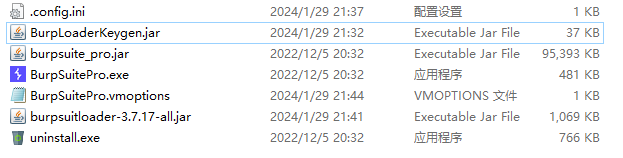
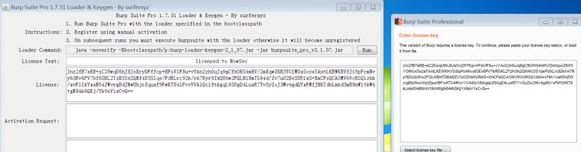

## 前言

工欲善其事必先利其器，Burp Suite 作为必不可少的工具，安装是非常有必要的。

## 下载

- [Burp Suite Pro 2022.11.4](https://portswigger.net/burp/releases/professional-community-2022-11-4) 本体
- [BurpSuiteCN](https://github.com/Leon406/BurpSuiteCN-Release) 汉化包
（点开链接之后点击releases ,然后下载Assets 下面的burpsuitloader-3.7.17-all.jar）
- [BurpLoaderKeygen](https://github.com/Tcilay-xi/backup/blob/main/BurpLoaderKeygen/BurpLoaderKeygen.jar) 注册机

## 安装

1. 下载[Burp Suite Pro 2022.11.4](https://portswigger.net/burp/releases/professional-community-2022-11-4)，按照常规步骤安装 
 注：建议更换路径安装
2. 下载[BurpLoaderKeygen](https://github.com/Tcilay-xi/backup/blob/main/BurpLoaderKeygen/BurpLoaderKeygen.jar) 注册机，将其放入到 Burp Suite Jar 包的同级目录下。
> 由于原作者删库跑路了，他的库[github](https://github.com/h3110w0r1d-y/BurpLoaderKeygen)  
> 上面的链接是我的备份：[BurpLoaderKeygen](https://github.com/Tcilay-xi/backup/blob/main/BurpLoaderKeygen/BurpLoaderKeygen.jar)
3. 下载[BurpSuiteCN](https://github.com/Leon406/BurpSuiteCN-Release) 汉化包，将其放入到 Burp Suite Jar 包的同级目录下。
 


## 激活
1. 打开命令行窗口，先带着注册机运行一下 `BurpSuite`  （注意先使用cd /d 命令将目录切换到BurpSuite的安装目录之下）
```
D:\tool\BurpSuitePro\jre\bin\java.exe --add-opens=java.base/java.lang=ALL-UNNAMED --add-opens=java.base/jdk.internal.org.objectweb.asm=ALL-UNNAMED --add-opens=java.base/jdk.internal.org.objectweb.asm.tree=ALL-UNNAMED --add-opens=java.base/jdk.internal.org.objectweb.asm.Opcodes=ALL-UNNAMED -javaagent:BurpLoaderKeygen.jar -jar D:\tool\BurpSuitePro\burpsuite_pro.jar
```
   其中`D:\tool\`更换为你的安装目录  (这串命令很长，前后有两个需要更换为安装目录的地方，请务必注意)
2. 运行后，会弹出一个窗口，提示`Enter License Key`，不管，放一边  
3. 新开命令行窗口，运行：  
```
D:\tool\BurpSuitePro\jre\bin\java.exe -jar D:\tool\BurpSuitePro\BurpLoaderKeygen.jar
```
（同上，注意安装目录的更改）

4. 将左侧窗口中的`License`中的内容复制粘贴到激活页面的`Enter License key`中，点击`Next`  
5. 点击`Manual activation`进行手动激活  
6. 点击`Copy Request`将其复制粘贴到左侧窗口的Activation Request中后，自动生成`Activation Response`  
7. 将左侧窗口的`Activation Response`的值复制粘贴到激活页面的第三个输入框内，点击`Next`  
8. 激活成功  

## 汉化 以及优雅的使用

- 打开你的安装目录中的`BurpSuitePro.vmoptions`  
- 添加保存：  
```
--add-opens=java.desktop/javax.swing=ALL-UNNAMED
--add-opens=java.base/java.lang=ALL-UNNAMED
--add-opens=java.base/jdk.internal.org.objectweb.asm=ALL-UNNAMED
--add-opens=java.base/jdk.internal.org.objectweb.asm.tree=ALL-UNNAMED
--add-opens=java.base/jdk.internal.org.objectweb.asm.Opcodes=ALL-UNNAMED
-javaagent:burpsuitloader-3.7.17-all.jar=loader,han
-javaagent:BurpLoaderKeygen.jar
-Xmx2048m
```
## 完成~
之后打开 `BurpSuitePro.exe` ，和官方正版使用毫无差别，优雅永不过时～  